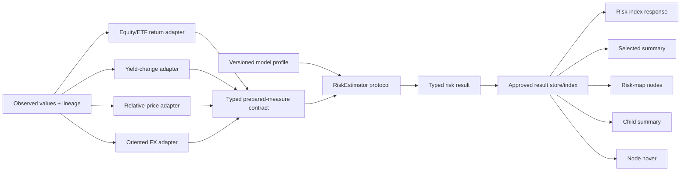
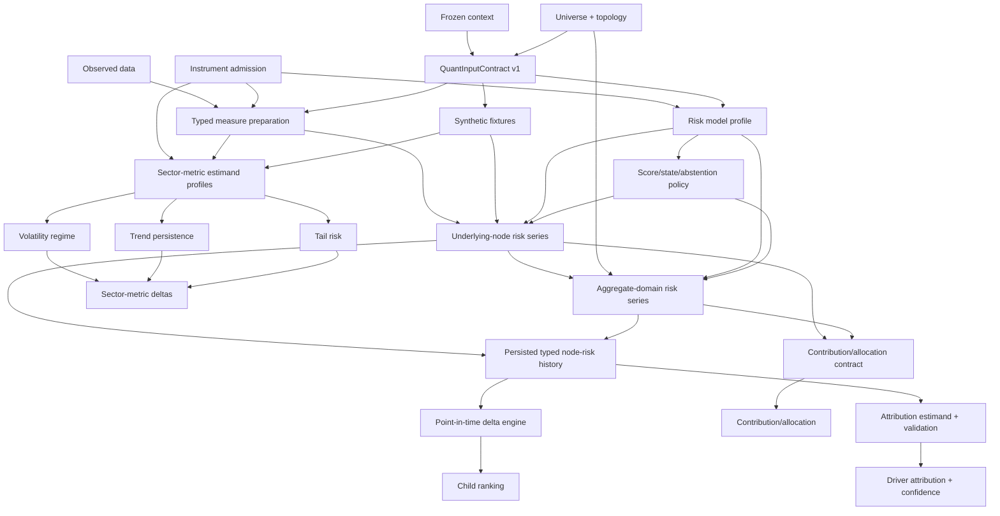
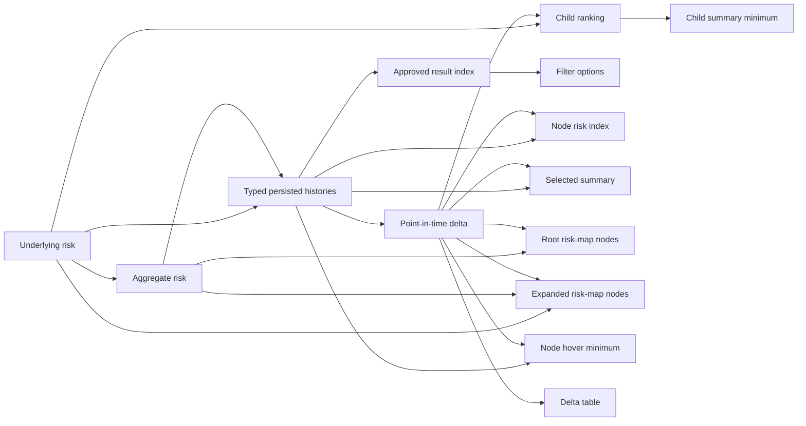
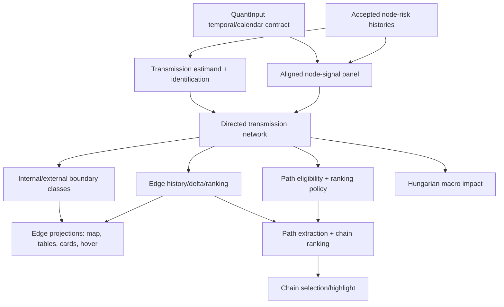

# SRM Beta Quant — Dependency DAG and Ordered UI/API Obligation Backlog v1

**Status:** ACCEPTED at Human Stop Q1

**Context:** `srm-beta-market-stress-daily-v1`

**Prepared:** 2026-09-22

**Machine-readable authority:**
[`dependency_graph_v1.yaml`](dependency_graph_v1.yaml)

**Governing work package:**
[`WP-QUANT-001`](../work_packages/WP-QUANT-001.md)

## 1. Result of the Q1 analysis

The SRM beta should not use one undifferentiated “UI dependency graph.” Four different questions
must be represented separately:

1. **Hard dependency:** what must already be accepted and available before another capability or UI
   response can be truthful?
2. **Minimum fulfillment:** which accepted capabilities are sufficient for the smallest honest
   version of an API/UI obligation?
3. **Enrichment and reuse:** which later capabilities can add fields to an already usable response,
   and which implementation/result can be reused by several consumers?
4. **Execution order:** among dependency-safe tasks, what should be done first given quantitative
   uncertainty, implementation effort, reuse value and the chosen beta strategy?

These relations are not interchangeable. A capability may be reusable without being universally
valid. A UI component may be technically easy while depending on difficult research. A later
enrichment must not block an earlier honest minimum response. A task may be topologically possible
but strategically deferred.

The accepted machine graph currently contains:

- 72 nodes: 8 foundations, 16 contracts, 10 quantitative capabilities, 9 derived capabilities,
  6 integration capabilities and 23 grouped UI obligations;
- 140 hard-dependency edges;
- 36 minimum-fulfillment links and 14 enrichment links;
- all 29 API `Comp.ID` values, each mapped exactly once;
- all 21 unique API endpoints;
- an explicit classification of every UI obligation and a complete stable topological listing;
- 16 delivery waves, including human stops and later deferred work.

Human Stop Q1 was accepted on 2026-09-22 with one operational clarification: the graphs remain
background planning and safety evidence, while day-to-day delivery follows the single numbered
UI-obligation sequence in Section 8. Q1 acceptance does not authorize a quantitative method;
method authorization begins with the Q2 specification for the first obligation.

### 1.1 What Q0–Q4 mean in plain language

These are stages of `WP-QUANT-001`, not UI-obligation numbers:

- **Q0 — fix the question:** freeze the one beta context so every result answers the same business
  question with the same information-time rules. Complete.
- **Q1 — choose a safe order:** identify every UI/API obligation, its real prerequisites and the
  exact order in which the team will address the obligations. Complete and accepted.
- **Q2 — specify the first obligation:** open `node-risk-index`; state its business question,
  estimands, required API output, admitted inputs, candidate methods and tests before writing model
  code. This is the next stage.
- **Q3 — implement and validate it:** implement only the Q2-approved candidate methods, run the
  precommitted tests and diagnostics, and obtain quantitative acceptance.
- **Q4 — hand it off:** map the accepted result to the API contract and deliver the thin executable
  handoff to the backend engineer. The remaining UI obligations then repeat the same
  specify → implement/reuse → validate → map → hand-off cycle in Section 8 order.

Q2 therefore does **not** mean “the second UI obligation.” It is the specification phase for UI
obligation 1.

## 2. The key architectural answer: yes, reuse is desirable — but not as an untyped pointer

The intuition in the design discussion is correct: once a risk-estimation capability exists, many
UI obligations should reuse its result, and an accepted estimator implementation may be reused
across several nodes. The safe form of that reuse is:

```text
observed source values
    → instrument/measure-specific causal adapter
    → typed prepared-measure contract
    → model-profile-selected estimator callable
    → typed risk result with diagnostics and lineage
    → persisted approved result
    → several pure response projections
```

It should not be:

```text
UI shell → arbitrary function pointer → raw heterogeneous series
```

The endpoint shell should never choose a model, download data or run hidden preprocessing. It
should request an already accepted typed result through an application/service boundary and project
that result into the response contract.

At implementation time, a “pointer” is likely to become a versioned registry or dependency-injected
callable keyed by `model_profile_id`. The registry may route several compatible nodes to the same
implementation. Reuse is admitted only when:

- the user-facing estimand is the same;
- a type-specific adapter has produced the same declared prepared-measure semantics;
- units, adverse direction, calendar, missingness and staleness policies are compatible;
- the model profile explicitly admits the instrument/measure pair;
- the same behavioral and no-look-ahead tests pass for that admission;
- failure or abstention remains explicit.

This separation lets us reuse code aggressively without pretending that an equity return, a yield
level, an FX quote and an aggregate child panel are the same mathematical object.



The aggregate estimator remains a separate capability because it consumes a time-aligned panel of
admitted child and anchor signals and estimates a domain state. It may reuse normalization,
missingness, result, state and projection primitives, but it is not automatically the same callable
as the underlying-node estimator.

## 3. Relation taxonomy

### 3.1 Hard dependency

`A → B` is a hard dependency only when B cannot be truthfully computed, validated or served without
accepted A. Hard edges are acyclic and determine the topological levels.

Examples:

- typed measure preparation → underlying-node risk series;
- underlying-node risk series → aggregate-domain risk series;
- accepted node series → aligned node panel → transmission network;
- transmission network → edge histories → edge UI projections;
- transmission network → ranked risk chains.

### 3.2 Minimum fulfillment

A minimum-fulfillment link identifies the smallest honest response. It is also a hard dependency.
It does not mean the endpoint will never gain more fields or richer interpretations.

Examples:

- node risk history plus delta is sufficient for `NodeRiskIndexResponse`;
- aggregate risk plus delta and topology is sufficient for the node layer of the root risk map;
- child risk and ranking is sufficient for a child summary containing risk and movement;
- accepted edge history is required before a spillover-strength table is truthful.

### 3.3 Enrichment

An enrichment link adds later capability without blocking the minimum response.

Examples:

- transmission edges enrich a node-only risk map;
- ranked chains enrich the graph's `highlightedChain` fields;
- transmission adds strongest incoming/outgoing edges to node hover;
- volatility, persistence and tail metrics enrich the child table;
- contribution allocation adds `importance_score`;
- transmission adds incoming/outgoing spillover columns.

### 3.4 Reuse

Reuse describes an implementation or result that can serve several consumers after contract and
admission checks. It does not create dependency merely because reuse is possible.

Examples:

- one approved node-risk result feeds five or more response projections;
- one point-in-time delta engine feeds map, summary, hover and delta-table responses;
- one accepted edge result feeds map edges, spillover tables, transmission cards, hover and chains;
- one chart/table serializer family maps different typed results without embedding mathematics.

## 4. Hard quantitative capability DAG

The first graph shows only the node- and sector-risk foundation. UI projections are shown separately
so the mathematical dependency structure remains legible.



Three consequences are deliberate:

1. The aggregate result depends on accepted child-state signals but is not a weighted average by
   default. Its own estimand and estimator still require Q2/Q3 decisions.
2. Volatility regime, trend persistence and tail risk share prepared inputs but do not depend on
   one another or on the final aggregate risk index. They can be researched in parallel after the
   common input layer exists.
3. Contribution/concentration is not a free by-product of aggregation. It requires a separately
   accepted allocation rule.

## 5. Minimum UI-fulfillment DAG

The following graph focuses on the reusable node-risk result and its early consumers. It explains
why the first vertical slice can satisfy several UI obligations without transmission.



`VS-001` therefore closes over six obligations:

- populated filter options;
- node risk-index history;
- selected-node summary;
- minimum child-node summary;
- root risk-map node layer;
- expanded risk-map node layer.

The node hover is a low-cost next projection but is not required to prove the first slice. The
delta-analysis table follows after its comparison semantics and uncertainty behavior are reviewed.

## 6. Transmission DAG remains downstream



This is a project-order dependency, not a claim that every future transmission method must consume
the displayed 0–1 risk score itself. The accepted transmission specification may select a richer
node-signal output from the same model result. What must exist first is an economically defined,
point-in-time-safe, stable node series with diagnostics and lineage.

## 7. Topological levels

Topological level is a valid layering constrained only by hard dependencies. Every hard edge moves
to a strictly higher level. Nodes within one level have no declared ordering, and a node may be
placed later than its earliest mathematically possible level to keep related prerequisite families
legible. The machine file lists every node exactly once under `topologicalLevels`. These levels do
not by themselves determine delivery priority.

| Level | Main contents | Meaning |
|---:|---|---|
| 0 | Frozen context, universe, observed data, API architecture, external-source placeholders | Inputs or external foundations |
| 1 | Quant input identity/projection contracts; alert, macro, news and generated-content policies | Cross-cutting specifications |
| 2 | Typed preparation, synthetic fixtures, risk model profile, news implication capability | Model-ready contracts |
| 3 | Risk score/state policy; sector-metric profiles; news UI technically possible | Final node-risk semantics and later metric specifications |
| 4 | Underlying risk; volatility, persistence and tail primitives | First quantitative capabilities |
| 5 | Aggregate risk; sector-metric deltas | Domain synthesis and metric comparison |
| 6 | Persisted node histories; contribution/allocation contract; sector-summary UI | Reusable accepted result layer and next-family specification |
| 7 | Approved selector index; delta; contribution engine; attribution contract; aligned panel; transmission specification | Derived risk capabilities and transition to later estimands |
| 8 | Child ranking; driver attribution; concentration description; transmission network; trigger events; first-slice projections | First UI slice and later quantitative branching |
| 9 | Chain-ranking policy; node-interpretation assembly; edge histories/boundaries; macro model; watchpoint/insight assembly; child/concentration UI | Downstream derived capabilities and governed integration |
| 10 | Edge narrative, chain capability, node-interpretation and direct spillover/edge-hover projections, macro/insight UI | Advanced quantitative and integration obligations |
| 11 | Risk-chain list and selected-chain state; narrative-complete internal/external cards | Path-dependent and narrative-complete UI |

The low topological level of news does not mean news should be built early. Its external-source,
licensing, evidence and governance uncertainty make it strategically later. This illustrates why
the hard DAG and delivery backlog must remain separate.

## 8. Authoritative UI-by-UI iteration order

**This is the chapter used to run the work.** The DAG, reuse families and delivery waves explain
why the order is safe; they do not replace this queue. The team opens one numbered obligation,
finishes its accepted backend handoff, and only then advances to the next row. A reusable subroutine
is adopted when the current obligation reaches it and its admission conditions pass; the backlog
does not require speculative implementation for distant obligations.

Every row follows the same obligation loop:

1. open the UI component and API specification;
2. re-derive and challenge the obligation's business question, then state the current proposed
   question and exact required response fields;
3. identify whether the answer is a new estimand, a projection of an accepted result, or a mixture;
4. compare methods or formally approve reuse of an existing typed capability;
5. fix expected behavior, minimal formalization, input/output contracts and deterministic tests;
6. implement or reuse the pure quantitative core and review diagnostics;
7. map the accepted result to the API response without hidden recomputation;
8. deliver a thin `.sh` entry point, invocation documentation, typed examples, exit/failure behavior
   and the versioned Python entry point to the backend engineer;
9. record human sign-off and only then start the next row.

The backlog's business-question wording is therefore provisional until the corresponding
obligation is opened and reviewed. It may be corrected or sharpened during that obligation's
specification work. Once the obligation specification is signed off, later semantic change requires
a versioned amendment or a formally reopened specification. If a proposed change would alter the
frozen decision horizon, risk target, object scope or information-time rules, it must be treated as
a filter-context change rather than silently absorbed into the obligation.

The `.sh` file is a transport and reproducibility boundary, not a place for quantitative logic. It
must neither download data nor write to the production database.

Physical folder structure follows a **lazy-growing** rule. The first obligations create only the
files they demonstrably need; Q1 does not freeze a speculative hierarchy for future models. The
first one or two completed obligation cycles are used to observe recurring artifact boundaries.
Only then may the team accept a reusable folder/template convention. A shared module is extracted
only after a second real consumer appears, not because the DAG predicts possible future reuse.

Scales use `1 = low` and `5 = very high`. “Projection effort” measures response/shell complexity;
“research uncertainty” measures unresolved quantitative or evidentiary difficulty. A simple endpoint
can therefore still have a difficult upstream requirement.

| # | UI obligation | Class | Minimum providers | Later enrichment | Projection effort | Research uncertainty | Wave |
|---:|---|---|---|---|---:|---:|---:|
| 1 | Node risk index | quantitative, projection | Persisted risk history + delta | Uncertainty bands if contract later admits them | 2 | 2 | W4 |
| 2 | Selected-node summary | projection | Current risk/state + delta + governed node metadata | Richer signed narrative | 1 | 2 | W4 |
| 3 | Child-node summary | quantitative, projection | Child risk + delta + top-N rule | Sector metrics, contribution and spillovers | 2 | 2 | W4 |
| 4 | Root risk-map nodes | projection | Aggregate risk + delta + topology | Transmission edges + highlighted chains | 3 | 2 | W4 |
| 5 | Expanded risk-map nodes | projection | Aggregate + child risk + delta + topology | Transmission edges + highlighted chains | 3 | 2 | W4 |
| 6 | Filter options | projection | Frozen context + approved result index | More targets/windows only after admission | 2 | 2 | W4 |
| 7 | Node hover | interaction, projection | Risk history + delta | Strongest edges + interpretation summary | 2 | 2 | W5 |
| 8 | Delta analysis | quantitative, projection | Comparable point-in-time risk estimates | Comparison uncertainty and richer metrics | 2 | 3 | W6 |
| 9 | Sector summary | quantitative, projection | Volatility regime + persistence + tail-risk estimands | Additional accepted risk targets | 2 | 4 | W6 |
| 10 | Risk concentration | quantitative, projection, narrative | Accepted aggregate allocation/contribution + governed concentration description | Sensitivity and uncertainty diagnostics | 2 | 5 | W7 |
| 11 | Node interpretation | quantitative, narrative | Driver attribution + calibrated confidence | Transmission and external evidence | 3 | 5 | W7 |
| 12 | Spillover strength | quantitative, projection | Edge history, ranking and delta | Alternative accepted edge metrics | 2 | 3 | W10 |
| 13 | Edge hover | interaction, projection | Edge summary + activity history | Governed channel narrative | 2 | 3 | W10 |
| 14 | Internal transmission | quantitative, projection, narrative | Edge history + within-boundary classification + governed required narrative | Alternative accepted edge metrics and richer diagnostics | 3 | 4 | W10 |
| 15 | External transmission | quantitative, projection, narrative | Edge history + cross-boundary classification + governed required narrative | Alternative accepted edge metrics and richer diagnostics | 3 | 4 | W10 |
| 16 | Risk chains | quantitative, projection | Directed network + path extraction/ranking | Scenario-specific rankings | 3 | 5 | W11 |
| 17 | Selected-chain label | interaction, projection | Accepted risk-chain set | None mathematically material | 1 | 1 | W11 |
| 18 | Key triggers and alerts | quantitative, projection | Accepted metric + event/threshold/dwell policy | Chain-scoped triggers | 3 | 4 | W12 |
| 19 | Watchpoints | narrative | Trigger events + governed monitoring logic | Chain/news context | 3 | 4 | W12 |
| 20 | Sector news | external integration, projection | Governed news source + node linkage | Quantitative relevance ranking | 2 | 4 | W13 |
| 21 | News implication | external integration, narrative | Governed news source + implication/linkage policy | Chain-specific context | 3 | 4 | W13 |
| 22 | Hungarian macro impact | quantitative, projection | Transmission network + point-in-time macro target/data | Scenario conditioning | 3 | 5 | W14 |
| 23 | Quantitative insights | narrative | Accepted outputs + IT contract + evidence/review policy | Transmission/news/macro evidence | 4 | 5 | W15 |

## 9. Background delivery waves and gates

These waves summarize shared prerequisites, parallel research opportunities and human gates. They
do not override the one-at-a-time UI sequence in Section 8.

The backlog uses four priority rules in order:

1. never violate a hard dependency;
2. close the node-risk vertical slice before transmission;
3. among dependency-safe work, prefer high-reuse capabilities and lower uncertainty;
4. preserve a human stop before every new estimand family or high-judgment integration.

| Wave | Deliverable | Parallelism | Gate |
|---:|---|---|---|
| W0 | Q1 graph and backlog accepted | None | Human Stop Q1 — complete |
| W1 | Define underlying/aggregate estimands and `QuantInputContract v1` | Research can compare alternatives; specification closes once | Human Stop Q2 |
| W2 | Implement typed adapters, causal masks, deterministic fixtures and profile contracts | Adapters and fixture regimes may proceed in parallel after the contract | Automated contract/fixture checks |
| W3 | Compare underlying candidates, then aggregate candidates | Candidate implementations may be parallel; aggregate waits for accepted child semantics | Human quantitative acceptance Q3 |
| W4 | Deliver `VS-001`: six minimum responses and populated filters | Response projections may proceed together after typed results exist | Backend handoff Q4 |
| W5 | Add node-hover minimum projection | Small isolated projection | Response behavior review |
| W6 | Build delta table and sector volatility/persistence/tail metrics | Metric families can proceed in parallel | Per-estimand acceptance |
| W7 | Build contribution/concentration and driver interpretation | Partial parallelism; both require accepted node results | Attribution/confidence review |
| W8 | Specify transmission target and identification | Research alternatives only | Transmission specification sign-off |
| W9 | Implement and validate transmission core | Candidate methods may be compared | Transmission quantitative sign-off |
| W10 | Add spillover table, internal/external cards, edge hover and risk-map edges | Numeric projections can proceed in parallel; transmission cards wait for the governed required narrative | Edge projection and narrative review |
| W11 | Extract/rank risk chains and serve selection state | Selection projection follows chain results | Chain semantics review |
| W12 | Define triggers, alerts and watchpoints | Trigger families may be parallel after policy | Monitoring review |
| W13 | Integrate sector and chain-aware news | Endpoint work can be parallel after source/linkage gate | External-source review |
| W14 | Research and validate Hungarian macro transmission | Separate high-uncertainty track | Macro method/data sign-off |
| W15 | Confirm and implement reviewed quantitative insights | Last, because API contract is provisional | IT contract + content review |

## 10. First vertical slice closure

`VS-001` is deliberately broader than one endpoint but narrower than one full page. It proves that
one accepted quantitative result can serve several API surfaces without hidden recomputation.
It is not delivered as one bulk task: its six UI obligations are completed sequentially as rows
1–6 of Section 8, each with its own contract mapping, handoff and review.

### Required capabilities

- `QuantInputContract v1`;
- typed causal preparation and masks;
- deterministic fixtures and precommitted behavior;
- underlying-node risk result;
- aggregate-domain risk result;
- state/threshold/abstention policy;
- result identity and persisted typed history;
- point-in-time delta primitive;
- child top-N rule;
- approved-result selector index;
- typed chart/table/JSON projections.

### Required UI/API responses

- `GET /api/v1/filter-options` with only backed choices;
- `GET /api/v1/nodes/{nodeId}/risk-index`;
- `GET /api/v1/nodes/{nodeId}/selected-summary`;
- minimum `GET /api/v1/nodes/{nodeId}/child-nodes-summary`;
- node-only root `GET /api/v1/risk-map`;
- node-only expanded `GET /api/v1/risk-map?expandedNodeId=...`.

### Explicitly absent from the slice

- transmission edges and strongest-edge fields;
- risk-chain highlighting;
- risk concentration unless an allocation estimand has separately passed review;
- volatility, persistence and tail columns unless individually accepted;
- news, alerts, watchpoints, macro impact and generated insights.

An empty `edges[]` collection and null chain selection are honest in the node-only risk-map slice;
fabricated placeholder edges are not.

## 11. Typed adapter and estimator reuse matrix

The following is an interface plan, not a selected transformation or model.

| Input family | Likely prepared-measure family | Special questions before admission | Reuse implication |
|---|---|---|---|
| Equity and fixed-income ETFs | Total/adjusted return or another explicitly selected return measure | Price field, distributions, adjusted history, currency and calendar | May share an underlying estimator after identical prepared semantics pass tests |
| Government yield indices | Yield changes or separately justified level/deviation measure | Units, basis points, curve direction, negative/near-zero values | Requires a yield adapter; must not be fed silently into a return-only estimator |
| Derived relative prices | Point-in-time-safe log-ratio/change based on both legs | Leg availability, alignment, double counting and construction lineage | Can reuse downstream estimator only after the derived measure is explicit |
| FX spot/index | Oriented return with declared adverse direction | Quote convention, policy lens and asymmetric interpretation | Can reuse downstream estimator only after orientation is fixed |
| Implied-volatility indices | Level/change/deviation chosen by separate measure semantics | Mean reversion, scale and role as validation versus score input | Usually a separate adapter/profile even if standardized later |
| Continuous-futures proxies | Deferred until controlled roll series exists | Roll methodology, gaps, back adjustment and contract lineage | No admission to the first estimator merely because observations exist |
| Aggregate child panel | Time-aligned typed child/anchor state panel | Weighting, commonality versus adverse direction, missingness and changing coverage | Uses a distinct aggregate estimator interface; shares result/projection primitives |

The first pilot should preferably use a bounded, economically coherent group whose admitted inputs
exercise the workflow without forcing every adapter family at once. Pilot selection remains a Q2
decision and should be made jointly with the exact estimand and fixture design.

## 12. Dynamic response contracts prevent false dependencies

Several API tables declare dynamic columns. This is important for sequencing:

- `ChildNodesSummaryResponse` can honestly begin with child risk and movement columns. Volatility,
  persistence, tail, contribution and spillover columns can be added only when those capabilities
  are accepted.
- `SectorSummaryTableResponse` is a separate metric family. Volatility regime, trend persistence
  and tail risk should not be smuggled in as aliases of `market-stress-intensity`.
- `RiskMapResponse` may be delivered first as a node layer. Transmission edges and chain highlighting
  are later enrichment, not placeholder data.
- `NodeHoverResponse` permits null strongest-edge references and null summary, so its risk-history
  minimum can precede transmission and narrative generation.

Dynamic schemas therefore help avoid a monolithic “finish every quantitative problem before any UI
works” dependency. They do not authorize omission of required fields or invented default values.

## 13. Accepted Human Stop Q1 decisions

1. **The four-relation model is accepted.** Hard dependency, minimum fulfillment, enrichment and reuse
   remain separately typed.
2. **The reuse boundary is accepted.** UI shells consume accepted typed results; estimator reuse happens
   behind a model-profile registry and type-specific adapters.
3. **`VS-001` closure is accepted.** The first slice contains the six obligations in Section 10 and no
   transmission dependency.
4. **Underlying-before-aggregate ordering is accepted.** Aggregate synthesis uses accepted child-state
   semantics, while retaining its own estimator and review gate.
5. **Sector metrics remain parallel siblings.** Volatility regime, persistence and tail risk share
   inputs but are separate estimands and do not depend on one another.
6. **Concentration remains outside `VS-001`.** It requires a contribution/allocation rule, not merely
   child risk scores.
7. **Transmission remains downstream of accepted node series.** The later transmission target decides
   which typed node signal is consumed; it must not silently redefine node risk.
8. **News is topologically early but strategically late.** External source, licensing, linkage
   and evidence governance dominate its scheduling.
9. **Macro transmission and generated insights remain late.** Both have unresolved contracts and high
   research uncertainty.
10. **A filter-options contract shell may exist early, but only backed choices may be populated.** The W4
    obligation is complete only when `asOf`, target and window values correspond to approved results.
11. **Obligation-specific method contracts are required.** Sector metrics, contribution/allocation,
    driver attribution and chain ranking each pass an explicit estimand/profile policy node before
    implementation; accepted upstream data or scores are necessary but not sufficient.

## 14. What Q1 does not authorize

Acceptance of this graph would not authorize:

- selecting EWMA, GARCH, PCA, dynamic factors, EVT, Mahalanobis distance or another estimator;
- choosing the pilot domain or child set;
- fixing transformations, estimation windows, memory, thresholds or imputation;
- implementing a universal risk function over raw heterogeneous data;
- changing the frozen filter context, proxy registry, Catalog Factory or KYI contracts;
- modifying the public API architecture;
- implementing transmission or generated content;
- starting production database integration.

Those decisions belong to Q2 and later obligation-specific work packages.

## 15. Executable validation

[`test_dependency_graph.py`](../tests/obligations/test_dependency_graph.py) verifies that:

- the YAML has no ambiguous duplicate mapping keys and all declared evidence paths resolve;
- every node has a declared kind and every UI obligation has a valid endpoint/wave shape;
- every UI obligation has one or more allowed obligation classes;
- the hard graph is acyclic;
- every edge references known nodes and moves to a higher topological level;
- the explicit topological listing contains every node exactly once and matches its declared level;
- UI shells depend on capabilities and contracts, not on other UI shells;
- every UI shell depends on the shared response-projection contract;
- every quantitative capability has an explicit method/estimand contract predecessor;
- every hard edge has a rationale and every fulfillment relation is typed and field-scoped;
- all 29 API components are mapped exactly once;
- all 21 unique endpoints have an obligation;
- every UI obligation has a minimum provider;
- every minimum provider is a hard dependency;
- no enrichment is accidentally promoted to a hard dependency;
- delivery waves cover every UI obligation exactly once and match each node's declared wave;
- the first vertical slice's dependency closure contains no transmission/edge/chain capability;
- complexity and uncertainty scores use the declared 1–5 range;
- every reuse claim declares its conditions and points only to known consumers.

The graph is therefore mechanically consistent, and Human Stop Q1 accepted its economic and
product ordering. Any future change to Section 8 or the machine-readable iteration order requires a
versioned amendment rather than a silent reorder.
