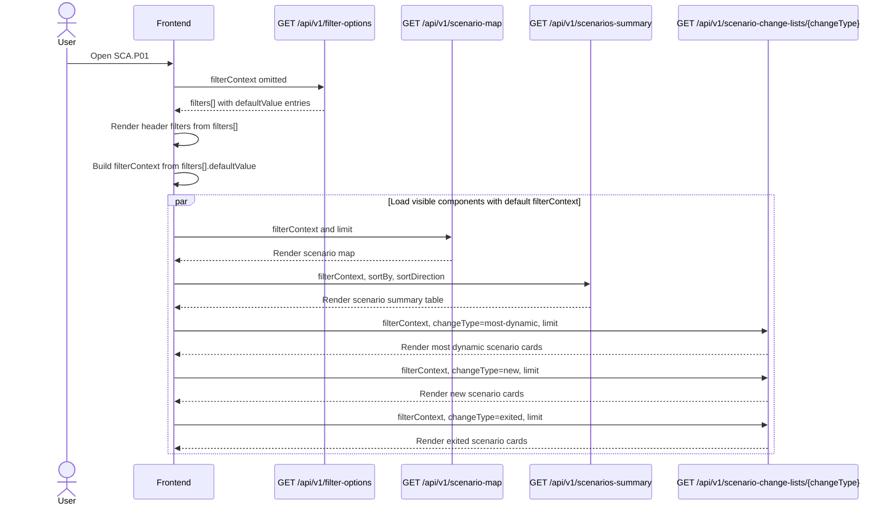
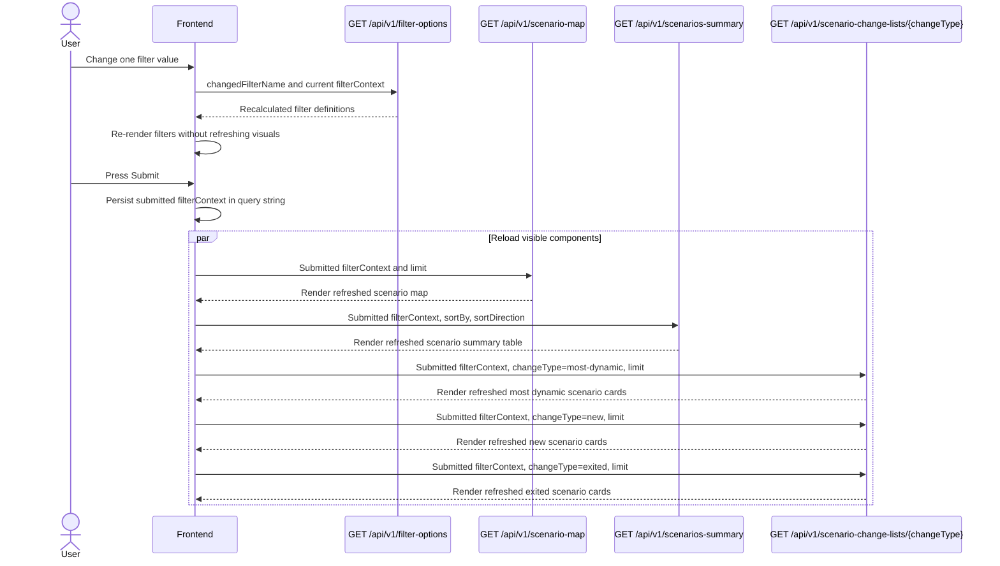
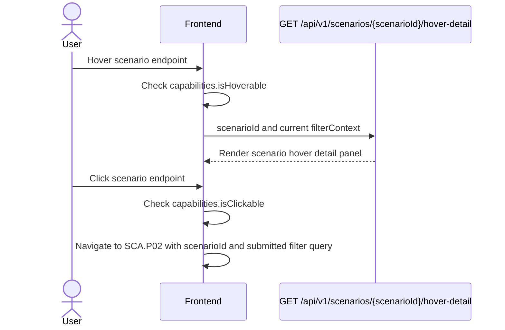
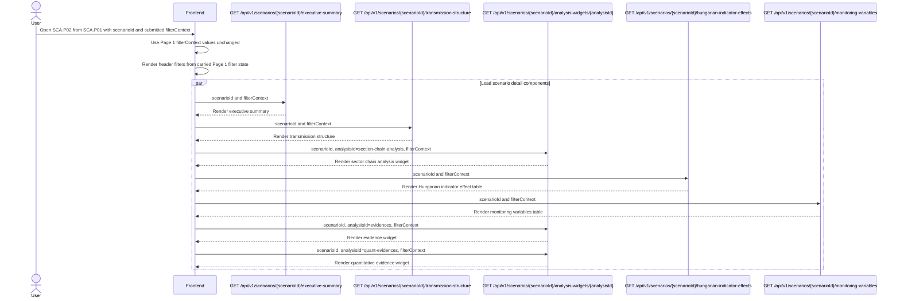
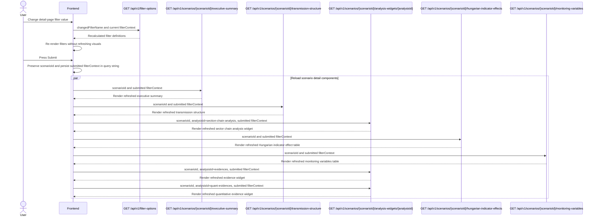

# API Architecture

Scope:
- Section `Page 1`
- Section `Page 2`
- Interaction `Initial page load`
- Interaction `Filter change and submit`
- Interaction `Scenario endpoint hover`
- Interaction `Scenario endpoint click-through navigation`

## 1. API design and key decision highlights

- Base path: `/api/v1`.
- Read-only UI data is exposed through `GET` endpoints with query and path parameters only.
- Filter submit does not call a dedicated submit endpoint; the frontend reissues visible component reads with the submitted `filterContext`.
- Visible frontend components are loaded through dedicated async endpoints.
- Backend-driven shared filters are returned by `GET /api/v1/filter-options`.
- Endpoint-specific parameters remain explicit and outside `filterContext`.
- Missing business data that is meaningful as partial historical coverage is returned as `null`, not coerced to `0`.

### Generic endpoint reuse

- `GET /api/v1/scenario-change-lists/{changeType}` serves the three Page 1 card lists because `most-dynamic`, `new`, and `exited` use the same row contract.
- `GET /api/v1/scenarios/{scenarioId}/analysis-widgets/{analysisId}` serves scenario-dependent dynamic widgets because the business specification states that these blocks can vary by scenario while keeping one modular widget shell.
- Parent responses expose capability fields such as `capabilities.isHoverable`, `capabilities.isClickable`, and `capabilities.availableScenarioViews[]`; the frontend must use them before enabling hover or click-through behavior.

### FastAPI best-practice alignment

This handoff follows the project guidance in [fastapi_best_practices.md](../../project-level-guides/best-practices/fastapi_best_practices.md), [fastapi_api_naming_conventions.md](../../project-level-guides/best-practices/fastapi_api_naming_conventions.md), [fastapi_dashboard_query_parameter_best_practices.md](../../project-level-guides/best-practices/fastapi_dashboard_query_parameter_best_practices.md), and [charting_series_payload_best_practices.md](../../project-level-guides/best-practices/charting_series_payload_best_practices.md):

- Public JSON response fields and public query parameters use `camelCase`.
- FastAPI implementation code should use Python `snake_case` internally with Pydantic aliases or explicit query aliases for public `camelCase` fields.
- Route paths use lowercase kebab-case resource names.
- Standard dashboard reads use `GET` with validated path/query parameters and no request body.
- Unknown visual endpoint filters should be rejected instead of accepted as catch-all parameters.
- Scenario-hover score-history chart payloads use `multi_columnar_time_series`.

### Field-path notation in schema tables

Output schema tables use field paths to describe the JSON response structure. Dot notation marks nested objects. Array fields are marked with `[]`. For example, `orders[].items[].quantity` means the `quantity` field of each item object inside each order object. The JSONPath equivalent is `$.orders[*].items[*].quantity`.

Schema tables include parent collector rows for nested objects and arrays before their child fields. This keeps both the envelope and the leaf fields visible.

Example:

| Field path | JSON/OpenAPI data type | Required | Description |
| --- | --- | --- | --- |
| `orders[]` | `object[]` | yes | List of orders. |
| `orders[].id` | `string` | yes | ID of each order. |
| `orders[].items[]` | `object[]` | yes | List of items in each order. |
| `orders[].items[].quantity` | `integer` | yes | Quantity of each item. |

## 2. Common request headers

Use these headers for every endpoint in this handoff.

| Header | Required | Notes |
|---|---|---|
| `Authorization` | yes | `Bearer <access_token>` issued by the identity provider. |
| `Accept` | yes | Must be `application/json`. |
| `X-Request-Id` | no | Optional client-generated correlation identifier for tracing. If omitted, the backend should generate one. |

Do not send `Content-Type: application/json` for `GET` endpoints with no request body.

Unless an endpoint states otherwise:
- endpoints use the common headers
- endpoints require the default `scenario-analysis:read` authorization scope
- endpoints have no request body
- successful responses use HTTP `200` with `application/json`

### Authentication and authorization **To be discussed with the front-end team and IT department**

- Authentication uses OAuth2/OIDC bearer access tokens.
- The frontend sends the token in the `Authorization` header.
- The API validates token signature, issuer, audience, expiration, roles, and scopes.
- Read endpoints require `scenario-analysis:read`.
- Missing, expired, malformed, or invalid credentials return `401`.
- Valid credentials without the required role or scope return `403`.

### Dynamic shared filter query contract

`GET /api/v1/filter-options` is the runtime source of valid shared filter keys for all visual and interaction endpoints.

Frontend request construction:
- Render controls by iterating `filters[]`.
- Build `filterContext` by iterating the same `filters[]`.
- Use `filters[].filterName` as the `filterContext` key.
- Use `filters[].selectedValue` when it is present; otherwise use `filters[].defaultValue`.
- Submit `filterContext` as a namespaced deep-object query parameter.
- Keep endpoint-specific parameters outside `filterContext`.

Generic request shape:

```text
GET /api/v1/<resource>?filterContext[<filterName>]=<selected-or-default-value>&<endpointSpecificKey>=<value>
```

Example request shape:

```text
GET /api/v1/scenario-map?filterContext[asOf]=2026-04-18&filterContext[forecastHorizon]=3m&filterContext[deltaWindow]=2w&filterContext[scenarioSet]=top-relevant&limit=8
```

Backend validation:
- Reject unknown `filterContext` keys that are not known filter names from the filter-options registry.
- Reject values that are not allowed for the current filter context.
- Treat endpoint-specific parameters separately from shared filters, even if names are similar.
- Return validation errors using the shared minimal error contract.

### Filter metadata endpoint

<a id="endpoint-get-api-v1-filter-options"></a>
`GET /api/v1/filter-options`

Purpose:
- Populate all header filters before visible components are loaded.
- Return backend-approved per-filter `defaultValue` entries for first render.
- Recalculate available filter options when one filter changes.
- Keep future filters backend-driven without adding page-bound endpoint variants.

Request modes:
- Initial page load: send no query parameters. The backend returns the full header filter set; each filter includes `defaultValue`.
- Filter change refresh: send `changedFilterName` and the current dynamic `filterContext` using deep-object query parameters. The backend returns the full filter set again, with `selectedValue` reflecting the supplied context, `defaultValue` carrying the backend-selected default for that refreshed filter set, and available values recalculated where needed.
- Both modes are `GET` requests with no request body.

Input schema:

| Location | Name | JSON/OpenAPI data type | Value format / semantic meaning | Required | Allowed values / format examples | Description |
|---|---|---|---|---|---|---|
| query | `changedFilterName` | `string` | backend-defined filter key | no | backend-defined filter keys; examples: `asOf`, `forecastHorizon`, `deltaWindow`, `scenarioSet` | Filter that triggered a metadata refresh. Omitted on initial page load. |
| query | `filterContext` | `object` | deepObject query object | no | object built from returned `filters[]`; example keys: `asOf`, `forecastHorizon`, `deltaWindow`, `scenarioSet` | Current filter values known by the frontend. Empty or omitted on initial page load. |
| query | `filterContext.<filterName>` | `string` | backend-defined filter value | no | value examples depend on `filters[].availableValues[]`; example: `filterContext[asOf]=2026-04-18` | Dynamic key-value pair where the key equals `filters[].filterName` and the value equals the current selected or default filter value. |

Output schema:

| Field path | JSON/OpenAPI data type | Required | Allowed values / format examples | Description |
|---|---|---|---|---|
| `filters[]` | `object[]` | yes | array of filter definition objects | Filter definitions to render in the shared filter header. |
| `filters[].filterName` | `string` | yes | backend-defined filter keys; examples: `asOf`, `forecastHorizon`, `deltaWindow`, `scenarioSet` | Filter name to render and the key the frontend sends under `filterContext`. |
| `filters[].label` | `string` | yes | free text; example: `Top relevant` | Human-readable filter label. |
| `filters[].availableValues[]` | `object[]` | yes | array of value-label objects | Available values for this filter. |
| `filters[].availableValues[].value` | `string` | yes | backend-defined values; examples depend on `filters[].filterName` | Machine value submitted to endpoints. |
| `filters[].availableValues[].label` | `string` | yes | free text; example: `Top relevant` | Display label shown in the control. |
| `filters[].defaultValue` | `string` | yes | backend-defined values; examples depend on `filters[].filterName` | Backend-selected default and the single source of default filter state. |
| `filters[].selectedValue` | `string or null` | yes | backend-defined values or `null`; examples depend on `filters[].filterName` | Selected value after applying `filterContext`; on cold load it normally equals `defaultValue`. |
| `filters[].proposedFilterObjectType` | `string` | yes | backend-defined control types; examples: `drop_down`, `date_picker`, `list` | Frontend control type proposed by the backend. |
| `filters[].isRequired` | `boolean` | yes | `true`, `false` | Whether the visual endpoints require this filter. |

Example request: [filter-options.request.json](#appendix-filter-options-request-json)
Example response: [filter-options.response.json](#appendix-filter-options-response-json)
Filter-change example request: [filter-options-filter-change.request.json](#appendix-filter-options-filter-change-request-json)

## 3. View component mapping

### 3.1. SCA.P01 - Szcenárió térkép összefoglaló


#### Request execution flow

##### **Initial Page Load**



Diagram endpoint links:
- [`GET /api/v1/filter-options`](#endpoint-get-api-v1-filter-options)
- [`GET /api/v1/scenario-map`](#endpoint-get-api-v1-scenario-map)
- [`GET /api/v1/scenarios-summary`](#endpoint-get-api-v1-scenarios-summary)
- [`GET /api/v1/scenario-change-lists/{changeType}`](#endpoint-get-api-v1-scenario-change-lists-change-type)

Interaction notes:
- The change-list endpoint is called once per visible `changeType`: `most-dynamic`, `new`, and `exited`.

##### **SCA.P01 Filter Change and Submit**



Diagram endpoint links:
- [`GET /api/v1/filter-options`](#endpoint-get-api-v1-filter-options)
- [`GET /api/v1/scenario-map`](#endpoint-get-api-v1-scenario-map)
- [`GET /api/v1/scenarios-summary`](#endpoint-get-api-v1-scenarios-summary)
- [`GET /api/v1/scenario-change-lists/{changeType}`](#endpoint-get-api-v1-scenario-change-lists-change-type)

Interaction notes:
- Filter changes only refresh filter definitions until the user presses `Submit`.
- On `Submit`, the URL stores the submitted `filterContext` for reproducible monitoring snapshots.

##### **Scenario Endpoint Hover and Click**



Diagram endpoint links:
- [`GET /api/v1/scenarios/{scenarioId}/hover-detail`](#endpoint-get-api-v1-scenarios-scenario-id-hover-detail)

Interaction notes:
- Hover and click are enabled only on scenario endpoints, not on historical trajectory points.
- Click-through navigation is a frontend route change; SCA.P02 loads its own component endpoints after navigation.

#### Component to endpoint mapping

| Mockup component id | UI block | Endpoint | Response schema |
|---|---|---|---|
| `SCA.P01.scenario-map` | Probability-impact scatter plot with trajectories | [`GET /api/v1/scenario-map`](#endpoint-get-api-v1-scenario-map) | `ScenarioMapResponse` |
| `SCA.P01.scenarios-summary-table` | Compact scenario summary table | [`GET /api/v1/scenarios-summary`](#endpoint-get-api-v1-scenarios-summary) | `ScenarioSummaryTableResponse` |
| `SCA.P01.most-dynamic-scenarios` | Most dynamic scenario cards | [`GET /api/v1/scenario-change-lists/{changeType}`](#endpoint-get-api-v1-scenario-change-lists-change-type) with `changeType=most-dynamic` | `ScenarioChangeListResponse` |
| `SCA.P01.new-scenarios` | New scenario cards | [`GET /api/v1/scenario-change-lists/{changeType}`](#endpoint-get-api-v1-scenario-change-lists-change-type) with `changeType=new` | `ScenarioChangeListResponse` |
| `SCA.P01.exited-scenarios` | Exited scenario cards | [`GET /api/v1/scenario-change-lists/{changeType}`](#endpoint-get-api-v1-scenario-change-lists-change-type) with `changeType=exited` | `ScenarioChangeListResponse` |
| `SCA.P01.scenario-map.scenario-current.hover` | Hover detail panel shell | [`GET /api/v1/scenarios/{scenarioId}/hover-detail`](#endpoint-get-api-v1-scenarios-scenario-id-hover-detail) | `ScenarioHoverDetailResponse` |
| `SCA.P01.scenario-map.scenario-current.hover.summary` | Hover score band | [`GET /api/v1/scenarios/{scenarioId}/hover-detail`](#endpoint-get-api-v1-scenarios-scenario-id-hover-detail) | `ScenarioHoverDetailResponse.scoreBand` |
| `SCA.P01.scenario-map.scenario-current.hover.key-evidences` | Hover key evidence list | [`GET /api/v1/scenarios/{scenarioId}/hover-detail`](#endpoint-get-api-v1-scenarios-scenario-id-hover-detail) | `ScenarioHoverDetailResponse.keyEvidences[]` |
| `SCA.P01.scenario-map.scenario-current.hover.scenario-chain` | Hover scenario chain | [`GET /api/v1/scenarios/{scenarioId}/hover-detail`](#endpoint-get-api-v1-scenarios-scenario-id-hover-detail) | `ScenarioHoverDetailResponse.scenarioChain` |
| `SCA.P01.scenario-map.scenario-current.hover.hun-relevances` | Hungarian relevance summary | [`GET /api/v1/scenarios/{scenarioId}/hover-detail`](#endpoint-get-api-v1-scenarios-scenario-id-hover-detail) | `ScenarioHoverDetailResponse.hungarianRelevance` |
| `SCA.P01.scenario-map.scenario-current.hover.field-movements.effect` | Impact score history chart | [`GET /api/v1/scenarios/{scenarioId}/hover-detail`](#endpoint-get-api-v1-scenarios-scenario-id-hover-detail) | `ScenarioHoverDetailResponse.fieldMovements.impactScoreChart` |
| `SCA.P01.scenario-map.scenario-current.hover.field-movements.probability` | Probability score history chart | [`GET /api/v1/scenarios/{scenarioId}/hover-detail`](#endpoint-get-api-v1-scenarios-scenario-id-hover-detail) | `ScenarioHoverDetailResponse.fieldMovements.probabilityScoreChart` |
| `SCA.P01.scenario-map.scenario-current.hover.field-movements.summary` | Movement explanation text | [`GET /api/v1/scenarios/{scenarioId}/hover-detail`](#endpoint-get-api-v1-scenarios-scenario-id-hover-detail) | `ScenarioHoverDetailResponse.fieldMovements.movementSummary[]` |

#### View component endpoints

<a id="endpoint-get-api-v1-scenario-map"></a>
`GET /api/v1/scenario-map`

Input schema:

| Location | Name | JSON/OpenAPI data type | Value format / semantic meaning | Required | Allowed values / format examples | Description |
|---|---|---|---|---|---|---|
| query | `filterContext` | `object` | deepObject query object | yes | see Section 2 dynamic shared filter contract | Shared filter values submitted to this endpoint. |
| query | `filterContext.<filterName>` | `string` | backend-defined filter value | yes | value examples depend on `filters[].availableValues[]` | Dynamic filter key-value pair; see Section 2. |
| query | `limit` | `integer` | result limit | no | integer example: `8`; minimum `1`, maximum `50` | Maximum number of scenarios to return on the map. |

Output schema:

| Field path | JSON/OpenAPI data type | Required | Allowed values / format examples | Description |
|---|---|---|---|---|
| `asOf` | `string` | yes | date example: `2026-04-18` | Snapshot date applied to the map. |
| `axes` | `object` | yes | object shape defined by nested rows | Scatter plot axis metadata. |
| `axes.x` | `object` | yes | object shape defined by nested rows | X-axis metadata. |
| `axes.x.field` | `string` | yes | `probabilityScore` | Data field plotted on x-axis. |
| `axes.x.label` | `string` | yes | `Valószínűség` | Display label. |
| `axes.x.min` | `number` | yes | numeric ratio example: `0` | Axis minimum. |
| `axes.x.max` | `number` | yes | numeric ratio example: `1` | Axis maximum. |
| `axes.x.midline` | `number` | yes | numeric ratio example: `0.5` | Quadrant helper line. |
| `axes.y` | `object` | yes | object shape defined by nested rows | Y-axis metadata. |
| `axes.y.field` | `string` | yes | `impactScore` | Data field plotted on y-axis. |
| `axes.y.label` | `string` | yes | `Hatás` | Display label. |
| `axes.y.min` | `number` | yes | numeric ratio example: `0` | Axis minimum. |
| `axes.y.max` | `number` | yes | numeric ratio example: `1` | Axis maximum. |
| `axes.y.midline` | `number` | yes | numeric ratio example: `0.5` | Quadrant helper line. |
| `scenarios[]` | `object[]` | yes | array of objects | Scenario markers. |
| `scenarios[].scenarioId` | `string` | yes | opaque id example: `scenario-energy-ai-riskoff-huf` | Stable scenario identifier used by hover and click-through. |
| `scenarios[].shortName` | `string` | yes | free text; example: `Energy-AI-HUF` | Compact map label. |
| `scenarios[].fullName` | `string` | yes | free text | Full scenario name. |
| `scenarios[].status` | `string` | yes | `active`, `new`, `exited` | Scenario relevance state. |
| `scenarios[].probabilityScore` | `number` | yes | numeric ratio example: `0.58` | Current probability score. |
| `scenarios[].impactScore` | `number` | yes | numeric ratio example: `0.74` | Current impact score. |
| `scenarios[].combinedScore` | `number` | yes | numeric ratio example: `0.66` | Combined priority score. |
| `scenarios[].movementDirection` | `string` | yes | `up`, `down`, `mixed`, `flat`, `up_right`, `up_left`, `down_right`, `down_left` | Movement summary for styling. |
| `scenarios[].currentPoint` | `object` | yes | object shape defined by nested rows | Current scatter position. |
| `scenarios[].currentPoint.probability` | `number` | yes | numeric ratio example: `0.58` | Current x coordinate. |
| `scenarios[].currentPoint.impact` | `number` | yes | numeric ratio example: `0.74` | Current y coordinate. |
| `scenarios[].previousPoint` | `object` | yes | object shape defined by nested rows | Previous comparison-window position. |
| `scenarios[].previousPoint.probability` | `number` | yes | numeric ratio example: `0.49` | Previous x coordinate. |
| `scenarios[].previousPoint.impact` | `number` | yes | numeric ratio example: `0.68` | Previous y coordinate. |
| `scenarios[].trajectory[]` | `object[]` | yes | array of objects | Historical movement points used for dotted trajectory. |
| `scenarios[].trajectory[].asOf` | `string` | yes | date example: `2026-04-11` | Trajectory point date. |
| `scenarios[].trajectory[].probability` | `number` | yes | numeric ratio example: `0.49` | Trajectory x coordinate. |
| `scenarios[].trajectory[].impact` | `number` | yes | numeric ratio example: `0.68` | Trajectory y coordinate. |
| `scenarios[].capabilities` | `object` | yes | object shape defined by nested rows | Backend-declared UI actions. |
| `scenarios[].capabilities.isHoverable` | `boolean` | yes | `true`, `false` | Whether hover-detail may be called. |
| `scenarios[].capabilities.isClickable` | `boolean` | yes | `true`, `false` | Whether click-through navigation is valid. |
| `scenarios[].capabilities.availableScenarioViews[]` | `string[]` | yes | `hover-detail`, `deep-analysis` | Allowed scenario-specific views. |

Example request: [scenario-map.request.json](#appendix-scenario-map-request-json)  Example response: [scenario-map.response.json](#appendix-scenario-map-response-json)

<a id="endpoint-get-api-v1-scenarios-summary"></a>
`GET /api/v1/scenarios-summary`

Input schema:

| Location | Name | JSON/OpenAPI data type | Value format / semantic meaning | Required | Allowed values / format examples | Description |
|---|---|---|---|---|---|---|
| query | `filterContext` | `object` | deepObject query object | yes | see Section 2 dynamic shared filter contract | Shared filter values submitted to this endpoint. |
| query | `filterContext.<filterName>` | `string` | backend-defined filter value | yes | value examples depend on `filters[].availableValues[]` | Dynamic filter key-value pair; see Section 2. |
| query | `sortBy` | `string` | `scenarioSummaryTable.columns[].id` | no | `probability_score`, `impact_score`, `combined_score`, `rank`, `short_name` | Sort column. |
| query | `sortDirection` | `string` | sort direction | no | `asc`, `desc` | Sort direction. |

Output schema:

| Field path | JSON/OpenAPI data type | Required | Allowed values / format examples | Description |
|---|---|---|---|---|
| `asOf` | `string` | yes | date example: `2026-04-18` | Snapshot date applied to rows. |
| `scenarioSummaryTable` | `object` | yes | `metric_table` payload | Extensible analytical table envelope. |
| `scenarioSummaryTable.format` | `string` | yes | `metric_table` | Table payload format used for extensible analytical tables. |
| `scenarioSummaryTable.version` | `string` | yes | semantic version example: `1.0` | Metric table payload contract version. |
| `scenarioSummaryTable.table` | `object` | yes | object | Table display and identity metadata. |
| `scenarioSummaryTable.table.title` | `string` | yes | free text; example: `Scenario summary` | Display title for the table. |
| `scenarioSummaryTable.table.rowIdentity` | `object` | yes | object | Mapping from semantic row identity fields to `rows[].id` and `rows[].name`. |
| `scenarioSummaryTable.table.rowIdentity.idField` | `string` | yes | `scenarioId` | Semantic id field represented by `rows[].id`. |
| `scenarioSummaryTable.table.rowIdentity.labelField` | `string` | yes | `scenarioShortName` | Semantic label field represented by `rows[].name`. |
| `scenarioSummaryTable.columns[]` | `object[]` | yes | array of column definition objects | Column definitions for the dynamic table. |
| `scenarioSummaryTable.columns[].id` | `string` | yes | stable column ids; examples: `short_name`, `summary`, `probability_score`, `impact_score`, `combined_score`, `combined_delta`, `direction`, `rank` | Stable machine-readable column identifier. Must match keys under `scenarioSummaryTable.rows[].cells`. |
| `scenarioSummaryTable.columns[].name` | `string` | yes | free text; example: `Combined score` | Human-readable column label. |
| `scenarioSummaryTable.columns[].cellType` | `string` | yes | `number`, `metric`, `metric_delta`, `category`, `rank`, `text` | Frontend rendering hint for this column. |
| `scenarioSummaryTable.columns[].dataType` | `string` | yes | `string`, `number`, `integer`, `boolean` | Primary cell value type. |
| `scenarioSummaryTable.columns[].unit` | `string or null` | yes | backend-defined values or `null`; examples: `score`, `score_delta`, `rank`, `null` | Semantic unit or scale for this column. |
| `scenarioSummaryTable.columns[].valueFormat` | `string or null` | yes | format example: `0.00`, or `null` | Suggested frontend display format for this column. |
| `scenarioSummaryTable.columns[].isSortable` | `boolean` | yes | `true`, `false` | Whether the frontend may offer sorting for this column. |
| `scenarioSummaryTable.columns[].isInitiallyVisible` | `boolean` | yes | `true`, `false` | Whether the frontend should show this column on first render. |
| `scenarioSummaryTable.rows[]` | `object[]` | yes | array of table row objects | Data rows for the dynamic table. |
| `scenarioSummaryTable.rows[].id` | `string` | yes | opaque backend id; example: `scenario-energy-ai-riskoff-huf` | Stable row identifier. |
| `scenarioSummaryTable.rows[].name` | `string` | yes | free text; example: `Energy-AI-HUF` | Row display label. |
| `scenarioSummaryTable.rows[].cells` | `object` | yes | object keyed by `scenarioSummaryTable.columns[].id` | Dynamic cell map. Each key should match one returned column id. |
| `scenarioSummaryTable.rows[].cells.<columnId>` | `object` | yes | object | Cell object for one declared column. |
| `scenarioSummaryTable.rows[].cells.<columnId>.value` | `string, number, boolean, or null` | yes | value type follows `scenarioSummaryTable.columns[].dataType` | Primary cell value for the matching column. |
| `scenarioSummaryTable.rows[].cells.<columnId>.delta` | `object` | no | object | Optional movement metadata for metric-delta cells. |
| `scenarioSummaryTable.rows[].cells.<columnId>.delta.direction` | `string` | no | `up`, `down`, `flat`, `not_available` | Optional movement direction for metric-delta cells. |
| `scenarioSummaryTable.meta` | `object` | yes | object | Table-level rendering and missing-value metadata. |
| `scenarioSummaryTable.meta.order` | `string` | yes | `ascending`, `descending`, `backend_defined` | Row ordering rule. |
| `scenarioSummaryTable.meta.missingValuePolicy` | `string` | yes | `show_not_available` | How unavailable `null` cell values should be rendered. |

Example request: [scenarios-summary.request.json](#appendix-scenarios-summary-request-json)  Example response: [scenarios-summary.response.json](#appendix-scenarios-summary-response-json)

<a id="endpoint-get-api-v1-scenario-change-lists-change-type"></a>
`GET /api/v1/scenario-change-lists/{changeType}`

Input schema:

| Location | Name | JSON/OpenAPI data type | Value format / semantic meaning | Required | Allowed values / format examples | Description |
|---|---|---|---|---|---|---|
| path | `changeType` | `string` | change-list type | yes | `most-dynamic`, `new`, `exited` | Which Page 1 card list to return. |
| query | `filterContext` | `object` | deepObject query object | yes | see Section 2 dynamic shared filter contract | Shared filter values submitted to this endpoint. |
| query | `filterContext.<filterName>` | `string` | backend-defined filter value | yes | value examples depend on `filters[].availableValues[]` | Dynamic filter key-value pair; see Section 2. |
| query | `limit` | `integer` | result limit | no | integer example: `3`; minimum `1`, maximum `20` | Maximum card count. |

Output schema:

| Field path | JSON/OpenAPI data type | Required | Allowed values / format examples | Description |
|---|---|---|---|---|
| `changeType` | `string` | yes | `most-dynamic`, `new`, `exited` | Returned list type. |
| `items[]` | `object[]` | yes | array of objects | Card items. |
| `items[].scenarioId` | `string` | yes | opaque id example: `scenario-energy-ai-riskoff-huf` | Scenario identifier. |
| `items[].shortName` | `string` | yes | free text; example: `Energy-AI-HUF` | Compact scenario name. |
| `items[].fullName` | `string` | yes | free text | Full scenario name. |
| `items[].summary` | `string` | yes | free text | Card summary. |
| `items[].changeReason` | `string` | yes | free text | Why the scenario appears in this list. |
| `items[].movementDirection` | `string` | yes | `up`, `down`, `mixed`, `flat` | Movement indicator for card styling. |
| `items[].rank` | `integer` | yes | integer example: `1` | Rank within the returned list. |

Example request: [scenario-change-lists.request.json](#appendix-scenario-change-lists-request-json)  Example response: [scenario-change-lists.response.json](#appendix-scenario-change-lists-response-json)

### 3.2. SCA.P02 - Adott szcenárió mélyelemzése


#### Request execution flow

##### **Initial Page Load**



Diagram endpoint links:
- [`GET /api/v1/scenarios/{scenarioId}/executive-summary`](#endpoint-get-api-v1-scenarios-scenario-id-executive-summary)
- [`GET /api/v1/scenarios/{scenarioId}/transmission-structure`](#endpoint-get-api-v1-scenarios-scenario-id-transmission-structure)
- [`GET /api/v1/scenarios/{scenarioId}/analysis-widgets/{analysisId}`](#endpoint-get-api-v1-scenarios-scenario-id-analysis-widgets-analysis-id)
- [`GET /api/v1/scenarios/{scenarioId}/hungarian-indicator-effects`](#endpoint-get-api-v1-scenarios-scenario-id-hungarian-indicator-effects)
- [`GET /api/v1/scenarios/{scenarioId}/monitoring-variables`](#endpoint-get-api-v1-scenarios-scenario-id-monitoring-variables)

Interaction notes:
- SCA.P02 initial load does not call `GET /api/v1/filter-options`.
- The frontend carries the submitted Page 1 `filterContext` into SCA.P02 and uses those values unchanged for every initial detail endpoint request.
- Page 2 header filters render from the carried Page 1 filter state on initial load; filter metadata is recalculated only after the user changes a Page 2 filter value.
- The dynamic widget endpoint is called separately for `section-chain-analysis`, `evidences`, and `quant-evidences`.

##### **SCA.P02 Filter Change and Submit**



Diagram endpoint links:
- [`GET /api/v1/filter-options`](#endpoint-get-api-v1-filter-options)
- [`GET /api/v1/scenarios/{scenarioId}/executive-summary`](#endpoint-get-api-v1-scenarios-scenario-id-executive-summary)
- [`GET /api/v1/scenarios/{scenarioId}/transmission-structure`](#endpoint-get-api-v1-scenarios-scenario-id-transmission-structure)
- [`GET /api/v1/scenarios/{scenarioId}/analysis-widgets/{analysisId}`](#endpoint-get-api-v1-scenarios-scenario-id-analysis-widgets-analysis-id)
- [`GET /api/v1/scenarios/{scenarioId}/hungarian-indicator-effects`](#endpoint-get-api-v1-scenarios-scenario-id-hungarian-indicator-effects)
- [`GET /api/v1/scenarios/{scenarioId}/monitoring-variables`](#endpoint-get-api-v1-scenarios-scenario-id-monitoring-variables)

Interaction notes:
- Filter changes only refresh filter definitions until the user presses `Submit`.
- `scenarioId` remains outside `filterContext`.
- Filter changes never replace the selected scenario unless the route changes explicitly.

#### Component to endpoint mapping

| Mockup component id | UI block | Endpoint | Response schema |
|---|---|---|---|
| `SCA.P02.executive-summary` | Executive summary block | [`GET /api/v1/scenarios/{scenarioId}/executive-summary`](#endpoint-get-api-v1-scenarios-scenario-id-executive-summary) | `ExecutiveSummaryResponse` |
| `SCA.P02.transmissions` | Trigger, transmission chain, affected sectors | [`GET /api/v1/scenarios/{scenarioId}/transmission-structure`](#endpoint-get-api-v1-scenarios-scenario-id-transmission-structure) | `TransmissionStructureResponse` |
| `SCA.P02.section-chain-analysis` | Scenario-dependent sector chain analysis widget | [`GET /api/v1/scenarios/{scenarioId}/analysis-widgets/{analysisId}`](#endpoint-get-api-v1-scenarios-scenario-id-analysis-widgets-analysis-id) with `analysisId=section-chain-analysis` | `AnalysisWidgetDocumentResponse` - provisional, confirm with IT |
| `SCA.P02.hun-indicator-effect` | Hungarian indicator impact table | [`GET /api/v1/scenarios/{scenarioId}/hungarian-indicator-effects`](#endpoint-get-api-v1-scenarios-scenario-id-hungarian-indicator-effects) | `HungarianIndicatorEffectsResponse` |
| `SCA.P02.monitoring-variables` | Variables and trigger thresholds table | [`GET /api/v1/scenarios/{scenarioId}/monitoring-variables`](#endpoint-get-api-v1-scenarios-scenario-id-monitoring-variables) | `MonitoringVariablesResponse` |
| `SCA.P02.evidences` | Qualitative evidence block | [`GET /api/v1/scenarios/{scenarioId}/analysis-widgets/{analysisId}`](#endpoint-get-api-v1-scenarios-scenario-id-analysis-widgets-analysis-id) with `analysisId=evidences` | Same provisional `AnalysisWidgetDocumentResponse` structure as `section-chain-analysis`; confirm with IT |
| `SCA.P02.quant-evidences` | Quantitative evidence block | [`GET /api/v1/scenarios/{scenarioId}/analysis-widgets/{analysisId}`](#endpoint-get-api-v1-scenarios-scenario-id-analysis-widgets-analysis-id) with `analysisId=quant-evidences` | Same provisional `AnalysisWidgetDocumentResponse` structure as `section-chain-analysis`; confirm with IT |

#### View component endpoints

<a id="endpoint-get-api-v1-scenarios-scenario-id-executive-summary"></a>
`GET /api/v1/scenarios/{scenarioId}/executive-summary`

Input schema:

| Location | Name | JSON/OpenAPI data type | Value format / semantic meaning | Required | Allowed values / format examples | Description |
|---|---|---|---|---|---|---|
| path | `scenarioId` | `string` | opaque id | yes | id example: `scenario-energy-ai-riskoff-huf` | Selected scenario. |
| query | `filterContext` | `object` | deepObject query object | yes | see Section 2 dynamic shared filter contract | Shared filter values submitted to this endpoint. |
| query | `filterContext.<filterName>` | `string` | backend-defined filter value | yes | value examples depend on `filters[].availableValues[]` | Dynamic filter key-value pair; see Section 2. |

Output schema:

| Field path | JSON/OpenAPI data type | Required | Allowed values / format examples | Description |
|---|---|---|---|---|
| `scenarioId` | `string` | yes | opaque id example: `scenario-energy-ai-riskoff-huf` | Selected scenario. |
| `title` | `string` | yes | free text | Executive summary title. |
| `summary` | `string` | yes | free text | Short executive narrative. |
| `keyFindings[]` | `string[]` | yes | array of free text | Highlighted findings. |
| `scoreSnapshot` | `object` | yes | object shape defined by nested rows | Current scenario scores. |
| `scoreSnapshot.impactScore` | `number` | yes | numeric ratio example: `0.74` | Impact score. |
| `scoreSnapshot.probabilityScore` | `number` | yes | numeric ratio example: `0.58` | Probability score. |
| `scoreSnapshot.combinedScore` | `number` | yes | numeric ratio example: `0.66` | Combined score. |
| `scoreSnapshot.direction` | `string` | yes | `up`, `down`, `mixed`, `flat` | Current movement direction. |
| `mainConsequence` | `string` | yes | free text | Main Hungarian or market consequence. |

Example request: [executive-summary.request.json](#appendix-executive-summary-request-json)  Example response: [executive-summary.response.json](#appendix-executive-summary-response-json)

<a id="endpoint-get-api-v1-scenarios-scenario-id-transmission-structure"></a>
`GET /api/v1/scenarios/{scenarioId}/transmission-structure`

Input schema:

| Location | Name | JSON/OpenAPI data type | Value format / semantic meaning | Required | Allowed values / format examples | Description |
|---|---|---|---|---|---|---|
| path | `scenarioId` | `string` | opaque id | yes | id example: `scenario-energy-ai-riskoff-huf` | Selected scenario. |
| query | `filterContext` | `object` | deepObject query object | yes | see Section 2 dynamic shared filter contract | Shared filter values submitted to this endpoint. |
| query | `filterContext.<filterName>` | `string` | backend-defined filter value | yes | value examples depend on `filters[].availableValues[]` | Dynamic filter key-value pair; see Section 2. |

Output schema:

| Field path | JSON/OpenAPI data type | Required | Allowed values / format examples | Description |
|---|---|---|---|---|
| `scenarioId` | `string` | yes | opaque id example: `scenario-energy-ai-riskoff-huf` | Selected scenario. |
| `trigger` | `object` | yes | object shape defined by nested rows | Scenario trigger. |
| `trigger.title` | `string` | yes | free text | Trigger title. |
| `trigger.description` | `string` | yes | free text | Trigger explanation. |
| `mainChain` | `object` | yes | object shape defined by nested rows | Main transmission chain, using the same simplified chain object structure as `scenarioChain`. |
| `mainChain.chainId` | `string` | yes | backend-defined values; example: `chain-energy-semiconductors` | Chain identifier. |
| `mainChain.label` | `string` | yes | free text; example: `Energy shock -> semiconductors -> AI services` | Chain label in source-to-outcome form. |
| `mainChain.description` | `string` | yes | free text | Short explanation of the main transmission chain. |
| `affectedSectors[]` | `object[]` | yes | array of objects | Sectors involved in the scenario. |
| `affectedSectors[].sectorId` | `string` | yes | opaque id example: `energy` | Sector identifier. |
| `affectedSectors[].name` | `string` | yes | free text | Sector name. |
| `affectedSectors[].role` | `string` | yes | `trigger`, `transmission`, `amplifier`, `outcome` | Sector role in the chain. |
| `affectedSectors[].impactType` | `string` | yes | backend-defined values; examples: `cost_shock`, `supply_constraint`, `funding_stress` | Type of impact on the sector. |
| `hungarianOutcome` | `string` | yes | free text | Hungarian relevance or final outcome. |

Example request: [transmission-structure.request.json](#appendix-transmission-structure-request-json)  Example response: [transmission-structure.response.json](#appendix-transmission-structure-response-json)

<a id="endpoint-get-api-v1-scenarios-scenario-id-analysis-widgets-analysis-id"></a>
`GET /api/v1/scenarios/{scenarioId}/analysis-widgets/{analysisId}`

Contract status:
- This full analysis-widget response data structure is provisional and must be confirmed with the IT department before implementation.
- The endpoint contract below is intended to show the proposed direction for `analysisId=section-chain-analysis`: an AI-generated renderable document plus optional supporting explanatory items, including charts, metric callouts, source references, or PNG images.
- `analysisId=evidences` and `analysisId=quant-evidences` use the same provisional `AnalysisWidgetDocumentResponse` structure as `section-chain-analysis`; only the generated content and supporting items differ.

Input schema:

| Location | Name | JSON/OpenAPI data type | Value format / semantic meaning | Required | Allowed values / format examples | Description |
|---|---|---|---|---|---|---|
| path | `scenarioId` | `string` | opaque id | yes | id example: `scenario-energy-ai-riskoff-huf` | Selected scenario. |
| path | `analysisId` | `string` | dynamic analysis content selector | yes | `section-chain-analysis`, `evidences`, `quant-evidences` | Requested modular analysis widget content. All three use the same provisional response structure pending IT confirmation. |
| query | `filterContext` | `object` | deepObject query object | yes | see Section 2 dynamic shared filter contract | Shared filter values submitted to this endpoint. |
| query | `filterContext.<filterName>` | `string` | backend-defined filter value | yes | value examples depend on `filters[].availableValues[]` | Dynamic filter key-value pair; see Section 2. |

Output schema:

| Field path | JSON/OpenAPI data type | Required | Allowed values / format examples | Description |
|---|---|---|---|---|
| `scenarioId` | `string` | yes | opaque id example: `scenario-energy-ai-riskoff-huf` | Selected scenario for which the analysis widget was produced. |
| `analysisId` | `string` | yes | `section-chain-analysis`, `evidences`, `quant-evidences` | Returned analysis content selector. The response structure is provisional for every analysis content selector and must be confirmed with IT. |
| `generatedAt` | `string` | yes | date-time example: `2026-04-18T10:15:00Z` | Timestamp when the widget content was generated. |
| `generationInternalBackendId` | `string` | yes | opaque backend debug id; example: `aw-gen-20260418-sector-chain-7f3b21` | Backend generation identifier for debugging and support. The frontend should not display it or use it for business logic. |
| `generationStatus` | `string` | yes | `complete`, `partial`, `failed` | Generation state. `partial` can be used when the textual analysis is available but one or more supporting visuals could not be prepared. |
| `content` | `object` | yes | object | Renderable generated widget document content. This provisional structure must be confirmed with IT. |
| `content.format` | `string` | yes | proposed values: `markdown`, `html` | Renderable content format; final supported subset follows the contract status above. |
| `content.body` | `string` | yes | Markdown or sanitized HTML example: `## Sector chain analysis...` | Generated textual analysis. The content can change structure depending on the selected scenario and should not be parsed as fixed sections by the frontend. |
| `content.language` | `string` | no | language code examples: `en`, `hu` | Content language when generated by the backend. |
| `supportingItems[]` | `object[]` | no | array of objects | Optional explanatory items referenced by the generated content. This provisional structure must be confirmed with IT. |
| `supportingItems[].itemId` | `string` | yes | opaque backend id; example: `chart-sector-stress-path` | Stable item identifier that the content body can reference when a supporting item is present. |
| `supportingItems[].itemType` | `string` | yes | proposed values; examples: `chart`, `metric_callout`, `source_reference`, `image` | Rendering category for the explanatory item. |
| `supportingItems[].title` | `string` | no | free text; example: `Sector stress path` | Display title for the explanatory item. |
| `supportingItems[].renderSpecFormat` | `string` | no | proposed values; examples: `multi_columnar_time_series`, `categorical_partition_chart`, `chart_placeholder` | Format of the optional visual specification. |
| `supportingItems[].renderSpec` | `object` | no | object shape to be agreed with IT; example: chart payload or chart reference object | Optional chart or visual specification. Use `multi_columnar_time_series` for time-series charts and `categorical_partition_chart` for pie, donut, and treemap charts. |
| `supportingItems[].chartMeta` | `object` | no | provisional chart metadata object | Optional chart display metadata when `renderSpec` is a placeholder or external chart reference. |
| `supportingItems[].chartMeta.chartTitle` | `string` | no | free text; example: `Sector stress path` | Display title for a supporting chart. |
| `supportingItems[].chartMeta.xAxisLabel` | `string or null` | no | free text or `null`; example: `Date` | Display label for the x-axis when the supporting chart has one. |
| `supportingItems[].chartMeta.yAxisLabel` | `string or null` | no | free text or `null`; example: `Stress index` | Display label for the y-axis when the supporting chart has one. |
| `supportingItems[].chartMeta.labelField` | `string or null` | no | field path or `null`; example: `renderSpec.segments[].name` | Data field used as the category or slice label when applicable. |
| `supportingItems[].chartMeta.valueField` | `string or null` | no | field path or `null`; example: `renderSpec.segments[].value` | Numeric data field represented by the chart metric when applicable. |
| `supportingItems[].chartMeta.metricName` | `string` | no | free text; example: `Sector stress index` | Human-readable metric name for the supporting chart, usually describing `chartMeta.valueField` when that field is present. |
| `supportingItems[].chartMeta.metricUnit` | `string or null` | no | backend-defined values or `null`; examples: `score`, `share` | Semantic unit or scale of the supporting chart metric. |
| `supportingItems[].chartMeta.valueFormat` | `string or null` | no | format example: `0.00`, `0%`, or `null` | Suggested frontend display format for values read from `chartMeta.valueField` when that field is present. |
| `supportingItems[].image` | `object` | no | object | Optional image payload or image reference metadata. |
| `supportingItems[].image.mimeType` | `string` | no | proposed value: `image/png` | MIME type for an optional PNG explanatory image. Final image handling must be agreed with IT. |
| `supportingItems[].image.deliveryMode` | `string` | no | proposed values: `embedded_base64`, `url` | Whether the PNG image is embedded in the JSON response or referenced by URL. Final delivery mode must be agreed with IT. |
| `supportingItems[].image.base64Data` | `string` | no | base64 PNG example: `iVBORw0KGgo...` | Base64-encoded PNG bytes when `deliveryMode=embedded_base64`. Use only if IT accepts embedded image payloads. |
| `supportingItems[].image.url` | `string` | no | URL example: `/api/v1/generated-assets/aw-gen-20260418-sector-chain-7f3b21/image-sector-bridge.png` | URL to the PNG when `deliveryMode=url`. Use only if IT chooses URL-based image delivery. |
| `supportingItems[].image.altText` | `string` | no | free text; example: `Transmission bridge from energy shock to HUF pressure.` | Accessibility text for the PNG image. |
| `supportingItems[].image.widthPx` | `integer` | no | positive integer example: `960` | Optional image width in pixels. |
| `supportingItems[].image.heightPx` | `integer` | no | positive integer example: `540` | Optional image height in pixels. |
| `warnings[]` | `string` | no | free text; example: `Generated widget content requires analyst review.` | Optional warnings about generation quality, missing data, provisional contract status, or review requirements. |

Analysis ID notes:
- `section-chain-analysis`: fully documented by the provisional schema and example below.
- `evidences`: uses the same provisional `AnalysisWidgetDocumentResponse` structure as `section-chain-analysis`; replace `content` and `supportingItems[]` with qualitative evidence content. Confirm with IT before implementation.
- `quant-evidences`: uses the same provisional `AnalysisWidgetDocumentResponse` structure as `section-chain-analysis`; replace `content` and `supportingItems[]` with quantitative evidence content. Confirm with IT before implementation.

Example request: [analysis-widgets.request.json](#appendix-analysis-widgets-request-json)  Example response: [analysis-widgets.response.json](#appendix-analysis-widgets-response-json)

<a id="endpoint-get-api-v1-scenarios-scenario-id-hungarian-indicator-effects"></a>
`GET /api/v1/scenarios/{scenarioId}/hungarian-indicator-effects`

Input schema:

| Location | Name | JSON/OpenAPI data type | Value format / semantic meaning | Required | Allowed values / format examples | Description |
|---|---|---|---|---|---|---|
| path | `scenarioId` | `string` | opaque id | yes | id example: `scenario-energy-ai-riskoff-huf` | Selected scenario. |
| query | `filterContext` | `object` | deepObject query object | yes | see Section 2 dynamic shared filter contract | Shared filter values submitted to this endpoint. |
| query | `filterContext.<filterName>` | `string` | backend-defined filter value | yes | value examples depend on `filters[].availableValues[]` | Dynamic filter key-value pair; see Section 2. |

Output schema:

| Field path | JSON/OpenAPI data type | Required | Allowed values / format examples | Description |
|---|---|---|---|---|
| `scenarioId` | `string` | yes | opaque id example: `scenario-energy-ai-riskoff-huf` | Selected scenario. |
| `hungarianIndicatorEffectsTable` | `object` | yes | `metric_table` payload | Extensible analytical table envelope. |
| `hungarianIndicatorEffectsTable.format` | `string` | yes | `metric_table` | Table payload format used for extensible analytical tables. |
| `hungarianIndicatorEffectsTable.version` | `string` | yes | semantic version example: `1.0` | Metric table payload contract version. |
| `hungarianIndicatorEffectsTable.table` | `object` | yes | object | Table display and identity metadata. |
| `hungarianIndicatorEffectsTable.table.title` | `string` | yes | free text; example: `Hungarian indicator effects` | Display title for the table. |
| `hungarianIndicatorEffectsTable.table.rowIdentity` | `object` | yes | object | Mapping from semantic row identity fields to `rows[].id` and `rows[].name`. |
| `hungarianIndicatorEffectsTable.table.rowIdentity.idField` | `string` | yes | `indicatorId` | Semantic id field represented by `rows[].id`. |
| `hungarianIndicatorEffectsTable.table.rowIdentity.labelField` | `string` | yes | `indicatorName` | Semantic label field represented by `rows[].name`. |
| `hungarianIndicatorEffectsTable.columns[]` | `object[]` | yes | array of column definition objects | Column definitions for the dynamic table. |
| `hungarianIndicatorEffectsTable.columns[].id` | `string` | yes | stable column ids; examples: `unit`, `baseline_1w`, `adverse_1w`, `confidence_1w`, `baseline_4w`, `adverse_4w`, `confidence_4w` | Stable machine-readable column identifier. Must match keys under `hungarianIndicatorEffectsTable.rows[].cells`. |
| `hungarianIndicatorEffectsTable.columns[].name` | `string` | yes | free text; example: `Baseline 1w` | Human-readable column label. |
| `hungarianIndicatorEffectsTable.columns[].cellType` | `string` | yes | `number`, `metric`, `metric_delta`, `category`, `rank`, `text` | Frontend rendering hint for this column. |
| `hungarianIndicatorEffectsTable.columns[].dataType` | `string` | yes | `string`, `number`, `integer`, `boolean` | Primary cell value type. |
| `hungarianIndicatorEffectsTable.columns[].unit` | `string or null` | yes | backend-defined values or `null`; examples: `basis_points`, `indicator_unit`, `confidence`, `null` | Semantic unit or scale for this column. |
| `hungarianIndicatorEffectsTable.columns[].valueFormat` | `string or null` | yes | format example: `0`, or `null` | Suggested frontend display format for this column. |
| `hungarianIndicatorEffectsTable.columns[].isSortable` | `boolean` | yes | `true`, `false` | Whether the frontend may offer sorting for this column. |
| `hungarianIndicatorEffectsTable.columns[].isInitiallyVisible` | `boolean` | yes | `true`, `false` | Whether the frontend should show this column on first render. |
| `hungarianIndicatorEffectsTable.rows[]` | `object[]` | yes | array of table row objects | Data rows for the dynamic table. |
| `hungarianIndicatorEffectsTable.rows[].id` | `string` | yes | opaque backend id; example: `hu-gdp` | Stable row identifier. |
| `hungarianIndicatorEffectsTable.rows[].name` | `string` | yes | free text; example: `Magyar GDP` | Row display label. |
| `hungarianIndicatorEffectsTable.rows[].cells` | `object` | yes | object keyed by `hungarianIndicatorEffectsTable.columns[].id` | Dynamic cell map. Each key should match one returned column id. |
| `hungarianIndicatorEffectsTable.rows[].cells.<columnId>` | `object` | yes | object | Cell object for one declared column. |
| `hungarianIndicatorEffectsTable.rows[].cells.<columnId>.value` | `string, number, boolean, or null` | yes | value type follows `hungarianIndicatorEffectsTable.columns[].dataType` | Primary cell value for the matching column. |
| `hungarianIndicatorEffectsTable.rows[].cells.<columnId>.delta` | `object` | no | object | Optional movement metadata for metric-delta cells. |
| `hungarianIndicatorEffectsTable.rows[].cells.<columnId>.delta.direction` | `string` | no | `up`, `down`, `flat`, `not_available` | Optional movement direction for metric-delta cells. |
| `hungarianIndicatorEffectsTable.meta` | `object` | yes | object | Table-level rendering and missing-value metadata. |
| `hungarianIndicatorEffectsTable.meta.order` | `string` | yes | `ascending`, `descending`, `backend_defined` | Row ordering rule. |
| `hungarianIndicatorEffectsTable.meta.missingValuePolicy` | `string` | yes | `show_not_available` | How unavailable `null` cell values should be rendered. |

Example request: [hungarian-indicator-effects.request.json](#appendix-hungarian-indicator-effects-request-json)  Example response: [hungarian-indicator-effects.response.json](#appendix-hungarian-indicator-effects-response-json)

<a id="endpoint-get-api-v1-scenarios-scenario-id-monitoring-variables"></a>
`GET /api/v1/scenarios/{scenarioId}/monitoring-variables`

Input schema:

| Location | Name | JSON/OpenAPI data type | Value format / semantic meaning | Required | Allowed values / format examples | Description |
|---|---|---|---|---|---|---|
| path | `scenarioId` | `string` | opaque id | yes | id example: `scenario-energy-ai-riskoff-huf` | Selected scenario. |
| query | `filterContext` | `object` | deepObject query object | yes | see Section 2 dynamic shared filter contract | Shared filter values submitted to this endpoint. |
| query | `filterContext.<filterName>` | `string` | backend-defined filter value | yes | value examples depend on `filters[].availableValues[]` | Dynamic filter key-value pair; see Section 2. |

Output schema:

| Field path | JSON/OpenAPI data type | Required | Allowed values / format examples | Description |
|---|---|---|---|---|
| `scenarioId` | `string` | yes | opaque id example: `scenario-energy-ai-riskoff-huf` | Selected scenario. |
| `monitoringVariablesTable` | `object` | yes | `metric_table` payload | Extensible analytical table envelope. |
| `monitoringVariablesTable.format` | `string` | yes | `metric_table` | Table payload format used for extensible analytical tables. |
| `monitoringVariablesTable.version` | `string` | yes | semantic version example: `1.0` | Metric table payload contract version. |
| `monitoringVariablesTable.table` | `object` | yes | object | Table display and identity metadata. |
| `monitoringVariablesTable.table.title` | `string` | yes | free text; example: `Monitoring variables` | Display title for the table. |
| `monitoringVariablesTable.table.rowIdentity` | `object` | yes | object | Mapping from semantic row identity fields to `rows[].id` and `rows[].name`. |
| `monitoringVariablesTable.table.rowIdentity.idField` | `string` | yes | `variableId` | Semantic id field represented by `rows[].id`. |
| `monitoringVariablesTable.table.rowIdentity.labelField` | `string` | yes | `variableName` | Semantic label field represented by `rows[].name`. |
| `monitoringVariablesTable.columns[]` | `object[]` | yes | array of column definition objects | Column definitions for the dynamic table. |
| `monitoringVariablesTable.columns[].id` | `string` | yes | stable column ids; examples: `warning_logic`, `trigger_condition`, `trigger_value`, `latest_value`, `unit`, `status`, `last_breakout_at`, `last_breakout_age_days` | Stable machine-readable column identifier. Must match keys under `monitoringVariablesTable.rows[].cells`. |
| `monitoringVariablesTable.columns[].name` | `string` | yes | free text; example: `Latest value` | Human-readable column label. |
| `monitoringVariablesTable.columns[].cellType` | `string` | yes | `number`, `metric`, `metric_delta`, `category`, `rank`, `text` | Frontend rendering hint for this column. |
| `monitoringVariablesTable.columns[].dataType` | `string` | yes | `string`, `number`, `integer`, `boolean` | Primary cell value type. |
| `monitoringVariablesTable.columns[].unit` | `string or null` | yes | backend-defined values or `null`; examples: `variable_unit`, `days`, `state`, `null` | Semantic unit or scale for this column. |
| `monitoringVariablesTable.columns[].valueFormat` | `string or null` | yes | format example: `0.0`, or `null` | Suggested frontend display format for this column. |
| `monitoringVariablesTable.columns[].isSortable` | `boolean` | yes | `true`, `false` | Whether the frontend may offer sorting for this column. |
| `monitoringVariablesTable.columns[].isInitiallyVisible` | `boolean` | yes | `true`, `false` | Whether the frontend should show this column on first render. |
| `monitoringVariablesTable.rows[]` | `object[]` | yes | array of table row objects | Data rows for the dynamic table. |
| `monitoringVariablesTable.rows[].id` | `string` | yes | opaque backend id; example: `brent-oil` | Stable row identifier. |
| `monitoringVariablesTable.rows[].name` | `string` | yes | free text; example: `Brent oil` | Row display label. |
| `monitoringVariablesTable.rows[].cells` | `object` | yes | object keyed by `monitoringVariablesTable.columns[].id` | Dynamic cell map. Each key should match one returned column id. |
| `monitoringVariablesTable.rows[].cells.<columnId>` | `object` | yes | object | Cell object for one declared column. |
| `monitoringVariablesTable.rows[].cells.<columnId>.value` | `string, number, boolean, or null` | yes | value type follows `monitoringVariablesTable.columns[].dataType` | Primary cell value for the matching column. |
| `monitoringVariablesTable.rows[].cells.<columnId>.delta` | `object` | no | object | Optional movement metadata for metric-delta cells. |
| `monitoringVariablesTable.rows[].cells.<columnId>.delta.direction` | `string` | no | `up`, `down`, `flat`, `not_available` | Optional movement direction for metric-delta cells. |
| `monitoringVariablesTable.meta` | `object` | yes | object | Table-level rendering and missing-value metadata. |
| `monitoringVariablesTable.meta.order` | `string` | yes | `ascending`, `descending`, `backend_defined` | Row ordering rule. |
| `monitoringVariablesTable.meta.missingValuePolicy` | `string` | yes | `show_not_available` | How unavailable `null` cell values should be rendered. |

Example request: [monitoring-variables.request.json](#appendix-monitoring-variables-request-json)  Example response: [monitoring-variables.response.json](#appendix-monitoring-variables-response-json)

## 4. Interaction-driven endpoints

### 4.1. Scenario hover detail

<a id="endpoint-get-api-v1-scenarios-scenario-id-hover-detail"></a>
`GET /api/v1/scenarios/{scenarioId}/hover-detail`

Serves the Page 1 scenario endpoint hover panel opened from `SCA.P01.scenario-map`.

Input schema:

| Location | Name | JSON/OpenAPI data type | Value format / semantic meaning | Required | Allowed values / format examples | Description |
|---|---|---|---|---|---|---|
| path | `scenarioId` | `string` | opaque id | yes | id example: `scenario-energy-ai-riskoff-huf` | Scenario endpoint currently hovered. |
| query | `filterContext` | `object` | deepObject query object | yes | see Section 2 dynamic shared filter contract | Shared filter values submitted to this endpoint. |
| query | `filterContext.<filterName>` | `string` | backend-defined filter value | yes | value examples depend on `filters[].availableValues[]` | Dynamic filter key-value pair; see Section 2. |

Output schema:

| Field path | JSON/OpenAPI data type | Required | Allowed values / format examples | Description |
|---|---|---|---|---|
| `scenarioId` | `string` | yes | opaque id example: `scenario-energy-ai-riskoff-huf` | Selected scenario. |
| `fullName` | `string` | yes | free text | Full scenario title. |
| `scoreBand` | `object` | yes | object shape defined by nested rows | Score strip content. |
| `scoreBand.impactScore` | `number` | yes | numeric ratio example: `0.74` | Current impact score. |
| `scoreBand.impactDelta` | `number` | yes | signed numeric ratio example: `0.06` | Impact movement over selected window. |
| `scoreBand.impactDirection` | `string` | yes | `up`, `down`, `flat` | Impact direction. |
| `scoreBand.probabilityScore` | `number` | yes | numeric ratio example: `0.58` | Current probability score. |
| `scoreBand.probabilityDelta` | `number` | yes | signed numeric ratio example: `0.09` | Probability movement over selected window. |
| `scoreBand.probabilityDirection` | `string` | yes | `up`, `down`, `flat` | Probability direction. |
| `keyEvidences[]` | `object[]` | yes | array of objects | Evidence bullets. |
| `keyEvidences[].evidenceId` | `string` | yes | opaque id example: `ev-oil-transport-001` | Evidence identifier. |
| `keyEvidences[].title` | `string` | yes | free text | Evidence title. |
| `keyEvidences[].summary` | `string` | yes | free text | Evidence summary. |
| `keyEvidences[].severity` | `string` | yes | `low`, `medium`, `high` | Evidence severity. |
| `keyEvidences[].sourceType` | `string` | yes | `market`, `news`, `model`, `quantitative`, `expert` | Evidence source family. |
| `scenarioChain` | `object` | yes | object shape defined by nested rows | Hover scenario chain, using the shared simplified chain object structure. |
| `scenarioChain.chainId` | `string` | yes | backend-defined values; example: `chain-energy-ai-huf` | Chain identifier. |
| `scenarioChain.label` | `string` | yes | free text; example: `Energy shock -> AI infrastructure -> HUF depreciation` | Chain label in source-to-outcome form. |
| `scenarioChain.description` | `string` | yes | free text | Short explanation of the hover scenario chain. |
| `hungarianRelevance` | `object` | yes | object shape defined by nested rows | Hungarian relevance block. |
| `hungarianRelevance.summary` | `string` | yes | free text | Relevance summary. |
| `hungarianRelevance.affectedIndicators[]` | `string[]` | yes | backend-defined values; examples: `HUF árfolyam`, `CPI energia komponens` | Affected Hungarian indicators. |
| `fieldMovements` | `object` | yes | object shape defined by nested rows | Score-history and explanation group. |
| `fieldMovements.impactScoreChart` | `object` | yes | `multi_columnar_time_series` chart payload | Impact score history chart payload. |
| `fieldMovements.impactScoreChart.format` | `string` | yes | `multi_columnar_time_series` | Chart payload format used for the impact score line chart. |
| `fieldMovements.impactScoreChart.version` | `string` | yes | semantic version example: `1.0` | Time-series chart payload contract version. |
| `fieldMovements.impactScoreChart.chart` | `object` | yes | object | Chart display metadata. |
| `fieldMovements.impactScoreChart.chart.title` | `string` | yes | free text; example: `Impact score history` | Display title for the hover chart. |
| `fieldMovements.impactScoreChart.chart.xAxis` | `object` | yes | object | X-axis display metadata. |
| `fieldMovements.impactScoreChart.chart.xAxis.label` | `string` | yes | free text; example: `Date` | Display label for the x-axis. |
| `fieldMovements.impactScoreChart.chart.xAxis.type` | `string` | yes | `date` | X-axis value type. |
| `fieldMovements.impactScoreChart.chart.yAxis` | `object` | yes | object | Y-axis display metadata. |
| `fieldMovements.impactScoreChart.chart.yAxis.label` | `string` | yes | free text; example: `Impact score` | Display label for the y-axis. |
| `fieldMovements.impactScoreChart.series[]` | `object[]` | yes | array of time-series objects | Plotted impact score series. |
| `fieldMovements.impactScoreChart.series[].id` | `string` | yes | stable metric id; example: `impact_score` | Stable machine-readable series identifier. |
| `fieldMovements.impactScoreChart.series[].name` | `string` | yes | free text; example: `Impact score` | Human-readable plotted metric name. |
| `fieldMovements.impactScoreChart.series[].unit` | `string` | yes | backend-defined values; examples: `score`, `index` | Semantic unit or scale of the plotted metric. |
| `fieldMovements.impactScoreChart.series[].dataType` | `string` | yes | `number`, `integer` | Series value type. |
| `fieldMovements.impactScoreChart.series[].index` | `object` | yes | object | Time index for this specific series. |
| `fieldMovements.impactScoreChart.series[].index.name` | `string` | yes | `asOf` | Time index name for this specific series. |
| `fieldMovements.impactScoreChart.series[].index.dataType` | `string` | yes | `date` | Time index value type for this specific series. |
| `fieldMovements.impactScoreChart.series[].index.values[]` | `string` | yes | date example: `2026-04-04` | Historical score dates, ordered by `fieldMovements.impactScoreChart.meta.order`. |
| `fieldMovements.impactScoreChart.series[].values[]` | `number or null` | yes | double or `null` | Historical impact score values aligned by position with `fieldMovements.impactScoreChart.series[].index.values[]`. |
| `fieldMovements.impactScoreChart.series[].valueFormat` | `string` | yes | format example: `0.00` | Suggested frontend display format for chart values. |
| `fieldMovements.impactScoreChart.series[].chartType` | `string` | yes | `line`, `bar`, `area` | Rendering hint for this series. |
| `fieldMovements.impactScoreChart.series[].axis` | `string` | yes | `left`, `right` | Target y-axis for this series. |
| `fieldMovements.impactScoreChart.meta` | `object` | yes | object | Chart-level metadata. |
| `fieldMovements.impactScoreChart.meta.order` | `string` | yes | `ascending`, `descending` | Sort order of the index values within each series. |
| `fieldMovements.impactScoreChart.meta.missingValuePolicy` | `string` | yes | `gap` | How missing `null` values should be rendered. |
| `fieldMovements.probabilityScoreChart` | `object` | yes | `multi_columnar_time_series` chart payload | Probability score history chart payload. |
| `fieldMovements.probabilityScoreChart.format` | `string` | yes | `multi_columnar_time_series` | Chart payload format used for the probability score line chart. |
| `fieldMovements.probabilityScoreChart.version` | `string` | yes | semantic version example: `1.0` | Time-series chart payload contract version. |
| `fieldMovements.probabilityScoreChart.chart` | `object` | yes | object | Chart display metadata. |
| `fieldMovements.probabilityScoreChart.chart.title` | `string` | yes | free text; example: `Probability score history` | Display title for the hover chart. |
| `fieldMovements.probabilityScoreChart.chart.xAxis` | `object` | yes | object | X-axis display metadata. |
| `fieldMovements.probabilityScoreChart.chart.xAxis.label` | `string` | yes | free text; example: `Date` | Display label for the x-axis. |
| `fieldMovements.probabilityScoreChart.chart.xAxis.type` | `string` | yes | `date` | X-axis value type. |
| `fieldMovements.probabilityScoreChart.chart.yAxis` | `object` | yes | object | Y-axis display metadata. |
| `fieldMovements.probabilityScoreChart.chart.yAxis.label` | `string` | yes | free text; example: `Probability score` | Display label for the y-axis. |
| `fieldMovements.probabilityScoreChart.series[]` | `object[]` | yes | array of time-series objects | Plotted probability score series. |
| `fieldMovements.probabilityScoreChart.series[].id` | `string` | yes | stable metric id; example: `probability_score` | Stable machine-readable series identifier. |
| `fieldMovements.probabilityScoreChart.series[].name` | `string` | yes | free text; example: `Probability score` | Human-readable plotted metric name. |
| `fieldMovements.probabilityScoreChart.series[].unit` | `string` | yes | backend-defined values; examples: `score`, `index` | Semantic unit or scale of the plotted metric. |
| `fieldMovements.probabilityScoreChart.series[].dataType` | `string` | yes | `number`, `integer` | Series value type. |
| `fieldMovements.probabilityScoreChart.series[].index` | `object` | yes | object | Time index for this specific series. |
| `fieldMovements.probabilityScoreChart.series[].index.name` | `string` | yes | `asOf` | Time index name for this specific series. |
| `fieldMovements.probabilityScoreChart.series[].index.dataType` | `string` | yes | `date` | Time index value type for this specific series. |
| `fieldMovements.probabilityScoreChart.series[].index.values[]` | `string` | yes | date example: `2026-04-04` | Historical score dates, ordered by `fieldMovements.probabilityScoreChart.meta.order`. |
| `fieldMovements.probabilityScoreChart.series[].values[]` | `number or null` | yes | double or `null` | Historical probability score values aligned by position with `fieldMovements.probabilityScoreChart.series[].index.values[]`. |
| `fieldMovements.probabilityScoreChart.series[].valueFormat` | `string` | yes | format example: `0.00` | Suggested frontend display format for chart values. |
| `fieldMovements.probabilityScoreChart.series[].chartType` | `string` | yes | `line`, `bar`, `area` | Rendering hint for this series. |
| `fieldMovements.probabilityScoreChart.series[].axis` | `string` | yes | `left`, `right` | Target y-axis for this series. |
| `fieldMovements.probabilityScoreChart.meta` | `object` | yes | object | Chart-level metadata. |
| `fieldMovements.probabilityScoreChart.meta.order` | `string` | yes | `ascending`, `descending` | Sort order of the index values within each series. |
| `fieldMovements.probabilityScoreChart.meta.missingValuePolicy` | `string` | yes | `gap` | How missing `null` values should be rendered. |
| `fieldMovements.movementSummary[]` | `object[]` | yes | array of objects | Narrative explanations for score movements. |
| `fieldMovements.movementSummary[].eventDate` | `string` | yes | date example: `2026-04-12` | Event date. |
| `fieldMovements.movementSummary[].summary` | `string` | yes | free text | Movement explanation. |
| `fieldMovements.movementSummary[].direction` | `string` | yes | `up`, `down`, `mixed`, `flat` | Direction explained by the note. |

Example request: [scenario-hover-detail.request.json](#appendix-scenario-hover-detail-request-json)  Example response: [scenario-hover-detail.response.json](#appendix-scenario-hover-detail-response-json)

## 5. Minimal error contract

All error responses use `application/json`.

| Field path | JSON/OpenAPI data type | Required | Allowed values / format examples | Description |
|---|---|---|---|---|
| `code` | `string` | yes | `AUTHENTICATION_REQUIRED`, `AUTHORIZATION_FAILED`, `VALIDATION_ERROR`, `UNKNOWN_FILTER`, `INVALID_FILTER_VALUE`, `SCENARIO_NOT_FOUND`, `UNSUPPORTED_WIDGET_TYPE`, `DATA_NOT_READY`, `INTERNAL_ERROR` | Stable machine-readable error code. |
| `message` | `string` | yes | free text; example: `Invalid filter value for scenarioSet.` | Human-readable error message. |
| `details` | `object` | no | object shape defined by nested rows | Endpoint-specific diagnostic context. |
| `requestId` | `string` | yes | id example: `sca-20260418-010` | Request correlation identifier. |

## 6. Implementation notes

## 7. Appendix - Embedded JSON Examples

### 7.1. GET /api/v1/filter-options examples

Endpoint: [`GET /api/v1/filter-options`](#endpoint-get-api-v1-filter-options)

<a id="appendix-filter-options-request-json"></a>
#### filter-options.request.json
Related endpoint: [`GET /api/v1/filter-options`](#endpoint-get-api-v1-filter-options)

```json
{
  "method": "GET",
  "path": "/api/v1/filter-options",
  "headers": {
    "Authorization": "Bearer <access_token>",
    "Accept": "application/json",
    "X-Request-Id": "sca-20260418-001"
  },
  "query": {},
  "body": null,
  "resolvedUrl": "/api/v1/filter-options"
}
```

<a id="appendix-filter-options-filter-change-request-json"></a>
#### filter-options-filter-change.request.json
Related endpoint: [`GET /api/v1/filter-options`](#endpoint-get-api-v1-filter-options)

```json
{
    "method":  "GET",
    "path":  "/api/v1/filter-options",
    "headers":  {
                    "Authorization":  "Bearer <access_token>",
                    "Accept":  "application/json",
                    "X-Request-Id":  "sca-20260418-001b"
                },
    "query":  {
                  "changedFilterName":  "deltaWindow",
                  "filterContext":  {
                                        "asOf":  "2026-04-18",
                                        "forecastHorizon":  "3m",
                                        "deltaWindow":  "1m",
                                        "scenarioSet":  "top-relevant"
                                    }
              },
    "body":  null,
    "resolvedUrl":  "/api/v1/filter-options?changedFilterName=deltaWindow&filterContext[asOf]=2026-04-18&filterContext[forecastHorizon]=3m&filterContext[deltaWindow]=1m&filterContext[scenarioSet]=top-relevant"
}
```

<a id="appendix-filter-options-response-json"></a>
#### filter-options.response.json
Related endpoint: [GET /api/v1/filter-options](#endpoint-get-api-v1-filter-options)

```json
{
    "filters":  [
                    {
                        "filterName":  "asOf",
                        "label":  "As of date",
                        "availableValues":  [
                                                {
                                                    "value":  "2026-04-18",
                                                    "label":  "2026-04-18"
                                                },
                                                {
                                                    "value":  "2026-04-11",
                                                    "label":  "2026-04-11"
                                                },
                                                {
                                                    "value":  "2026-04-04",
                                                    "label":  "2026-04-04"
                                                }
                                            ],
                        "defaultValue":  "2026-04-18",
                        "selectedValue":  "2026-04-18",
                        "proposedFilterObjectType":  "date_picker",
                        "isRequired":  true
                    },
                    {
                        "filterName":  "forecastHorizon",
                        "label":  "Előretekintési időtáv",
                        "availableValues":  [
                                                {
                                                    "value":  "1m",
                                                    "label":  "1 month"
                                                },
                                                {
                                                    "value":  "3m",
                                                    "label":  "3 months"
                                                },
                                                {
                                                    "value":  "6m",
                                                    "label":  "6 months"
                                                }
                                            ],
                        "defaultValue":  "3m",
                        "selectedValue":  "3m",
                        "proposedFilterObjectType":  "drop_down",
                        "isRequired":  true
                    },
                    {
                        "filterName":  "deltaWindow",
                        "label":  "Összehasonlítási ablak",
                        "availableValues":  [
                                                {
                                                    "value":  "1w",
                                                    "label":  "1 week"
                                                },
                                                {
                                                    "value":  "2w",
                                                    "label":  "2 weeks"
                                                },
                                                {
                                                    "value":  "1m",
                                                    "label":  "1 month"
                                                }
                                            ],
                        "defaultValue":  "2w",
                        "selectedValue":  "2w",
                        "proposedFilterObjectType":  "drop_down",
                        "isRequired":  true
                    },
                    {
                        "filterName":  "scenarioSet",
                        "label":  "Szcenárió halmaz",
                        "availableValues":  [
                                                {
                                                    "value":  "top-relevant",
                                                    "label":  "Top relevant"
                                                },
                                                {
                                                    "value":  "new",
                                                    "label":  "New scenarios"
                                                },
                                                {
                                                    "value":  "exited",
                                                    "label":  "Exited scenarios"
                                                },
                                                {
                                                    "value":  "all-active",
                                                    "label":  "All active scenarios"
                                                }
                                            ],
                        "defaultValue":  "top-relevant",
                        "selectedValue":  "top-relevant",
                        "proposedFilterObjectType":  "drop_down",
                        "isRequired":  true
                    }
                ]
}
```

### 7.2. GET /api/v1/scenario-map examples

Endpoint: [`GET /api/v1/scenario-map`](#endpoint-get-api-v1-scenario-map)

<a id="appendix-scenario-map-request-json"></a>
#### scenario-map.request.json
Related endpoint: [`GET /api/v1/scenario-map`](#endpoint-get-api-v1-scenario-map)

```json
{
  "method": "GET",
  "path": "/api/v1/scenario-map",
  "headers": {
    "Authorization": "Bearer <access_token>",
    "Accept": "application/json",
    "X-Request-Id": "sca-20260418-002"
  },
  "query": {
    "filterContext": {
      "asOf": "2026-04-18",
      "forecastHorizon": "3m",
      "deltaWindow": "2w",
      "scenarioSet": "top-relevant"
    },
    "limit": 8
  },
  "body": null,
  "resolvedUrl": "/api/v1/scenario-map?filterContext[asOf]=2026-04-18&filterContext[forecastHorizon]=3m&filterContext[deltaWindow]=2w&filterContext[scenarioSet]=top-relevant&limit=8"
}
```

<a id="appendix-scenario-map-response-json"></a>
#### scenario-map.response.json
Related endpoint: [`GET /api/v1/scenario-map`](#endpoint-get-api-v1-scenario-map)

```json
{
    "asOf":  "2026-04-18",
    "axes":  {
                 "x":  {
                           "field":  "probabilityScore",
                           "label":  "Valószínűség",
                           "min":  0,
                           "max":  1,
                           "midline":  0.5
                       },
                 "y":  {
                           "field":  "impactScore",
                           "label":  "Hatás",
                           "min":  0,
                           "max":  1,
                           "midline":  0.5
                       }
             },
    "scenarios":  [
                      {
                          "scenarioId":  "scenario-energy-ai-riskoff-huf",
                          "shortName":  "Energy-AI-HUF",
                          "fullName":  "Energiapiaci sokk -> AI szektor -> globális risk-off -> forintgyengülés",
                          "status":  "active",
                          "probabilityScore":  0.58,
                          "impactScore":  0.74,
                          "combinedScore":  0.66,
                          "movementDirection":  "up_right",
                          "currentPoint":  {
                                               "probability":  0.58,
                                               "impact":  0.74
                                           },
                          "previousPoint":  {
                                                "probability":  0.49,
                                                "impact":  0.68
                                            },
                          "trajectory":  [
                                             {
                                                 "asOf":  "2026-04-04",
                                                 "probability":  0.46,
                                                 "impact":  0.66
                                             },
                                             {
                                                 "asOf":  "2026-04-11",
                                                 "probability":  0.49,
                                                 "impact":  0.68
                                             },
                                             {
                                                 "asOf":  "2026-04-18",
                                                 "probability":  0.58,
                                                 "impact":  0.74
                                             }
                                         ],
                          "capabilities":  {
                                               "isHoverable":  true,
                                               "isClickable":  true,
                                               "availableScenarioViews":  [
                                                                              "hover-detail",
                                                                              "deep-analysis"
                                                                          ]
                                           }
                      },
                      {
                          "scenarioId":  "scenario-us-yields-riskoff",
                          "shortName":  "US yields",
                          "fullName":  "US hozamemelkedés -> globális risk-off -> feltörekvő devizanyomás",
                          "status":  "active",
                          "probabilityScore":  0.71,
                          "impactScore":  0.63,
                          "combinedScore":  0.67,
                          "movementDirection":  "up_left",
                          "currentPoint":  {
                                               "probability":  0.71,
                                               "impact":  0.63
                                           },
                          "previousPoint":  {
                                                "probability":  0.76,
                                                "impact":  0.58
                                            },
                          "trajectory":  [
                                             {
                                                 "asOf":  "2026-04-04",
                                                 "probability":  0.78,
                                                 "impact":  0.56
                                             },
                                             {
                                                 "asOf":  "2026-04-11",
                                                 "probability":  0.76,
                                                 "impact":  0.58
                                             },
                                             {
                                                 "asOf":  "2026-04-18",
                                                 "probability":  0.71,
                                                 "impact":  0.63
                                             }
                                         ],
                          "capabilities":  {
                                               "isHoverable":  true,
                                               "isClickable":  true,
                                               "availableScenarioViews":  [
                                                                              "hover-detail",
                                                                              "deep-analysis"
                                                                          ]
                                           }
                      }
                  ]
}
```

### 7.3. GET /api/v1/scenarios-summary examples

Endpoint: [`GET /api/v1/scenarios-summary`](#endpoint-get-api-v1-scenarios-summary)

<a id="appendix-scenarios-summary-request-json"></a>
#### scenarios-summary.request.json
Related endpoint: [`GET /api/v1/scenarios-summary`](#endpoint-get-api-v1-scenarios-summary)

```json
{
  "method": "GET",
  "path": "/api/v1/scenarios-summary",
  "headers": {
    "Authorization": "Bearer <access_token>",
    "Accept": "application/json",
    "X-Request-Id": "sca-20260418-003"
  },
  "query": {
    "filterContext": {
      "asOf": "2026-04-18",
      "forecastHorizon": "3m",
      "deltaWindow": "2w",
      "scenarioSet": "top-relevant"
    },
    "sortBy": "combined_score",
    "sortDirection": "desc"
  },
  "body": null,
  "resolvedUrl": "/api/v1/scenarios-summary?filterContext[asOf]=2026-04-18&filterContext[forecastHorizon]=3m&filterContext[deltaWindow]=2w&filterContext[scenarioSet]=top-relevant&sortBy=combined_score&sortDirection=desc"
}
```

<a id="appendix-scenarios-summary-response-json"></a>
#### scenarios-summary.response.json
Related endpoint: [`GET /api/v1/scenarios-summary`](#endpoint-get-api-v1-scenarios-summary)

```json
{
  "asOf": "2026-04-18",
  "scenarioSummaryTable": {
    "format": "metric_table",
    "version": "1.0",
    "table": {
      "title": "Scenario summary",
      "rowIdentity": {
        "idField": "scenarioId",
        "labelField": "scenarioShortName"
      }
    },
    "columns": [
      {
        "id": "short_name",
        "name": "Short name",
        "cellType": "text",
        "dataType": "string",
        "unit": null,
        "valueFormat": null,
        "isSortable": true,
        "isInitiallyVisible": true
      },
      {
        "id": "summary",
        "name": "Summary",
        "cellType": "text",
        "dataType": "string",
        "unit": null,
        "valueFormat": null,
        "isSortable": false,
        "isInitiallyVisible": true
      },
      {
        "id": "probability_score",
        "name": "Probability score",
        "cellType": "metric",
        "dataType": "number",
        "unit": "score",
        "valueFormat": "0.00",
        "isSortable": true,
        "isInitiallyVisible": true
      },
      {
        "id": "impact_score",
        "name": "Impact score",
        "cellType": "metric",
        "dataType": "number",
        "unit": "score",
        "valueFormat": "0.00",
        "isSortable": true,
        "isInitiallyVisible": true
      },
      {
        "id": "combined_score",
        "name": "Combined score",
        "cellType": "metric",
        "dataType": "number",
        "unit": "score",
        "valueFormat": "0.00",
        "isSortable": true,
        "isInitiallyVisible": true
      },
      {
        "id": "probability_delta",
        "name": "Probability delta",
        "cellType": "metric_delta",
        "dataType": "number",
        "unit": "score_delta",
        "valueFormat": "+0.00;-0.00",
        "isSortable": true,
        "isInitiallyVisible": false
      },
      {
        "id": "impact_delta",
        "name": "Impact delta",
        "cellType": "metric_delta",
        "dataType": "number",
        "unit": "score_delta",
        "valueFormat": "+0.00;-0.00",
        "isSortable": true,
        "isInitiallyVisible": false
      },
      {
        "id": "combined_delta",
        "name": "Combined delta",
        "cellType": "metric_delta",
        "dataType": "number",
        "unit": "score_delta",
        "valueFormat": "+0.00;-0.00",
        "isSortable": true,
        "isInitiallyVisible": true
      },
      {
        "id": "direction",
        "name": "Direction",
        "cellType": "category",
        "dataType": "string",
        "unit": "movement_direction",
        "valueFormat": null,
        "isSortable": true,
        "isInitiallyVisible": true
      },
      {
        "id": "rank",
        "name": "Rank",
        "cellType": "rank",
        "dataType": "integer",
        "unit": "rank",
        "valueFormat": "0",
        "isSortable": true,
        "isInitiallyVisible": true
      }
    ],
    "rows": [
      {
        "id": "scenario-energy-ai-riskoff-huf",
        "name": "Energy-AI-HUF",
        "cells": {
          "short_name": {
            "value": "Energy-AI-HUF"
          },
          "summary": {
            "value": "Energy supply disruption amplifies AI infrastructure financing risk."
          },
          "probability_score": {
            "value": 0.58
          },
          "impact_score": {
            "value": 0.74
          },
          "combined_score": {
            "value": 0.66
          },
          "probability_delta": {
            "value": 0.09,
            "delta": {
              "direction": "up"
            }
          },
          "impact_delta": {
            "value": 0.06,
            "delta": {
              "direction": "up"
            }
          },
          "combined_delta": {
            "value": 0.08,
            "delta": {
              "direction": "up"
            }
          },
          "direction": {
            "value": "up"
          },
          "rank": {
            "value": 1
          }
        }
      },
      {
        "id": "scenario-us-yields-riskoff",
        "name": "US yields",
        "cells": {
          "short_name": {
            "value": "US yields"
          },
          "summary": {
            "value": "Persistent US yield rise increases global risk-off pressure."
          },
          "probability_score": {
            "value": 0.71
          },
          "impact_score": {
            "value": 0.63
          },
          "combined_score": {
            "value": 0.67
          },
          "probability_delta": {
            "value": -0.05,
            "delta": {
              "direction": "down"
            }
          },
          "impact_delta": {
            "value": 0.05,
            "delta": {
              "direction": "up"
            }
          },
          "combined_delta": {
            "value": 0.01,
            "delta": {
              "direction": "flat"
            }
          },
          "direction": {
            "value": "mixed"
          },
          "rank": {
            "value": 2
          }
        }
      }
    ],
    "meta": {
      "order": "descending",
      "missingValuePolicy": "show_not_available"
    }
  }
}
```

### 7.4. GET /api/v1/scenario-change-lists/{changeType} examples

Endpoint: [`GET /api/v1/scenario-change-lists/{changeType}`](#endpoint-get-api-v1-scenario-change-lists-change-type)

<a id="appendix-scenario-change-lists-request-json"></a>
#### scenario-change-lists.request.json
Related endpoint: [`GET /api/v1/scenario-change-lists/{changeType}`](#endpoint-get-api-v1-scenario-change-lists-change-type)

```json
{
  "method": "GET",
  "path": "/api/v1/scenario-change-lists/{changeType}",
  "pathParameters": {
    "changeType": "most-dynamic"
  },
  "headers": {
    "Authorization": "Bearer <access_token>",
    "Accept": "application/json",
    "X-Request-Id": "sca-20260418-004"
  },
  "query": {
    "filterContext": {
      "asOf": "2026-04-18",
      "forecastHorizon": "3m",
      "deltaWindow": "2w",
      "scenarioSet": "top-relevant"
    },
    "limit": 3
  },
  "body": null,
  "resolvedUrl": "/api/v1/scenario-change-lists/most-dynamic?filterContext[asOf]=2026-04-18&filterContext[forecastHorizon]=3m&filterContext[deltaWindow]=2w&filterContext[scenarioSet]=top-relevant&limit=3"
}
```

<a id="appendix-scenario-change-lists-response-json"></a>
#### scenario-change-lists.response.json
Related endpoint: [`GET /api/v1/scenario-change-lists/{changeType}`](#endpoint-get-api-v1-scenario-change-lists-change-type)

```json
{
    "changeType":  "most-dynamic",
    "items":  [
                  {
                      "scenarioId":  "scenario-energy-ai-riskoff-huf",
                      "shortName":  "Energy-AI-HUF",
                      "fullName":  "Energiapiaci sokk -> AI szektor -> globális risk-off -> forintgyengülés",
                      "summary":  "A kockázat a memóriachip-ellátási és finanszírozási csatornán keresztül erősödött.",
                      "changeReason":  "Olajár- és hitelspread-emelkedés ugyanabban az ablakban.",
                      "movementDirection":  "up",
                      "rank":  1
                  },
                  {
                      "scenarioId":  "scenario-us-yields-riskoff",
                      "shortName":  "US yields",
                      "fullName":  "US hozamemelkedés -> globális risk-off -> feltörekvő devizanyomás",
                      "summary":  "A valószínűség enyhült, de a hatás pontszám emelkedett.",
                      "changeReason":  "A dollárerősödés és a hozamemelkedés szétvált.",
                      "movementDirection":  "mixed",
                      "rank":  2
                  }
              ]
}
```

### 7.5. GET /api/v1/scenarios/{scenarioId}/hover-detail examples

Endpoint: [`GET /api/v1/scenarios/{scenarioId}/hover-detail`](#endpoint-get-api-v1-scenarios-scenario-id-hover-detail)

<a id="appendix-scenario-hover-detail-request-json"></a>
#### scenario-hover-detail.request.json
Related endpoint: [`GET /api/v1/scenarios/{scenarioId}/hover-detail`](#endpoint-get-api-v1-scenarios-scenario-id-hover-detail)

```json
{
  "method": "GET",
  "path": "/api/v1/scenarios/{scenarioId}/hover-detail",
  "pathParameters": {
    "scenarioId": "scenario-energy-ai-riskoff-huf"
  },
  "headers": {
    "Authorization": "Bearer <access_token>",
    "Accept": "application/json",
    "X-Request-Id": "sca-20260418-005"
  },
  "query": {
    "filterContext": {
      "asOf": "2026-04-18",
      "forecastHorizon": "3m",
      "deltaWindow": "2w",
      "scenarioSet": "top-relevant"
    }
  },
  "body": null,
  "resolvedUrl": "/api/v1/scenarios/scenario-energy-ai-riskoff-huf/hover-detail?filterContext[asOf]=2026-04-18&filterContext[forecastHorizon]=3m&filterContext[deltaWindow]=2w&filterContext[scenarioSet]=top-relevant"
}
```

<a id="appendix-scenario-hover-detail-response-json"></a>
#### scenario-hover-detail.response.json
Related endpoint: [`GET /api/v1/scenarios/{scenarioId}/hover-detail`](#endpoint-get-api-v1-scenarios-scenario-id-hover-detail)

```json
{
    "scenarioId":  "scenario-energy-ai-riskoff-huf",
    "fullName":  "Energiapiaci sokk -> AI szektor -> globális risk-off -> forintgyengülés",
    "scoreBand":  {
                      "impactScore":  0.74,
                      "impactDelta":  0.06,
                      "impactDirection":  "up",
                      "probabilityScore":  0.58,
                      "probabilityDelta":  0.09,
                      "probabilityDirection":  "up"
                  },
    "keyEvidences":  [
                         {
                             "evidenceId":  "ev-oil-transport-001",
                             "title":  "Olajszállítási prémium emelkedett",
                             "summary":  "A tengeri szállítási díjak és olajvolatilitás egyszerre emelkedtek.",
                             "severity":  "high",
                             "sourceType":  "market"
                         },
                         {
                             "evidenceId":  "ev-ai-credit-002",
                             "title":  "AI hitelspread tágulás",
                             "summary":  "Az AI infrastruktúrához kötött kibocsátók spreadjei szélesedtek.",
                             "severity":  "medium",
                             "sourceType":  "quantitative"
                         }
                     ],
    "scenarioChain":  {
                          "chainId":  "chain-energy-ai-huf",
                          "label":  "Energy shock -> AI infrastructure -> global risk-off -> HUF depreciation",
                          "description":  "Energy-market pressure raises AI infrastructure funding stress and can transmit into global risk-off behavior with Hungarian FX relevance."
                      },
    "hungarianRelevance":  {
                               "summary":  "A szcenárió a forintárfolyamra, importált inflációra és vállalati finanszírozási feltételekre releváns.",
                               "affectedIndicators":  [
                                                          "HUF árfolyam",
                                                          "CPI energia komponens",
                                                          "vállalati hitelspread"
                                                      ]
                           },
    "fieldMovements":  {
                           "impactScoreChart":  {
                                                    "format":  "multi_columnar_time_series",
                                                    "version":  "1.0",
                                                    "chart":  {
                                                                  "title":  "Impact score history",
                                                                  "xAxis":  {
                                                                                "label":  "Date",
                                                                                "type":  "date"
                                                                            },
                                                                  "yAxis":  {
                                                                                "label":  "Impact score"
                                                                            }
                                                              },
                                                    "series":  [
                                                                   {
                                                                       "id":  "impact_score",
                                                                       "name":  "Impact score",
                                                                       "unit":  "score",
                                                                       "dataType":  "number",
                                                                       "index":  {
                                                                                     "name":  "asOf",
                                                                                     "dataType":  "date",
                                                                                     "values":  [
                                                                                                    "2026-04-04",
                                                                                                    "2026-04-11",
                                                                                                    "2026-04-18"
                                                                                                ]
                                                                                 },
                                                                       "values":  [
                                                                                      0.66,
                                                                                      0.68,
                                                                                      0.74
                                                                                  ],
                                                                       "valueFormat":  "0.00",
                                                                       "chartType":  "line",
                                                                       "axis":  "left"
                                                                   }
                                                               ],
                                                    "meta":  {
                                                                 "order":  "ascending",
                                                                 "missingValuePolicy":  "gap"
                                                             }
                                                },
                           "probabilityScoreChart":  {
                                                         "format":  "multi_columnar_time_series",
                                                         "version":  "1.0",
                                                         "chart":  {
                                                                       "title":  "Probability score history",
                                                                       "xAxis":  {
                                                                                     "label":  "Date",
                                                                                     "type":  "date"
                                                                                 },
                                                                       "yAxis":  {
                                                                                     "label":  "Probability score"
                                                                                 }
                                                                   },
                                                         "series":  [
                                                                        {
                                                                            "id":  "probability_score",
                                                                            "name":  "Probability score",
                                                                            "unit":  "score",
                                                                            "dataType":  "number",
                                                                            "index":  {
                                                                                          "name":  "asOf",
                                                                                          "dataType":  "date",
                                                                                          "values":  [
                                                                                                         "2026-04-04",
                                                                                                         "2026-04-11",
                                                                                                         "2026-04-18"
                                                                                                     ]
                                                                                      },
                                                                            "values":  [
                                                                                           0.46,
                                                                                           0.49,
                                                                                           0.58
                                                                                       ],
                                                                            "valueFormat":  "0.00",
                                                                            "chartType":  "line",
                                                                            "axis":  "left"
                                                                        }
                                                                    ],
                                                         "meta":  {
                                                                      "order":  "ascending",
                                                                      "missingValuePolicy":  "gap"
                                                                  }
                                                     },
                           "movementSummary":  [
                                                   {
                                                       "eventDate":  "2026-04-12",
                                                       "summary":  "Energiaár-volatilitás és chipellátási hírek együtt emelték a score-okat.",
                                                       "direction":  "up"
                                                   }
                                               ]
                       }
}
```

### 7.6. GET /api/v1/scenarios/{scenarioId}/executive-summary examples

Endpoint: [`GET /api/v1/scenarios/{scenarioId}/executive-summary`](#endpoint-get-api-v1-scenarios-scenario-id-executive-summary)

<a id="appendix-executive-summary-request-json"></a>
#### executive-summary.request.json
Related endpoint: [`GET /api/v1/scenarios/{scenarioId}/executive-summary`](#endpoint-get-api-v1-scenarios-scenario-id-executive-summary)

```json
{
  "method": "GET",
  "path": "/api/v1/scenarios/{scenarioId}/executive-summary",
  "pathParameters": {
    "scenarioId": "scenario-energy-ai-riskoff-huf"
  },
  "headers": {
    "Authorization": "Bearer <access_token>",
    "Accept": "application/json",
    "X-Request-Id": "sca-20260418-006"
  },
  "query": {
    "filterContext": {
      "asOf": "2026-04-18",
      "forecastHorizon": "3m",
      "deltaWindow": "2w",
      "scenarioSet": "top-relevant"
    }
  },
  "body": null,
  "resolvedUrl": "/api/v1/scenarios/scenario-energy-ai-riskoff-huf/executive-summary?filterContext[asOf]=2026-04-18&filterContext[forecastHorizon]=3m&filterContext[deltaWindow]=2w&filterContext[scenarioSet]=top-relevant"
}
```

<a id="appendix-executive-summary-response-json"></a>
#### executive-summary.response.json
Related endpoint: [`GET /api/v1/scenarios/{scenarioId}/executive-summary`](#endpoint-get-api-v1-scenarios-scenario-id-executive-summary)

```json
{
    "scenarioId":  "scenario-energy-ai-riskoff-huf",
    "title":  "Energy-AI-HUF executive summary",
    "summary":  "A szcenárió szerint egy tartós energiapiaci zavar az AI infrastruktúra költség- és finanszírozási csatornáján át globális risk-off állapotot erősíthet, amely magyar szempontból forintgyengülési és importált inflációs kockázatot jelent.",
    "keyFindings":  [
                        "A hatás score magas, mert a végkimenet közvetlenül érinti a HUF és CPI pályát.",
                        "A valószínűség emelkedett a chipellátási és energiaár-jelek együttmozgása miatt.",
                        "A szcenárió monitoringja vezetői szinten indokolt."
                    ],
    "scoreSnapshot":  {
                          "impactScore":  0.74,
                          "probabilityScore":  0.58,
                          "combinedScore":  0.66,
                          "direction":  "up"
                      },
    "mainConsequence":  "Magas béta devizák sérülékenysége és importált inflációs nyomás."
}
```

### 7.7. GET /api/v1/scenarios/{scenarioId}/transmission-structure examples

Endpoint: [`GET /api/v1/scenarios/{scenarioId}/transmission-structure`](#endpoint-get-api-v1-scenarios-scenario-id-transmission-structure)

<a id="appendix-transmission-structure-request-json"></a>
#### transmission-structure.request.json
Related endpoint: [`GET /api/v1/scenarios/{scenarioId}/transmission-structure`](#endpoint-get-api-v1-scenarios-scenario-id-transmission-structure)

```json
{
  "method": "GET",
  "path": "/api/v1/scenarios/{scenarioId}/transmission-structure",
  "pathParameters": {
    "scenarioId": "scenario-energy-ai-riskoff-huf"
  },
  "headers": {
    "Authorization": "Bearer <access_token>",
    "Accept": "application/json",
    "X-Request-Id": "sca-20260418-007"
  },
  "query": {
    "filterContext": {
      "asOf": "2026-04-18",
      "forecastHorizon": "3m",
      "deltaWindow": "2w",
      "scenarioSet": "top-relevant"
    }
  },
  "body": null,
  "resolvedUrl": "/api/v1/scenarios/scenario-energy-ai-riskoff-huf/transmission-structure?filterContext[asOf]=2026-04-18&filterContext[forecastHorizon]=3m&filterContext[deltaWindow]=2w&filterContext[scenarioSet]=top-relevant"
}
```

<a id="appendix-transmission-structure-response-json"></a>
#### transmission-structure.response.json
Related endpoint: [`GET /api/v1/scenarios/{scenarioId}/transmission-structure`](#endpoint-get-api-v1-scenarios-scenario-id-transmission-structure)

```json
{
    "scenarioId":  "scenario-energy-ai-riskoff-huf",
    "trigger":  {
                    "title":  "Hormuzi-szoros körüli feszültség",
                    "description":  "Az energiapiaci és tengeri szállítási kockázat emelkedése."
                },
    "mainChain":  {
                      "chainId":  "chain-energy-semiconductors",
                      "label":  "Energy shock -> semiconductors -> AI services",
                      "description":  "Energy-market pressure transmits through semiconductor supply constraints into AI service cost and funding stress."
                  },
    "affectedSectors":  [
                            {
                                "sectorId":  "energy",
                                "name":  "Energia",
                                "role":  "trigger",
                                "impactType":  "cost_shock"
                            },
                            {
                                "sectorId":  "semiconductors",
                                "name":  "Félvezetők",
                                "role":  "transmission",
                                "impactType":  "supply_constraint"
                            },
                            {
                                "sectorId":  "ai-services",
                                "name":  "AI szolgáltatók",
                                "role":  "amplifier",
                                "impactType":  "funding_stress"
                            }
                        ],
    "hungarianOutcome":  "Forintgyengülés és CPI energia komponensen keresztüli inflációs nyomás."
}
```

### 7.8. GET /api/v1/scenarios/{scenarioId}/analysis-widgets/{analysisId} examples

Endpoint: [`GET /api/v1/scenarios/{scenarioId}/analysis-widgets/{analysisId}`](#endpoint-get-api-v1-scenarios-scenario-id-analysis-widgets-analysis-id)

<a id="appendix-analysis-widgets-request-json"></a>
#### analysis-widgets.request.json
Related endpoint: [`GET /api/v1/scenarios/{scenarioId}/analysis-widgets/{analysisId}`](#endpoint-get-api-v1-scenarios-scenario-id-analysis-widgets-analysis-id)

```json
{
  "method": "GET",
  "path": "/api/v1/scenarios/{scenarioId}/analysis-widgets/{analysisId}",
  "pathParameters": {
    "scenarioId": "scenario-energy-ai-riskoff-huf",
    "analysisId": "section-chain-analysis"
  },
  "headers": {
    "Authorization": "Bearer <access_token>",
    "Accept": "application/json",
    "X-Request-Id": "sca-20260418-008"
  },
  "query": {
    "filterContext": {
      "asOf": "2026-04-18",
      "forecastHorizon": "3m",
      "deltaWindow": "2w",
      "scenarioSet": "top-relevant"
    }
  },
  "body": null,
  "resolvedUrl": "/api/v1/scenarios/scenario-energy-ai-riskoff-huf/analysis-widgets/section-chain-analysis?filterContext[asOf]=2026-04-18&filterContext[forecastHorizon]=3m&filterContext[deltaWindow]=2w&filterContext[scenarioSet]=top-relevant"
}
```

<a id="appendix-analysis-widgets-response-json"></a>
#### analysis-widgets.response.json
Related endpoint: [`GET /api/v1/scenarios/{scenarioId}/analysis-widgets/{analysisId}`](#endpoint-get-api-v1-scenarios-scenario-id-analysis-widgets-analysis-id)

```json
{
  "scenarioId": "scenario-energy-ai-riskoff-huf",
  "analysisId": "section-chain-analysis",
  "generatedAt": "2026-04-18T10:15:00Z",
  "generationInternalBackendId": "aw-gen-20260418-sector-chain-7f3b21",
  "generationStatus": "complete",
  "content": {
    "format": "markdown",
    "language": "en",
    "body": "## Sector chain analysis\n\nThe energy shock is currently the strongest trigger in the scenario. It first raises pressure on semiconductor supply and AI infrastructure costs, then transmits into financing conditions and broader risk-off behavior.\n\n{{chart:chart-sector-stress-path}}\n\nThe contribution split remains concentrated in energy, semiconductors, and AI services. This means the scenario should be monitored as a narrow but high-impact chain rather than a broad market deterioration.\n\n{{chart:chart-sector-contribution-split}}"
  },
  "supportingItems": [
    {
      "itemId": "chart-sector-stress-path",
      "itemType": "chart",
      "title": "Sector stress path",
      "renderSpecFormat": "multi_columnar_time_series",
      "renderSpec": {
        "format": "multi_columnar_time_series",
        "version": "1.0",
        "chart": {
          "title": "Sector stress path",
          "xAxis": {
            "label": "Date",
            "type": "date"
          },
          "yAxis": {
            "label": "Stress index"
          }
        },
        "series": [
          {
            "id": "energy",
            "name": "Energy",
            "unit": "score",
            "dataType": "number",
            "index": {
              "name": "asOf",
              "dataType": "date",
              "values": [
                "2026-04-04",
                "2026-04-11",
                "2026-04-18"
              ]
            },
            "values": [
              0.52,
              0.57,
              0.66
            ],
            "valueFormat": "0.00",
            "chartType": "line",
            "axis": "left"
          },
          {
            "id": "semiconductors",
            "name": "Semiconductors",
            "unit": "score",
            "dataType": "number",
            "index": {
              "name": "asOf",
              "dataType": "date",
              "values": [
                "2026-04-04",
                "2026-04-11",
                "2026-04-18"
              ]
            },
            "values": [
              0.48,
              0.54,
              0.63
            ],
            "valueFormat": "0.00",
            "chartType": "line",
            "axis": "left"
          },
          {
            "id": "ai_services",
            "name": "AI services",
            "unit": "score",
            "dataType": "number",
            "index": {
              "name": "asOf",
              "dataType": "date",
              "values": [
                "2026-04-04",
                "2026-04-11",
                "2026-04-18"
              ]
            },
            "values": [
              0.41,
              0.47,
              0.59
            ],
            "valueFormat": "0.00",
            "chartType": "line",
            "axis": "left"
          }
        ],
        "meta": {
          "order": "ascending",
          "missingValuePolicy": "gap"
        }
      },
      "chartMeta": {
        "chartTitle": "Sector stress path",
        "xAxisLabel": "Date",
        "yAxisLabel": "Stress index",
        "metricName": "Sector stress index",
        "metricUnit": "score",
        "valueFormat": "0.00"
      }
    },
    {
      "itemId": "chart-sector-contribution-split",
      "itemType": "chart",
      "title": "Contribution split",
      "renderSpecFormat": "categorical_partition_chart",
      "renderSpec": {
        "format": "categorical_partition_chart",
        "version": "1.0",
        "chart": {
          "title": "Contribution split",
          "chartType": "pie",
          "category": {
            "label": "Sector"
          },
          "value": {
            "id": "contribution_share",
            "name": "Contribution share",
            "unit": "share",
            "dataType": "number",
            "valueFormat": "0%"
          }
        },
        "segments": [
          {
            "id": "energy",
            "name": "Energy",
            "value": 0.38
          },
          {
            "id": "semiconductors",
            "name": "Semiconductors",
            "value": 0.34
          },
          {
            "id": "ai_services",
            "name": "AI services",
            "value": 0.28
          }
        ],
        "meta": {
          "order": "backend_defined",
          "missingValuePolicy": "show_not_available"
        }
      },
      "chartMeta": {
        "chartTitle": "Contribution split",
        "xAxisLabel": null,
        "yAxisLabel": null,
        "labelField": "renderSpec.segments[].name",
        "valueField": "renderSpec.segments[].value",
        "metricName": "Contribution share",
        "metricUnit": "share",
        "valueFormat": "0%"
      }
    }
  ],
  "warnings": [
    "This provisional analysis-widget contract must be confirmed with IT before implementation.",
    "Generated widget content requires analyst review before publication."
  ]
}
```

### 7.9. GET /api/v1/scenarios/{scenarioId}/hungarian-indicator-effects examples

Endpoint: [`GET /api/v1/scenarios/{scenarioId}/hungarian-indicator-effects`](#endpoint-get-api-v1-scenarios-scenario-id-hungarian-indicator-effects)

<a id="appendix-hungarian-indicator-effects-request-json"></a>
#### hungarian-indicator-effects.request.json
Related endpoint: [`GET /api/v1/scenarios/{scenarioId}/hungarian-indicator-effects`](#endpoint-get-api-v1-scenarios-scenario-id-hungarian-indicator-effects)

```json
{
  "method": "GET",
  "path": "/api/v1/scenarios/{scenarioId}/hungarian-indicator-effects",
  "pathParameters": {
    "scenarioId": "scenario-energy-ai-riskoff-huf"
  },
  "headers": {
    "Authorization": "Bearer <access_token>",
    "Accept": "application/json",
    "X-Request-Id": "sca-20260418-009"
  },
  "query": {
    "filterContext": {
      "asOf": "2026-04-18",
      "forecastHorizon": "3m",
      "deltaWindow": "2w",
      "scenarioSet": "top-relevant"
    }
  },
  "body": null,
  "resolvedUrl": "/api/v1/scenarios/scenario-energy-ai-riskoff-huf/hungarian-indicator-effects?filterContext[asOf]=2026-04-18&filterContext[forecastHorizon]=3m&filterContext[deltaWindow]=2w&filterContext[scenarioSet]=top-relevant"
}
```

<a id="appendix-hungarian-indicator-effects-response-json"></a>
#### hungarian-indicator-effects.response.json
Related endpoint: [`GET /api/v1/scenarios/{scenarioId}/hungarian-indicator-effects`](#endpoint-get-api-v1-scenarios-scenario-id-hungarian-indicator-effects)

```json
{
  "scenarioId": "scenario-energy-ai-riskoff-huf",
  "hungarianIndicatorEffectsTable": {
    "format": "metric_table",
    "version": "1.0",
    "table": {
      "title": "Hungarian indicator effects",
      "rowIdentity": {
        "idField": "indicatorId",
        "labelField": "indicatorName"
      }
    },
    "columns": [
      {
        "id": "unit",
        "name": "Unit",
        "cellType": "text",
        "dataType": "string",
        "unit": null,
        "valueFormat": null,
        "isSortable": true,
        "isInitiallyVisible": true
      },
      {
        "id": "baseline_1w",
        "name": "Baseline 1w",
        "cellType": "metric",
        "dataType": "number",
        "unit": "indicator_unit",
        "valueFormat": "0",
        "isSortable": true,
        "isInitiallyVisible": true
      },
      {
        "id": "adverse_1w",
        "name": "Adverse 1w",
        "cellType": "metric",
        "dataType": "number",
        "unit": "indicator_unit",
        "valueFormat": "0",
        "isSortable": true,
        "isInitiallyVisible": true
      },
      {
        "id": "confidence_1w",
        "name": "Confidence 1w",
        "cellType": "category",
        "dataType": "string",
        "unit": "confidence",
        "valueFormat": null,
        "isSortable": true,
        "isInitiallyVisible": true
      },
      {
        "id": "baseline_4w",
        "name": "Baseline 4w",
        "cellType": "metric",
        "dataType": "number",
        "unit": "indicator_unit",
        "valueFormat": "0",
        "isSortable": true,
        "isInitiallyVisible": true
      },
      {
        "id": "adverse_4w",
        "name": "Adverse 4w",
        "cellType": "metric",
        "dataType": "number",
        "unit": "indicator_unit",
        "valueFormat": "0",
        "isSortable": true,
        "isInitiallyVisible": true
      },
      {
        "id": "confidence_4w",
        "name": "Confidence 4w",
        "cellType": "category",
        "dataType": "string",
        "unit": "confidence",
        "valueFormat": null,
        "isSortable": true,
        "isInitiallyVisible": true
      },
      {
        "id": "baseline_6m",
        "name": "Baseline 6m",
        "cellType": "metric",
        "dataType": "number",
        "unit": "indicator_unit",
        "valueFormat": "0",
        "isSortable": true,
        "isInitiallyVisible": true
      },
      {
        "id": "adverse_6m",
        "name": "Adverse 6m",
        "cellType": "metric",
        "dataType": "number",
        "unit": "indicator_unit",
        "valueFormat": "0",
        "isSortable": true,
        "isInitiallyVisible": true
      },
      {
        "id": "confidence_6m",
        "name": "Confidence 6m",
        "cellType": "category",
        "dataType": "string",
        "unit": "confidence",
        "valueFormat": null,
        "isSortable": true,
        "isInitiallyVisible": true
      }
    ],
    "rows": [
      {
        "id": "hu-gdp",
        "name": "Hungarian GDP",
        "cells": {
          "unit": {
            "value": "basis_points"
          },
          "baseline_1w": {
            "value": -60
          },
          "adverse_1w": {
            "value": -120
          },
          "confidence_1w": {
            "value": "medium"
          },
          "baseline_4w": {
            "value": -80
          },
          "adverse_4w": {
            "value": -140
          },
          "confidence_4w": {
            "value": "medium"
          },
          "baseline_6m": {
            "value": -120
          },
          "adverse_6m": {
            "value": -180
          },
          "confidence_6m": {
            "value": "low"
          }
        }
      },
      {
        "id": "hu-cpi",
        "name": "Hungarian CPI",
        "cells": {
          "unit": {
            "value": "basis_points"
          },
          "baseline_1w": {
            "value": 10
          },
          "adverse_1w": {
            "value": 40
          },
          "confidence_1w": {
            "value": "medium"
          },
          "baseline_4w": {
            "value": 20
          },
          "adverse_4w": {
            "value": 50
          },
          "confidence_4w": {
            "value": "medium"
          },
          "baseline_6m": {
            "value": 40
          },
          "adverse_6m": {
            "value": 80
          },
          "confidence_6m": {
            "value": "low"
          }
        }
      }
    ],
    "meta": {
      "order": "backend_defined",
      "missingValuePolicy": "show_not_available"
    }
  }
}
```

### 7.10. GET /api/v1/scenarios/{scenarioId}/monitoring-variables examples

Endpoint: [`GET /api/v1/scenarios/{scenarioId}/monitoring-variables`](#endpoint-get-api-v1-scenarios-scenario-id-monitoring-variables)

<a id="appendix-monitoring-variables-request-json"></a>
#### monitoring-variables.request.json
Related endpoint: [`GET /api/v1/scenarios/{scenarioId}/monitoring-variables`](#endpoint-get-api-v1-scenarios-scenario-id-monitoring-variables)

```json
{
  "method": "GET",
  "path": "/api/v1/scenarios/{scenarioId}/monitoring-variables",
  "pathParameters": {
    "scenarioId": "scenario-energy-ai-riskoff-huf"
  },
  "headers": {
    "Authorization": "Bearer <access_token>",
    "Accept": "application/json",
    "X-Request-Id": "sca-20260418-010"
  },
  "query": {
    "filterContext": {
      "asOf": "2026-04-18",
      "forecastHorizon": "3m",
      "deltaWindow": "2w",
      "scenarioSet": "top-relevant"
    }
  },
  "body": null,
  "resolvedUrl": "/api/v1/scenarios/scenario-energy-ai-riskoff-huf/monitoring-variables?filterContext[asOf]=2026-04-18&filterContext[forecastHorizon]=3m&filterContext[deltaWindow]=2w&filterContext[scenarioSet]=top-relevant"
}
```

<a id="appendix-monitoring-variables-response-json"></a>
#### monitoring-variables.response.json
Related endpoint: [`GET /api/v1/scenarios/{scenarioId}/monitoring-variables`](#endpoint-get-api-v1-scenarios-scenario-id-monitoring-variables)

```json
{
  "scenarioId": "scenario-energy-ai-riskoff-huf",
  "monitoringVariablesTable": {
    "format": "metric_table",
    "version": "1.0",
    "table": {
      "title": "Monitoring variables",
      "rowIdentity": {
        "idField": "variableId",
        "labelField": "variableName"
      }
    },
    "columns": [
      {
        "id": "warning_logic",
        "name": "Warning logic",
        "cellType": "text",
        "dataType": "string",
        "unit": null,
        "valueFormat": null,
        "isSortable": false,
        "isInitiallyVisible": true
      },
      {
        "id": "trigger_condition",
        "name": "Trigger condition",
        "cellType": "text",
        "dataType": "string",
        "unit": null,
        "valueFormat": null,
        "isSortable": false,
        "isInitiallyVisible": true
      },
      {
        "id": "trigger_value",
        "name": "Trigger value",
        "cellType": "metric",
        "dataType": "number",
        "unit": "variable_unit",
        "valueFormat": "0.0",
        "isSortable": true,
        "isInitiallyVisible": true
      },
      {
        "id": "latest_value",
        "name": "Latest value",
        "cellType": "metric",
        "dataType": "number",
        "unit": "variable_unit",
        "valueFormat": "0.0",
        "isSortable": true,
        "isInitiallyVisible": true
      },
      {
        "id": "unit",
        "name": "Unit",
        "cellType": "text",
        "dataType": "string",
        "unit": null,
        "valueFormat": null,
        "isSortable": true,
        "isInitiallyVisible": true
      },
      {
        "id": "status",
        "name": "Status",
        "cellType": "category",
        "dataType": "string",
        "unit": "state",
        "valueFormat": null,
        "isSortable": true,
        "isInitiallyVisible": true
      },
      {
        "id": "last_breakout_at",
        "name": "Last breakout",
        "cellType": "text",
        "dataType": "string",
        "unit": null,
        "valueFormat": null,
        "isSortable": true,
        "isInitiallyVisible": true
      },
      {
        "id": "last_breakout_age_days",
        "name": "Breakout age",
        "cellType": "number",
        "dataType": "integer",
        "unit": "days",
        "valueFormat": "0",
        "isSortable": true,
        "isInitiallyVisible": true
      }
    ],
    "rows": [
      {
        "id": "brent-oil",
        "name": "Brent oil",
        "cells": {
          "warning_logic": {
            "value": "Three consecutive days above threshold."
          },
          "trigger_condition": {
            "value": "latestValue >= triggerValue"
          },
          "trigger_value": {
            "value": 101
          },
          "latest_value": {
            "value": 96.4
          },
          "unit": {
            "value": "USD/bbl"
          },
          "status": {
            "value": "watch"
          },
          "last_breakout_at": {
            "value": "2026-01-19"
          },
          "last_breakout_age_days": {
            "value": 90
          }
        }
      },
      {
        "id": "krw-usd",
        "name": "KRW/USD exchange rate",
        "cells": {
          "warning_logic": {
            "value": "Weekly weakening above 4 percent."
          },
          "trigger_condition": {
            "value": "weeklyChangePct <= -4"
          },
          "trigger_value": {
            "value": -4
          },
          "latest_value": {
            "value": -2.7
          },
          "unit": {
            "value": "percent"
          },
          "status": {
            "value": "normal"
          },
          "last_breakout_at": {
            "value": "2026-04-13"
          },
          "last_breakout_age_days": {
            "value": 5
          }
        }
      }
    ],
    "meta": {
      "order": "backend_defined",
      "missingValuePolicy": "show_not_available"
    }
  }
}
```
