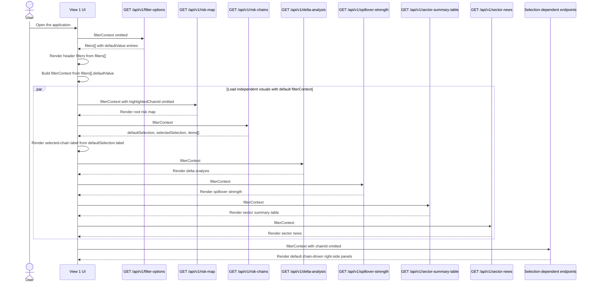
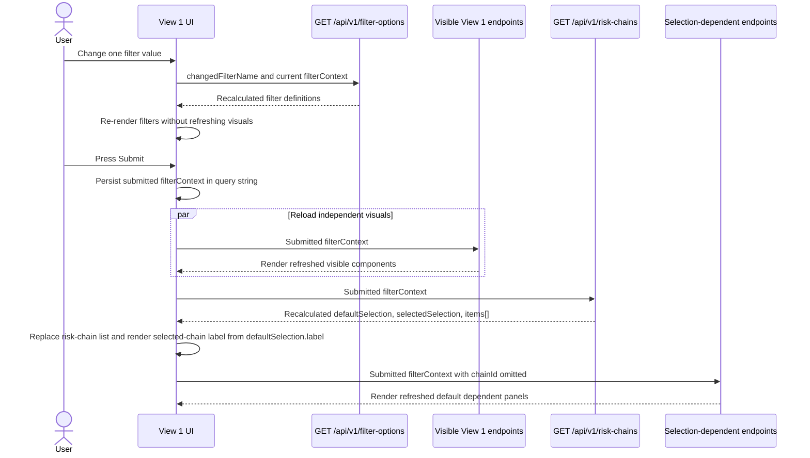
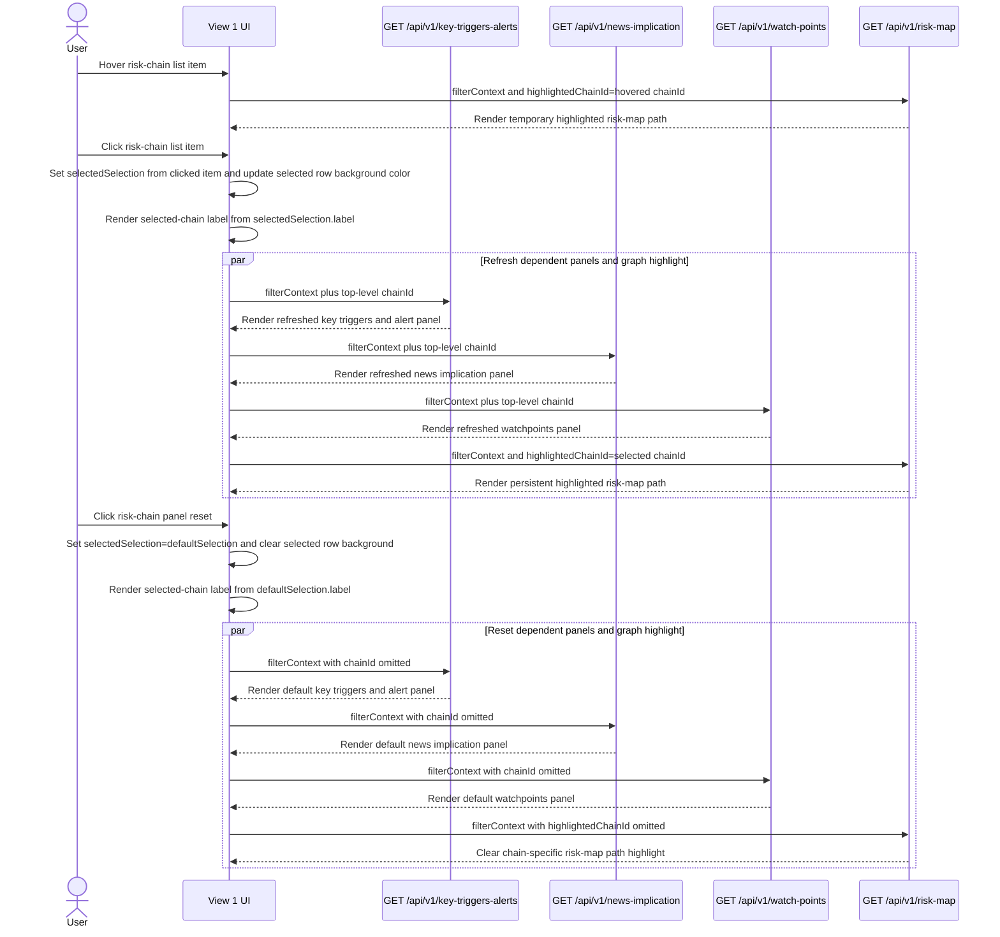
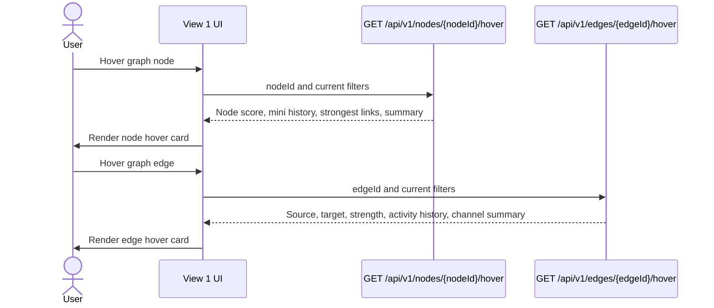
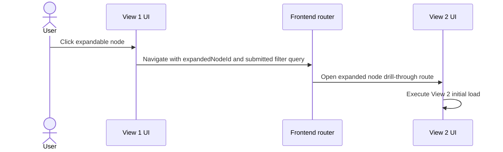
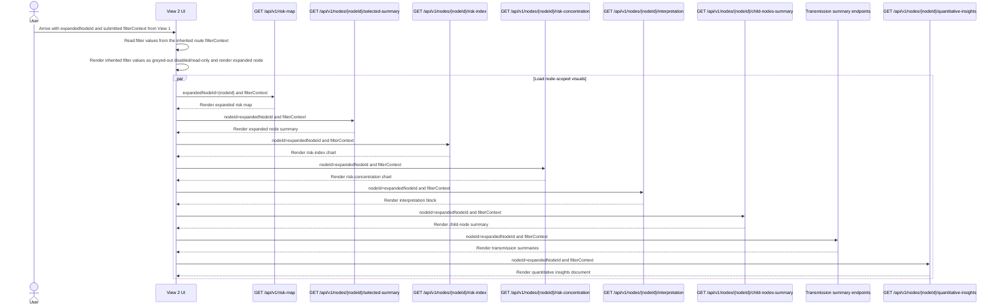
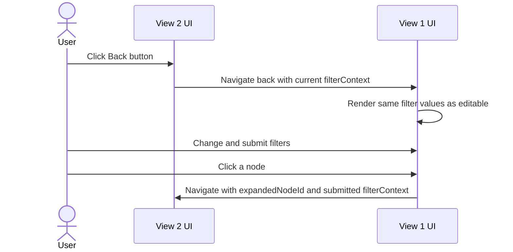
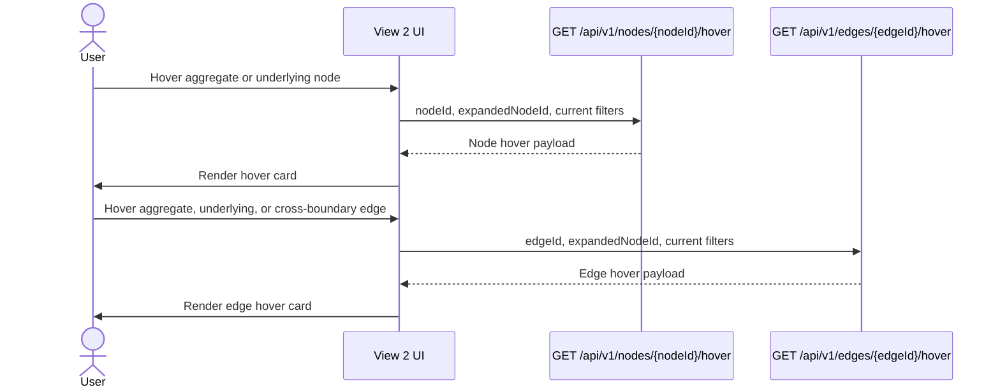
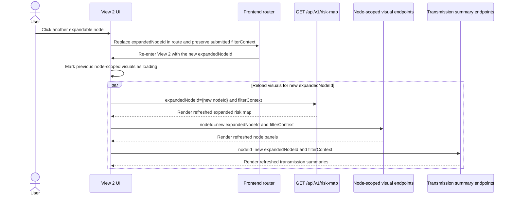

# API Architecture

Scope:
- Section `Page 1`
- Section `Page-2`
- Interaction `Initial page load`
- Interaction `Filter change and submit on Page 1`
- Interaction `Select specific risk chain for view relevant right side panel info`
- Interaction `Hover - Node`
- Interaction `Hover - Edge`
- Interaction `Click`

## 1. API design and key decision highlights

- Base path: `/api/v1`.
- Endpoint names are logical resource names, not page names or overview names.
- Root and drill-through graph states use the same `GET /api/v1/risk-map` endpoint; `expandedNodeId` selects the node whose child structure is opened.
- Drill-through support panels use generic node-scoped endpoints under `/nodes/{nodeId}` so the same contracts can support any expandable node hierarchy.
- Payload conventions follow [`charting_series_payload_best_practices.md`](../../project-level-guides/best-practices/charting_series_payload_best_practices.md): `multi_columnar_time_series` for time-indexed charts, `categorical_partition_chart` for partition charts, `metric_table` for extensible analytical tables, and JSON-native objects for alerts, news, narratives, and fixed records.
- Chart fields use a `Chart` suffix and table fields use a `Table` suffix.
- `Comp.ID:SRM.P02.quantitative-insights` is provisional; see its endpoint section for the confirmation scope.
- Visible frontend components are loaded through dedicated async endpoints.
- Missing directional values are returned as `null`, not coerced to `0`.
- Risk-chain selection is an endpoint-specific interaction selector, not a shared filter. `chainId` and `highlightedChainId` stay outside `filterContext`.

### 1.1. FastAPI best-practice alignment

This handoff follows the project guidance in [fastapi_best_practices.md](../../project-level-guides/best-practices/fastapi_best_practices.md), [fastapi_api_naming_conventions.md](../../project-level-guides/best-practices/fastapi_api_naming_conventions.md), [fastapi_dashboard_query_parameter_best_practices.md](../../project-level-guides/best-practices/fastapi_dashboard_query_parameter_best_practices.md), and [charting_series_payload_best_practices.md](../../project-level-guides/best-practices/charting_series_payload_best_practices.md):

- Public JSON response fields and public query parameters use `camelCase`, for example `expandedNodeId`, `nodeId`, `filterContext`, `asOf`, `riskIndex`, `deltaWindow`, and `highlightedChainId`.
- FastAPI implementation code should still use Python `snake_case` internally, with Pydantic aliases or explicit FastAPI query aliases for the public `camelCase` API fields.
- Route paths use lowercase kebab-case resource names and avoid action verbs, for example `/risk-map`, `/sector-summary-table`, and `/nodes/{nodeId}/risk-concentration`.
- Standard dashboard reads use `GET` with explicit path parameters, endpoint-specific query parameters, and the validated dynamic `filterContext` query object; no request body is sent.

### 1.2. Field-path notation in schema tables

Output schema tables use field paths to describe the JSON response structure. Dot notation marks nested objects. Array fields are marked with `[]`. For example, `orders[].items[].quantity` means the `quantity` field of each item object inside each order object. The JSONPath equivalent is `$.orders[*].items[*].quantity`.

Schema tables include parent collector rows for nested objects and arrays before their child fields. This keeps both the envelope and the leaf fields visible.

Example:

| Field path | JSON/OpenAPI data type | Required | Description |
| --- | --- | --- | --- |
| `orders[]` | `object[]` | yes | List of orders. |
| `orders[].id` | `string` | yes | ID of each order. |
| `orders[].items[]` | `object[]` | yes | List of items in each order. |
| `orders[].items[].quantity` | `integer` | yes | Quantity of each item. |

## 2. Common request headers

Use these headers for every endpoint in this handoff.

| Header | Required | Notes |
|---|---|---|
| `Authorization` | yes | `Bearer <access_token>` issued by the identity provider. |
| `Accept` | yes | Must be `application/json`. |
| `X-Request-Id` | no | Client-generated request correlation identifier. If omitted, the backend generates one. |

Do not send `Content-Type: application/json` for `GET` endpoints with no body.

Unless an endpoint states otherwise, every endpoint in this handoff uses the common authenticated headers, requires `systemic-risk:read`, has no request body, and returns HTTP `200` with `application/json`.

### Authentication and authorization - **To be discussed with the front-end team and IT department**

- Authentication uses OAuth2/OIDC access tokens.
- The frontend sends the access token in the `Authorization` header.
- The API validates token signature, issuer, audience, expiration, and required scopes or roles.
- The default required scope for this handoff is `systemic-risk:read`.
- Missing, expired, malformed, or invalid tokens return `401`.
- Valid tokens without the required role or scope return `403`.
- User roles should be resolved from token claims and checked by reusable FastAPI dependencies.

### Dynamic shared filter query contract

`GET /api/v1/filter-options` is the runtime source of valid shared filter keys for all visual and interaction endpoints.

Frontend request construction:
- Render controls by iterating `filters[]`.
- Build `filterContext` by iterating the same `filters[]`.
- Use `filters[].filterName` as the `filterContext` key.
- Use `filters[].selectedValue` when it is present; otherwise use `filters[].defaultValue`.
- Submit `filterContext` as a namespaced deep-object query parameter.
- Keep endpoint-specific parameters outside `filterContext`.

Generic request shape:

```text
GET /api/v1/<resource>?filterContext[<filterName>]=<selected-or-default-value>&<endpointSpecificKey>=<value>
```

Example request shape:

```text
GET /api/v1/risk-map?filterContext[asOf]=2026-04-18&filterContext[riskIndex]=systemic-risk-score&highlightedChainId=chain-energy-huf-cpi
```

Backend validation:
- Reject unknown `filterContext` keys that are not known filter names from the filter-options registry.
- Reject values that are not allowed for the current filter context.
- Treat endpoint-specific parameters separately from shared filters, even if names are similar.
- Return validation errors using the shared minimal error contract.

### Filter metadata endpoint

<a id="endpoint-get-api-v1-filter-options"></a>
`GET /api/v1/filter-options`

Purpose:
- Populate all header filters before visible components are loaded.
- Return backend-approved per-filter `defaultValue` entries for first render.
- Recalculate available filter options when one filter changes.
- Keep future filters backend-driven without adding page-bound endpoint variants.

Request modes:
- Initial page load: send no query parameters. The backend returns the full header filter set; each filter includes `defaultValue`.
- Filter change refresh: send `changedFilterName` and the current dynamic `filterContext` using deep-object query parameters. The backend returns the full filter set again, with `selectedValue` reflecting the supplied context, `defaultValue` carrying the backend-selected default for that refreshed filter set, and available values recalculated where needed.
- Both modes are `GET` requests with no request body.

Input schema:

| Location | Name | JSON/OpenAPI data type | Value format / semantic meaning | Required | Allowed values / format examples | Description |
| --- | --- | --- | --- | --- | --- | --- |
| query | `changedFilterName` | `string` | backend-defined filter key | no | backend-defined filter keys; examples: `asOf`, `riskIndex`, `regionScope` | Filter that triggered a metadata refresh. Omitted on initial page load. |
| query | `filterContext` | `object` | deepObject query object | no | object built from returned `filters[]`; example keys: `asOf`, `riskIndex`, `regionScope` | Current filter values known by the frontend. Empty or omitted on initial page load. |
| query | `filterContext.<filterName>` | `string` | backend-defined filter value | no | value examples depend on `filters[].availableValues[]`; example: `filterContext[asOf]=2026-04-18` | Dynamic key-value pair where the key equals `filters[].filterName` and the value equals the current selected or default filter value. |

Output schema:

| Field path | JSON/OpenAPI data type | Required | Allowed values / format examples | Description |
| --- | --- | --- | --- | --- |
| `filters[]` | `object[]` | yes | array of filter definition objects | Filter definitions to render in the shared filter header. |
| `filters[].filterName` | `string` | yes | backend-defined filter keys; examples: `asOf`, `riskIndex`, `regionScope` | Filter name to render and the key the frontend sends under `filterContext`. |
| `filters[].label` | `string` | yes | free text; example: `Energy markets` | Human-readable filter label. |
| `filters[].availableValues[]` | `object[]` | yes | array of value-label objects | Available values for this filter. |
| `filters[].availableValues[].value` | `string` | yes | backend-defined values; examples depend on `filters[].filterName` | Machine value submitted to endpoints. |
| `filters[].availableValues[].label` | `string` | yes | free text; example: `Energy markets` | Display label shown in the control. |
| `filters[].defaultValue` | `string` | yes | backend-defined values; examples depend on `filters[].filterName` | Backend-selected default and the single source of default filter state. |
| `filters[].selectedValue` | `string or null` | yes | backend-defined values or `null`; examples depend on `filters[].filterName` | Selected value after applying `filterContext`; on cold load it normally equals `defaultValue`. |
| `filters[].proposedFilterObjectType` | `string` | yes | backend-defined control types; examples: `drop_down`, `date_picker`, `list` | Frontend control type proposed by the backend. |
| `filters[].isRequired` | `boolean` | yes | `true`, `false` | Whether the visual endpoints require this filter. |

Example request: [filter-options.request.json](#appendix-filter-options-request-json)
Example response: [filter-options.response.json](#appendix-filter-options-response-json)
Filter-change example request: [filter-options-filter-change.request.json](#appendix-filter-options-filter-change-request-json)

## 3. View component mapping

### 3.1. Page 1 - Aggregate Risk Map


#### Request execution flow

##### **Initial Page Load**



Diagram endpoint links:
- [`GET /api/v1/filter-options`](#endpoint-get-api-v1-filter-options)
- [`GET /api/v1/risk-map`](#endpoint-get-api-v1-risk-map)
- [`GET /api/v1/risk-chains`](#endpoint-get-api-v1-risk-chains)
- [`GET /api/v1/delta-analysis`](#endpoint-get-api-v1-delta-analysis)
- [`GET /api/v1/spillover-strength`](#endpoint-get-api-v1-spillover-strength)
- [`GET /api/v1/sector-summary-table`](#endpoint-get-api-v1-sector-summary-table)
- [`GET /api/v1/sector-news`](#endpoint-get-api-v1-sector-news)
- [`GET /api/v1/key-triggers-alerts`](#endpoint-get-api-v1-key-triggers-alerts)
- [`GET /api/v1/news-implication`](#endpoint-get-api-v1-news-implication)
- [`GET /api/v1/watch-points`](#endpoint-get-api-v1-watch-points)

Grouped endpoint contents for this diagram:
- `Selection-dependent endpoints`: [`GET /api/v1/key-triggers-alerts`](#endpoint-get-api-v1-key-triggers-alerts), [`GET /api/v1/news-implication`](#endpoint-get-api-v1-news-implication), [`GET /api/v1/watch-points`](#endpoint-get-api-v1-watch-points).

Interaction notes:
- On initial load, render the selected-chain label from `RiskChainsResponse.defaultSelection.label`; omit `chainId` and `highlightedChainId` for default non-chain-specific content.

##### **View 1 Filter Change and Submit**



Diagram endpoint links:
- [`GET /api/v1/filter-options`](#endpoint-get-api-v1-filter-options)
- [`GET /api/v1/key-triggers-alerts`](#endpoint-get-api-v1-key-triggers-alerts)
- [`GET /api/v1/news-implication`](#endpoint-get-api-v1-news-implication)
- [`GET /api/v1/watch-points`](#endpoint-get-api-v1-watch-points)
- [`GET /api/v1/risk-map`](#endpoint-get-api-v1-risk-map)
- [`GET /api/v1/risk-chains`](#endpoint-get-api-v1-risk-chains)
- [`GET /api/v1/delta-analysis`](#endpoint-get-api-v1-delta-analysis)
- [`GET /api/v1/spillover-strength`](#endpoint-get-api-v1-spillover-strength)
- [`GET /api/v1/sector-summary-table`](#endpoint-get-api-v1-sector-summary-table)
- [`GET /api/v1/sector-news`](#endpoint-get-api-v1-sector-news)
- [`GET /api/v1/hu-macro-transmission-impact`](#endpoint-get-api-v1-hu-macro-transmission-impact)

Grouped endpoint contents for this diagram:
- `Visible View 1 endpoints`: [`GET /api/v1/risk-map`](#endpoint-get-api-v1-risk-map), [`GET /api/v1/delta-analysis`](#endpoint-get-api-v1-delta-analysis), [`GET /api/v1/spillover-strength`](#endpoint-get-api-v1-spillover-strength), [`GET /api/v1/sector-summary-table`](#endpoint-get-api-v1-sector-summary-table), [`GET /api/v1/sector-news`](#endpoint-get-api-v1-sector-news), [`GET /api/v1/hu-macro-transmission-impact`](#endpoint-get-api-v1-hu-macro-transmission-impact).
- `Selection-dependent endpoints`: [`GET /api/v1/key-triggers-alerts`](#endpoint-get-api-v1-key-triggers-alerts), [`GET /api/v1/news-implication`](#endpoint-get-api-v1-news-implication), [`GET /api/v1/watch-points`](#endpoint-get-api-v1-watch-points).

Interaction notes:
- Filter changes only refresh filter definitions until the user presses `Submit`.
- On `Submit`, discard any previously clicked risk-chain list selection, reissue `GET /api/v1/risk-chains` with the submitted `filterContext`, and render the selected-chain label from the recalculated `defaultSelection.label`.
- On `Submit`, chain-dependent panels omit `chainId`; this resets them to backend default non-chain-specific content.

##### **Risk Chain List Hover, Selection, and Reset**



Diagram endpoint links:
- [`GET /api/v1/key-triggers-alerts`](#endpoint-get-api-v1-key-triggers-alerts)
- [`GET /api/v1/news-implication`](#endpoint-get-api-v1-news-implication)
- [`GET /api/v1/watch-points`](#endpoint-get-api-v1-watch-points)
- [`GET /api/v1/risk-map`](#endpoint-get-api-v1-risk-map)

Interaction notes:
- Hover and click both call `GET /api/v1/risk-map` with `highlightedChainId=<chainId>`; hover highlight is temporary, click highlight is persistent until reset or another selection.
- Click refreshes only the chain-dependent panels and graph highlight. Summary tables and unrelated panels do not reload.
- Reset restores `selectedSelection=defaultSelection`, clears the selected row, renders the selected-chain label from `defaultSelection.label`, omits `chainId` for dependent panels, and omits `highlightedChainId` for the graph.

##### **Node and Edge Hover**



Diagram endpoint links:
- [`GET /api/v1/nodes/{nodeId}/hover`](#endpoint-get-api-v1-nodes-nodeid-hover)
- [`GET /api/v1/edges/{edgeId}/hover`](#endpoint-get-api-v1-edges-edgeid-hover)

Interaction notes:
- No dedicated edge-click endpoint is defined in this handoff for either view. Edge click is reserved for a future edge drill-through contract.

##### **Expandable Node Click**



Diagram endpoint links:
- No click-specific endpoint is required. After navigation, the frontend executes the View 2 initial expanded node drill-through load, whose endpoint links are listed in that diagram.

Interaction notes:
- Enable this click only when the graph node has `nodes[].isExpandable=true`.
- The frontend navigates with `expandedNodeId` and the current submitted `filterContext`; the View 2 load then recalculates the graph and node-scoped visuals through their normal endpoints.

#### Component to endpoint mapping

| Mockup component id | UI block | Endpoint | Response schema |
|---|---|---|---|
| `Comp.ID:SRM.P01.risk-map-agr` | Aggregate systemic risk graph | [`GET /api/v1/risk-map`](#endpoint-get-api-v1-risk-map) | `RiskMapResponse` |
| `Comp.ID:SRM.P01.risk-map-agr.node.hover` | Aggregate node hover card | [`GET /api/v1/nodes/{nodeId}/hover`](#endpoint-get-api-v1-nodes-nodeid-hover) | `NodeHoverResponse` |
| `Comp.ID:SRM.P01.risk-map-agr.edge-agr-agr.hover` | Aggregate-to-aggregate edge hover card | [`GET /api/v1/edges/{edgeId}/hover`](#endpoint-get-api-v1-edges-edgeid-hover) | `EdgeHoverResponse` |
| `Comp.ID:SRM.P01.risk-chains` | Clickable risk-chain list with selected-row state | [`GET /api/v1/risk-chains`](#endpoint-get-api-v1-risk-chains) | `RiskChainsResponse` |
| `Comp.ID:SRM.P01.selected-chain` | Selected-chain label above the chain-dependent right-side panels | [`GET /api/v1/risk-chains`](#endpoint-get-api-v1-risk-chains) | Initial and reset state from `RiskChainsResponse.defaultSelection`; click state from `RiskChainsResponse.selectedSelection` updated by the selected risk-chain list item |
| `Comp.ID:SRM.P01.key-triggers-alerts` | Key triggers and alert panel | [`GET /api/v1/key-triggers-alerts`](#endpoint-get-api-v1-key-triggers-alerts) | `KeyTriggersAlertsResponse` |
| `Comp.ID:SRM.P01.News-Implication` | News implication block | [`GET /api/v1/news-implication`](#endpoint-get-api-v1-news-implication) | `NewsImplicationResponse` |
| `Comp.ID:SRM.P01.watch-points` | Watchpoints block | [`GET /api/v1/watch-points`](#endpoint-get-api-v1-watch-points) | `WatchPointsResponse` |
| `Comp.ID:SRM.P01.Delta-analysis` | Delta analysis table | [`GET /api/v1/delta-analysis`](#endpoint-get-api-v1-delta-analysis) | `DeltaAnalysisResponse` |
| `Comp.ID:SRM.P01.spillover-strenght` | Spillover strength table | [`GET /api/v1/spillover-strength`](#endpoint-get-api-v1-spillover-strength) | `SpilloverStrengthResponse` |
| `Comp.ID:SRM.P01.sector-summary-table` | Sector summary table | [`GET /api/v1/sector-summary-table`](#endpoint-get-api-v1-sector-summary-table) | `SectorSummaryTableResponse` |
| `Comp.ID:SRM.P01.sector-summary-table.sector-news` | Short sector news summary | [`GET /api/v1/sector-news`](#endpoint-get-api-v1-sector-news) | `SectorNewsResponse` |
| `Comp.ID:SRM.P01.sector-summary-table.hu-macro-transmission-impact` | Hungarian macro transmission impact block | [`GET /api/v1/hu-macro-transmission-impact`](#endpoint-get-api-v1-hu-macro-transmission-impact) | `HuMacroTransmissionImpactResponse` |

#### View component endpoints

<a id="endpoint-get-api-v1-risk-map"></a>
`GET /api/v1/risk-map`

Usage modes:
- Root graph mode: omit `expandedNodeId`. The endpoint renders the Page 1 aggregate graph; `expandedNode` and `clusterBoundary` are `null`.
- Expanded-node mode: send `expandedNodeId=<nodeId>`. The endpoint renders the Page 2 graph by replacing the selected node with its child structure. Page 2 panel endpoints receive the same selected node as their `{nodeId}` path parameter.
- Highlighted-chain mode: send `highlightedChainId=<chainId>` for either a risk-chain list hover or click. The backend resolves the highlighted path and returns it under `highlightedChain.nodeIds[]` and `highlightedChain.edgeIds[]`. Omit `highlightedChainId` for no chain-specific graph highlight.

Input schema:

| Location | Name | JSON/OpenAPI data type | Value format / semantic meaning | Required | Allowed values / format examples | Description |
| --- | --- | --- | --- | --- | --- | --- |
| query | `filterContext` | `object` | deepObject query object | yes | see Section 2 dynamic shared filter contract | Shared filter values submitted to this endpoint. |
| query | `filterContext.<filterName>` | `string` | backend-defined filter value | yes | value examples depend on `filters[].availableValues[]` | Dynamic filter key-value pair; see Section 2. |
| query | `highlightedChainId` | `string` | opaque id | no | backend-defined values; example: `chain-energy-huf-cpi` | Optional real risk-chain ID whose path should be highlighted in the graph. Used by both risk-chain list hover and click. Omit for no chain-specific highlight. |
| query | `expandedNodeId` | `string or null` | opaque id | no | opaque backend id; example: `agg-energy`, or `null` | Optional node to expand into its child structure. Omit or send `null` for the root graph. |

Output schema:

| Field path | JSON/OpenAPI data type | Required | Allowed values / format examples | Description |
| --- | --- | --- | --- | --- |
| `snapshot` | `object` | yes | object | Snapshot metadata for the graph response. |
| `snapshot.asOf` | `string` | yes | date example: `2026-06-10` | Snapshot date rendered by the graph. |
| `expandedNode` | `object or null` | yes | object or `null` | Expanded node context. `null` means the root graph is rendered. |
| `expandedNode.nodeId` | `string` | no | opaque backend id; example: `agg-energy` | Expanded node identifier when an expansion is active. |
| `expandedNode.label` | `string` | no | free text; example: `Energy markets` | Expanded node display label. |
| `expandedNode.nodeType` | `string` | no | backend-defined values; examples: `aggregate`, `underlying` | Expanded node category. |
| `nodes[]` | `object[]` | yes | array of graph node objects | Graph nodes to render. |
| `nodes[].nodeId` | `string` | yes | opaque backend id; example: `und-ttf-gas` | Graph node identifier. |
| `nodes[].nodeType` | `string` | yes | backend-defined values; examples: `aggregate`, `underlying` | Node category. |
| `nodes[].parentNodeId` | `string or null` | yes | opaque backend id; example: `agg-energy`, or `null` | Parent node for child nodes. `null` for root-level nodes. |
| `nodes[].label` | `string` | yes | free text; example: `Energy markets` | Display label. |
| `nodes[].riskScore` | `number` | yes | 0-1 double | Current normalized risk score. |
| `nodes[].riskState` | `string` | yes | `low`, `watch`, `elevated`, `critical` | UI risk state. |
| `nodes[].delta` | `object` | yes | object | Movement metadata for this node. |
| `nodes[].delta.value` | `number or null` | yes | double or `null` | Movement versus `deltaWindow`. |
| `nodes[].delta.direction` | `string` | yes | `up`, `down`, `flat`, `not_available` | Direction shown by the UI. |
| `nodes[].isHoverable` | `boolean` | yes | `true`, `false` | Whether node hover should be enabled. |
| `nodes[].isExpandable` | `boolean` | yes | `true`, `false` | Whether the node can be used as the root of the Page 2 expanded-node drill-through view. This means navigation and full graph redraw, not in-place graph expansion. |
| `nodes[].isInsideExpandedCluster` | `boolean` | yes | `true`, `false` | Whether the node belongs to the currently expanded node structure. |
| `nodes[].availableNodeViews[]` | `string` | no | backend-defined values; examples: `risk-map`, `selected-summary`, `risk-index`, `risk-concentration`, `interpretation`, `child-nodes-summary`, `transmission-summary`, `quantitative-insights`, `hover` | Backend-declared node capabilities. The UI uses this list to decide which node panels are meaningful for the selected node, such as showing drill-through-related panels when the relevant view codes are present. |
| `edges[]` | `object[]` | yes | array of graph edge objects | Graph edges to render. |
| `edges[].edgeId` | `string` | yes | opaque backend id; example: `edge-ttf-huf` | Edge identifier. |
| `edges[].sourceNodeId` | `string` | yes | opaque backend id; example: `edge-ttf-huf` | Source node. |
| `edges[].targetNodeId` | `string` | yes | opaque backend id; example: `edge-ttf-huf` | Target node. |
| `edges[].edgeScope` | `string` | yes | backend-defined values; examples: `aggregate_to_aggregate`, `underlying_to_aggregate` | Relationship scope. |
| `edges[].strength` | `number or null` | yes | 0-1 double or `null` | Transmission strength. |
| `edges[].delta` | `object` | yes | object | Movement metadata for this edge. |
| `edges[].delta.direction` | `string` | yes | `up`, `down`, `flat`, `not_available` | Strength movement. |
| `edges[].isHoverable` | `boolean` | yes | `true`, `false` | Whether edge hover should be enabled. |
| `highlightedChain` | `object` | yes | object | Chain highlight metadata for the graph. |
| `highlightedChain.chainId` | `string or null` | yes | backend-defined values; example: `chain-energy-huf-cpi`, or `null` | Chain path highlighted in the graph. `null` means no chain-specific path highlight. |
| `highlightedChain.nodeIds[]` | `string` | no | opaque backend id; example: `und-ttf-gas` | Ordered highlighted path nodes. |
| `highlightedChain.edgeIds[]` | `string` | no | opaque backend id; example: `edge-ttf-huf` | Ordered highlighted path edges. |
| `highlightedChain.style` | `string` | no | `emphasized_path`, `none` | Suggested graph highlight style. |
| `clusterBoundary` | `object or null` | yes | object or `null` | Visual grouping hint for the child nodes of the current expanded node. The UI may use it to draw a boundary, background, hull, or label around the child-node group on View 2. `null` for the root graph. |
| `clusterBoundary.nodeId` | `string` | no | opaque backend id; example: `agg-energy` | Expanded node whose child group should be visually bounded. |
| `clusterBoundary.label` | `string` | no | free text; example: `Energy markets` | Boundary label to show near or inside the visual grouping, if the graph design supports it. |

UI usage notes:
- Use `nodes[].isExpandable=true` to enable Page 2 drill-through navigation and full graph redraw with `expandedNodeId=<nodeId>`.
- Use `nodes[].availableNodeViews[]` as the capability list for node-specific panels. For example, `risk-index` or `child-nodes-summary` tells the UI those panels are meaningful for the selected node.
- Use `clusterBoundary` only as a visual grouping hint on the graph canvas. It does not define a separate data filter or endpoint; it tells the UI which expanded node's child group may be visually enclosed or labeled.

Example request: [risk-map.request.json](#appendix-risk-map-request-json)
Example response: [risk-map.response.json](#appendix-risk-map-response-json)

<a id="endpoint-get-api-v1-risk-chains"></a>
`GET /api/v1/risk-chains`

Input schema:

| Location | Name | JSON/OpenAPI data type | Value format / semantic meaning | Required | Allowed values / format examples | Description |
| --- | --- | --- | --- | --- | --- | --- |
| query | `filterContext` | `object` | deepObject query object | yes | see Section 2 dynamic shared filter contract | Shared filter values submitted to this endpoint. |
| query | `filterContext.<filterName>` | `string` | backend-defined filter value | yes | value examples depend on `filters[].availableValues[]` | Dynamic filter key-value pair; see Section 2. |

Output schema:

| Field path | JSON/OpenAPI data type | Required | Allowed values / format examples | Description |
| --- | --- | --- | --- | --- |
| `defaultSelection` | `object` | yes | object | Default non-chain-specific selection state. |
| `defaultSelection.chainId` | `string or null` | yes | `null` | Default selection chain ID. `null` means the default non-chain-specific view; no pseudo chain ID is used. |
| `defaultSelection.label` | `string` | yes | free text; example: `Global` | Label shown above the chain-dependent right-side panels after initial load and reset. |
| `selectedSelection` | `object` | yes | object | Current chain selection state. |
| `selectedSelection.chainId` | `string or null` | yes | backend-defined values; example: `chain-energy-huf-cpi`, or `null` | Current selected real chain ID. `null` means the default non-chain-specific view. |
| `selectedSelection.label` | `string` | yes | free text; examples: `Global`, `Energy markets` | Label shown above the chain-dependent right-side panels. |
| `items[]` | `object[]` | yes | array of risk-chain objects | Risk-chain list items. |
| `items[].chainId` | `string` | yes | backend-defined values; example: `chain-energy-huf-cpi` | Risk chain identifier. |
| `items[].rank` | `integer` | yes | positive integer example: `1` | Priority order. |
| `items[].label` | `string` | yes | free text; example: `Energy markets` | Chain label such as `Agg1 -> Agg3 -> Agg5`. |
| `items[].strength` | `number` | yes | 0-1 double | Overall chain strength. |
| `items[].dominantDirection` | `string` | yes | `outgoing`, `incoming`, `mixed` | Dominant transmission direction. |
| `items[].isSelected` | `boolean` | yes | `true`, `false` | Whether the list item should use the selected background. On initial load, filter submit, and reset, every chain list item is `false` because the default state is selected outside the list. |

Example request: [risk-chains.request.json](#appendix-risk-chains-request-json)
Example response: [risk-chains.response.json](#appendix-risk-chains-response-json)

<a id="endpoint-get-api-v1-key-triggers-alerts"></a>
`GET /api/v1/key-triggers-alerts`

Input schema:

| Location | Name | JSON/OpenAPI data type | Value format / semantic meaning | Required | Allowed values / format examples | Description |
| --- | --- | --- | --- | --- | --- | --- |
| query | `filterContext` | `object` | deepObject query object | yes | see Section 2 dynamic shared filter contract | Shared filter values submitted to this endpoint. |
| query | `filterContext.<filterName>` | `string` | backend-defined filter value | yes | value examples depend on `filters[].availableValues[]` | Dynamic filter key-value pair; see Section 2. |
| query | `chainId` | `string` | opaque id | no | backend-defined values; example: `chain-energy-huf-cpi` | Selected real risk chain. Omit for the backend default non-chain-specific view. |

Output schema:

| Field path | JSON/OpenAPI data type | Required | Allowed values / format examples | Description |
| --- | --- | --- | --- | --- |
| `items[]` | `object[]` | yes | array of objects | Quantitative trigger records. Each item is one statistical or numerical trigger that raised an alert. |
| `items[].triggerId` | `string` | yes | opaque backend id; example: `trigger-energy-volatility-threshold` | Stable trigger identifier. |
| `items[].triggerChart` | `object` | yes | `multi_columnar_time_series` chart payload | Line chart showing the trigger metric time series. |
| `items[].triggerChart.format` | `string` | yes | `multi_columnar_time_series` | Chart payload format used for the trigger line chart. |
| `items[].triggerChart.version` | `string` | yes | semantic version example: `1.0` | Time-series chart payload contract version. |
| `items[].triggerChart.chart` | `object` | yes | object | Chart display metadata. |
| `items[].triggerChart.chart.title` | `string` | yes | free text; example: `Energy volatility trigger path` | Display title for the trigger chart. |
| `items[].triggerChart.chart.xAxis` | `object` | yes | object | X-axis display metadata. |
| `items[].triggerChart.chart.xAxis.label` | `string` | yes | free text; example: `Date` | Display label for the x-axis. |
| `items[].triggerChart.chart.xAxis.type` | `string` | yes | `date` | X-axis value type. |
| `items[].triggerChart.chart.yAxis` | `object` | yes | object | Y-axis display metadata. |
| `items[].triggerChart.chart.yAxis.label` | `string` | yes | free text; example: `Volatility z-score` | Display label for the y-axis. |
| `items[].triggerChart.series[]` | `object[]` | yes | array of time-series objects | Plotted trigger series. |
| `items[].triggerChart.series[].id` | `string` | yes | stable metric id; example: `energy_volatility_z_score` | Stable machine-readable series identifier. |
| `items[].triggerChart.series[].name` | `string` | yes | free text; example: `Energy volatility z-score` | Human-readable plotted metric name. |
| `items[].triggerChart.series[].unit` | `string` | yes | backend-defined values; examples: `z_score`, `score`, `ratio`, `percent` | Semantic unit or scale of the plotted trigger metric. |
| `items[].triggerChart.series[].dataType` | `string` | yes | `number`, `integer` | Series value type. |
| `items[].triggerChart.series[].index` | `object` | yes | object | Time index for this specific series. |
| `items[].triggerChart.series[].index.name` | `string` | yes | `date` | Time index name for this specific series. |
| `items[].triggerChart.series[].index.dataType` | `string` | yes | `date` | Time index value type for this specific series. |
| `items[].triggerChart.series[].index.values[]` | `string` | yes | date example: `2026-06-10` | Trigger metric observation dates, ordered by `items[].triggerChart.meta.order`. |
| `items[].triggerChart.series[].values[]` | `number or null` | yes | double or `null` | Trigger metric values aligned by position with `items[].triggerChart.series[].index.values[]`. |
| `items[].triggerChart.series[].valueFormat` | `string` | yes | format examples: `0.00`, `0%` | Suggested frontend display format for trigger metric values. |
| `items[].triggerChart.series[].chartType` | `string` | yes | `line` | Rendering hint for this trigger metric series. |
| `items[].triggerChart.series[].axis` | `string` | yes | `left`, `right` | Target y-axis for this series. |
| `items[].triggerChart.meta` | `object` | yes | object | Chart-level metadata. |
| `items[].triggerChart.meta.order` | `string` | yes | `ascending`, `descending` | Sort order of the index values within each series. |
| `items[].triggerChart.meta.missingValuePolicy` | `string` | yes | `gap` | How missing `null` values should be rendered. |
| `items[].eventDate` | `string` | yes | date example: `2026-04-18` | Date when the quantitative trigger condition fired, such as crossing a threshold or breaching a volatility rule. |
| `items[].eventValue` | `number` | yes | double | Trigger metric value on `eventDate`. This should match the primary plotted series value for the same date. |
| `items[].summary` | `string` | yes | free text; example: `Energy volatility crossed the alert threshold.` | Textual explanation of the quantitative trigger and why it raised an alert. |

Example request: [key-triggers-alerts.request.json](#appendix-key-triggers-alerts-request-json)
Example response: [key-triggers-alerts.response.json](#appendix-key-triggers-alerts-response-json)

<a id="endpoint-get-api-v1-news-implication"></a>
`GET /api/v1/news-implication`

Input schema:

| Location | Name | JSON/OpenAPI data type | Value format / semantic meaning | Required | Allowed values / format examples | Description |
| --- | --- | --- | --- | --- | --- | --- |
| query | `filterContext` | `object` | deepObject query object | yes | see Section 2 dynamic shared filter contract | Shared filter values submitted to this endpoint. |
| query | `filterContext.<filterName>` | `string` | backend-defined filter value | yes | value examples depend on `filters[].availableValues[]` | Dynamic filter key-value pair; see Section 2. |
| query | `chainId` | `string` | opaque id | no | backend-defined values; example: `chain-energy-huf-cpi` | Selected real risk chain. Omit for the backend default non-chain-specific view. |

Output schema:

| Field path | JSON/OpenAPI data type | Required | Allowed values / format examples | Description |
| --- | --- | --- | --- | --- |
| `items[]` | `object[]` | yes | array of news implication objects | News implication records. |
| `items[].itemId` | `string` | yes | opaque backend id; example: `news-energy-001` | Narrative item identifier. |
| `items[].headline` | `string` | yes | free text; example: `Energy volatility rises` | Short news headline or topic. |
| `items[].summary` | `string` | yes | free text; example: `Short narrative summary.` | Concise news summary. |
| `items[].implication` | `string` | yes | free text; example: `Risk transmission may strengthen.` | Risk implication for the selected chain. |
| `items[].severity` | `string` | yes | `info`, `watch`, `elevated`, `critical` | Narrative severity. |
| `items[].sourceDate` | `string or null` | yes | date example: `2026-06-10`, or `null` | Source date when available. |

Example request: [news-implication.request.json](#appendix-news-implication-request-json)
Example response: [news-implication.response.json](#appendix-news-implication-response-json)

<a id="endpoint-get-api-v1-watch-points"></a>
`GET /api/v1/watch-points`

Input schema:

| Location | Name | JSON/OpenAPI data type | Value format / semantic meaning | Required | Allowed values / format examples | Description |
| --- | --- | --- | --- | --- | --- | --- |
| query | `filterContext` | `object` | deepObject query object | yes | see Section 2 dynamic shared filter contract | Shared filter values submitted to this endpoint. |
| query | `filterContext.<filterName>` | `string` | backend-defined filter value | yes | value examples depend on `filters[].availableValues[]` | Dynamic filter key-value pair; see Section 2. |
| query | `chainId` | `string` | opaque id | no | backend-defined values; example: `chain-energy-huf-cpi` | Selected real risk chain. Omit for the backend default non-chain-specific view. |

Output schema:

| Field path | JSON/OpenAPI data type | Required | Allowed values / format examples | Description |
| --- | --- | --- | --- | --- |
| `items[]` | `object[]` | yes | array of watchpoint objects | Watchpoint records. |
| `items[].watchPointId` | `string` | yes | opaque backend id; example: `watch-huf-liquidity` | Watchpoint identifier. |
| `items[].name` | `string` | yes | free text; example: `Energy markets` | Watchpoint name. |
| `items[].relationshipToChain` | `string` | yes | free text; example: `Receives the strongest signal from energy-market stress.` | How the watchpoint relates to the selected chain. |
| `items[].whyImportant` | `string` | yes | free text; example: `Can accelerate FX stress.` | Why this point can accelerate or transform the risk. |
| `items[].monitoringFocus` | `string` | yes | free text; example: `Watch intraday liquidity depth.` | What users should monitor. |
| `items[].severity` | `string` | yes | `info`, `watch`, `elevated`, `critical` | Monitoring severity. |

Example request: [watch-points.request.json](#appendix-watch-points-request-json)
Example response: [watch-points.response.json](#appendix-watch-points-response-json)

<a id="endpoint-get-api-v1-delta-analysis"></a>
`GET /api/v1/delta-analysis`

Input schema:

| Location | Name | JSON/OpenAPI data type | Value format / semantic meaning | Required | Allowed values / format examples | Description |
| --- | --- | --- | --- | --- | --- | --- |
| query | `filterContext` | `object` | deepObject query object | yes | see Section 2 dynamic shared filter contract | Shared filter values submitted to this endpoint. |
| query | `filterContext.<filterName>` | `string` | backend-defined filter value | yes | value examples depend on `filters[].availableValues[]` | Dynamic filter key-value pair; see Section 2. |

Output schema:

| Field path | JSON/OpenAPI data type | Required | Allowed values / format examples | Description |
| --- | --- | --- | --- | --- |
| `deltaTable` | `object` | yes | `metric_table` payload | Extensible analytical table envelope. |
| `deltaTable.format` | `string` | yes | `metric_table` | Table payload format used for extensible analytical tables. |
| `deltaTable.version` | `string` | yes | semantic version example: `1.0` | Metric table payload contract version. |
| `deltaTable.table` | `object` | yes | object | Table display and identity metadata. |
| `deltaTable.table.title` | `string` | yes | free text; example: `Delta analysis` | Display title for the table. |
| `deltaTable.table.rowIdentity` | `object` | yes | object | Mapping from semantic row identity fields to `rows[].id` and `rows[].name`. |
| `deltaTable.table.rowIdentity.idField` | `string` | yes | `nodeId` | Semantic id field represented by `rows[].id`. |
| `deltaTable.table.rowIdentity.labelField` | `string` | yes | `nodeLabel` | Semantic label field represented by `rows[].name`. |
| `deltaTable.columns[]` | `object[]` | yes | array of column definition objects | Column definitions for the dynamic table. |
| `deltaTable.columns[].id` | `string` | yes | stable column ids; examples: `risk_index_value`, `delta_value`, `delta_direction`, `risk_state` | Stable machine-readable column identifier. Must match keys under `deltaTable.rows[].cells`. |
| `deltaTable.columns[].name` | `string` | yes | free text; example: `Risk index value` | Human-readable column label. |
| `deltaTable.columns[].cellType` | `string` | yes | `number`, `metric`, `metric_delta`, `category`, `rank`, `text` | Frontend rendering hint for this column. |
| `deltaTable.columns[].dataType` | `string` | yes | `string`, `number`, `integer`, `boolean` | Primary cell value type. |
| `deltaTable.columns[].unit` | `string or null` | yes | backend-defined values or `null`; examples: `score`, `state`, `null` | Semantic unit or scale for this column. |
| `deltaTable.columns[].valueFormat` | `string or null` | yes | format example: `0.00`, or `null` | Suggested frontend display format for this column. |
| `deltaTable.columns[].isSortable` | `boolean` | yes | `true`, `false` | Whether the frontend may offer sorting for this column. |
| `deltaTable.columns[].isInitiallyVisible` | `boolean` | yes | `true`, `false` | Whether the frontend should show this column on first render. |
| `deltaTable.rows[]` | `object[]` | yes | array of table row objects | Data rows for the dynamic table. |
| `deltaTable.rows[].id` | `string` | yes | opaque backend id; example: `agg-energy` | Stable row identifier. |
| `deltaTable.rows[].name` | `string` | yes | free text; example: `Energy markets` | Row display label. |
| `deltaTable.rows[].cells` | `object` | yes | object keyed by `deltaTable.columns[].id` | Dynamic cell map. Each key should match one returned column id. |
| `deltaTable.rows[].cells.<columnId>` | `object` | yes | object | Cell object for one declared column. |
| `deltaTable.rows[].cells.<columnId>.value` | `string, number, boolean, or null` | yes | value type follows `deltaTable.columns[].dataType` | Primary cell value for the matching column. |
| `deltaTable.rows[].cells.<columnId>.delta` | `object` | no | object | Optional movement metadata for metric-delta cells. |
| `deltaTable.rows[].cells.<columnId>.delta.direction` | `string` | no | `up`, `down`, `flat`, `not_available` | Optional movement direction for metric-delta cells. |
| `deltaTable.meta` | `object` | yes | object | Table-level rendering and missing-value metadata. |
| `deltaTable.meta.order` | `string` | yes | `ascending`, `descending`, `backend_defined` | Row ordering rule. |
| `deltaTable.meta.missingValuePolicy` | `string` | yes | `show_not_available` | How unavailable `null` cell values should be rendered. |

Example request: [delta-analysis.request.json](#appendix-delta-analysis-request-json)
Example response: [delta-analysis.response.json](#appendix-delta-analysis-response-json)

<a id="endpoint-get-api-v1-spillover-strength"></a>
`GET /api/v1/spillover-strength`

Input schema:

| Location | Name | JSON/OpenAPI data type | Value format / semantic meaning | Required | Allowed values / format examples | Description |
| --- | --- | --- | --- | --- | --- | --- |
| query | `filterContext` | `object` | deepObject query object | yes | see Section 2 dynamic shared filter contract | Shared filter values submitted to this endpoint. |
| query | `filterContext.<filterName>` | `string` | backend-defined filter value | yes | value examples depend on `filters[].availableValues[]` | Dynamic filter key-value pair; see Section 2. |

Output schema:

| Field path | JSON/OpenAPI data type | Required | Allowed values / format examples | Description |
| --- | --- | --- | --- | --- |
| `spilloverTable` | `object` | yes | `metric_table` payload | Extensible analytical table envelope. |
| `spilloverTable.format` | `string` | yes | `metric_table` | Table payload format used for extensible analytical tables. |
| `spilloverTable.version` | `string` | yes | semantic version example: `1.0` | Metric table payload contract version. |
| `spilloverTable.table` | `object` | yes | object | Table display and identity metadata. |
| `spilloverTable.table.title` | `string` | yes | free text; example: `Spillover strength` | Display title for the table. |
| `spilloverTable.table.rowIdentity` | `object` | yes | object | Mapping from semantic row identity fields to `rows[].id` and `rows[].name`. |
| `spilloverTable.table.rowIdentity.idField` | `string` | yes | `edgeId` | Semantic id field represented by `rows[].id`. |
| `spilloverTable.table.rowIdentity.labelField` | `string` | yes | `edgeLabel` | Semantic label field represented by `rows[].name`. |
| `spilloverTable.columns[]` | `object[]` | yes | array of column definition objects | Column definitions for the dynamic table. |
| `spilloverTable.columns[].id` | `string` | yes | stable column ids; examples: `rank`, `transmitter`, `receiver`, `strength`, `strength_delta` | Stable machine-readable column identifier. Must match keys under `spilloverTable.rows[].cells`. |
| `spilloverTable.columns[].name` | `string` | yes | free text; example: `Strength` | Human-readable column label. |
| `spilloverTable.columns[].cellType` | `string` | yes | `number`, `metric`, `metric_delta`, `category`, `rank`, `text` | Frontend rendering hint for this column. |
| `spilloverTable.columns[].dataType` | `string` | yes | `string`, `number`, `integer`, `boolean` | Primary cell value type. |
| `spilloverTable.columns[].unit` | `string or null` | yes | backend-defined values or `null`; examples: `normalized_strength`, `rank`, `null` | Semantic unit or scale for this column. |
| `spilloverTable.columns[].valueFormat` | `string or null` | yes | format example: `0.00`, or `null` | Suggested frontend display format for this column. |
| `spilloverTable.columns[].isSortable` | `boolean` | yes | `true`, `false` | Whether the frontend may offer sorting for this column. |
| `spilloverTable.columns[].isInitiallyVisible` | `boolean` | yes | `true`, `false` | Whether the frontend should show this column on first render. |
| `spilloverTable.rows[]` | `object[]` | yes | array of table row objects | Data rows for the dynamic table. |
| `spilloverTable.rows[].id` | `string` | yes | opaque backend id; example: `edge-ttf-huf` | Stable row identifier. |
| `spilloverTable.rows[].name` | `string` | yes | free text; example: `Energy markets -> HUF funding and FX` | Row display label. |
| `spilloverTable.rows[].cells` | `object` | yes | object keyed by `spilloverTable.columns[].id` | Dynamic cell map. Each key should match one returned column id. |
| `spilloverTable.rows[].cells.<columnId>` | `object` | yes | object | Cell object for one declared column. |
| `spilloverTable.rows[].cells.<columnId>.value` | `string, number, boolean, or null` | yes | value type follows `spilloverTable.columns[].dataType` | Primary cell value for the matching column. |
| `spilloverTable.rows[].cells.<columnId>.delta` | `object` | no | object | Optional movement metadata for metric-delta cells. |
| `spilloverTable.rows[].cells.<columnId>.delta.direction` | `string` | no | `up`, `down`, `flat`, `not_available` | Optional movement direction for metric-delta cells. |
| `spilloverTable.meta` | `object` | yes | object | Table-level rendering and missing-value metadata. |
| `spilloverTable.meta.order` | `string` | yes | `ascending`, `descending`, `backend_defined` | Row ordering rule. |
| `spilloverTable.meta.missingValuePolicy` | `string` | yes | `show_not_available` | How unavailable `null` cell values should be rendered. |

Example request: [spillover-strength.request.json](#appendix-spillover-strength-request-json)
Example response: [spillover-strength.response.json](#appendix-spillover-strength-response-json)

<a id="endpoint-get-api-v1-sector-summary-table"></a>
`GET /api/v1/sector-summary-table`

Input schema:

| Location | Name | JSON/OpenAPI data type | Value format / semantic meaning | Required | Allowed values / format examples | Description |
| --- | --- | --- | --- | --- | --- | --- |
| query | `filterContext` | `object` | deepObject query object | yes | see Section 2 dynamic shared filter contract | Shared filter values submitted to this endpoint. |
| query | `filterContext.<filterName>` | `string` | backend-defined filter value | yes | value examples depend on `filters[].availableValues[]` | Dynamic filter key-value pair; see Section 2. |

Output schema:

| Field path | JSON/OpenAPI data type | Required | Allowed values / format examples | Description |
| --- | --- | --- | --- | --- |
| `sectorSummaryTable` | `object` | yes | `metric_table` payload | Extensible analytical table envelope. |
| `sectorSummaryTable.format` | `string` | yes | `metric_table` | Table payload format used for extensible analytical tables. |
| `sectorSummaryTable.version` | `string` | yes | semantic version example: `1.0` | Metric table payload contract version. |
| `sectorSummaryTable.table` | `object` | yes | object | Table display and identity metadata. |
| `sectorSummaryTable.table.title` | `string` | yes | free text; example: `Sector summary` | Display title for the table. |
| `sectorSummaryTable.table.rowIdentity` | `object` | yes | object | Mapping from semantic row identity fields to `rows[].id` and `rows[].name`. |
| `sectorSummaryTable.table.rowIdentity.idField` | `string` | yes | `nodeId` | Semantic id field represented by `rows[].id`. |
| `sectorSummaryTable.table.rowIdentity.labelField` | `string` | yes | `nodeLabel` | Semantic label field represented by `rows[].name`. |
| `sectorSummaryTable.columns[]` | `object[]` | yes | array of column definition objects | Column definitions for the dynamic table. |
| `sectorSummaryTable.columns[].id` | `string` | yes | stable column ids; examples: `volatility_regime`, `trend_persistence`, `tail_risk` | Stable machine-readable column identifier. Must match keys under `sectorSummaryTable.rows[].cells`. |
| `sectorSummaryTable.columns[].name` | `string` | yes | free text; example: `Volatility regime` | Human-readable column label. |
| `sectorSummaryTable.columns[].cellType` | `string` | yes | `metric_delta` | Frontend rendering hint for this column. |
| `sectorSummaryTable.columns[].dataType` | `string` | yes | `number` | Primary cell value type. |
| `sectorSummaryTable.columns[].unit` | `string or null` | yes | backend-defined values; example: `score` | Semantic unit or scale for this column. |
| `sectorSummaryTable.columns[].valueFormat` | `string or null` | yes | format example: `0.00` | Suggested frontend display format for this column. |
| `sectorSummaryTable.columns[].isSortable` | `boolean` | yes | `true`, `false` | Whether the frontend may offer sorting for this column. |
| `sectorSummaryTable.columns[].isInitiallyVisible` | `boolean` | yes | `true`, `false` | Whether the frontend should show this column on first render. |
| `sectorSummaryTable.rows[]` | `object[]` | yes | array of table row objects | Data rows for the dynamic table. |
| `sectorSummaryTable.rows[].id` | `string` | yes | opaque backend id; example: `agg-energy` | Stable row identifier. |
| `sectorSummaryTable.rows[].name` | `string` | yes | free text; example: `Energy markets` | Row display label. |
| `sectorSummaryTable.rows[].cells` | `object` | yes | object keyed by `sectorSummaryTable.columns[].id` | Dynamic cell map. Each key should match one returned column id. |
| `sectorSummaryTable.rows[].cells.<columnId>` | `object` | yes | object | Cell object for one declared column. |
| `sectorSummaryTable.rows[].cells.<columnId>.value` | `number or null` | yes | 0-1 double or `null` | Primary cell value for the matching metric column. |
| `sectorSummaryTable.rows[].cells.<columnId>.delta` | `object` | yes | object | Movement metadata for this metric cell. |
| `sectorSummaryTable.rows[].cells.<columnId>.delta.direction` | `string` | yes | `up`, `down`, `flat`, `not_available` | Movement direction for this metric cell. |
| `sectorSummaryTable.meta` | `object` | yes | object | Table-level rendering and missing-value metadata. |
| `sectorSummaryTable.meta.order` | `string` | yes | `ascending`, `descending`, `backend_defined` | Row ordering rule. |
| `sectorSummaryTable.meta.missingValuePolicy` | `string` | yes | `show_not_available` | How unavailable `null` cell values should be rendered. |

Example request: [sector-summary-table.request.json](#appendix-sector-summary-table-request-json)
Example response: [sector-summary-table.response.json](#appendix-sector-summary-table-response-json)

<a id="endpoint-get-api-v1-sector-news"></a>
`GET /api/v1/sector-news`

Input schema:

| Location | Name | JSON/OpenAPI data type | Value format / semantic meaning | Required | Allowed values / format examples | Description |
| --- | --- | --- | --- | --- | --- | --- |
| query | `filterContext` | `object` | deepObject query object | yes | see Section 2 dynamic shared filter contract | Shared filter values submitted to this endpoint. |
| query | `filterContext.<filterName>` | `string` | backend-defined filter value | yes | value examples depend on `filters[].availableValues[]` | Dynamic filter key-value pair; see Section 2. |

Output schema:

| Field path | JSON/OpenAPI data type | Required | Allowed values / format examples | Description |
| --- | --- | --- | --- | --- |
| `items[]` | `object[]` | yes | array of sector news objects | Sector news summary records. |
| `items[].relatedNodeId` | `string` | yes | opaque backend id; example: `agg-energy` | Related node. |
| `items[].headline` | `string` | yes | free text; example: `Energy volatility rises` | Short topic title. |
| `items[].summary` | `string` | yes | free text; example: `Short narrative summary.` | Brief sector news summary. |
| `items[].implication` | `string` | yes | free text; example: `Risk transmission may strengthen.` | Implication for systemic risk. |
| `items[].severity` | `string` | yes | `info`, `watch`, `elevated`, `critical` | News severity. |

Example request: [sector-news.request.json](#appendix-sector-news-request-json)
Example response: [sector-news.response.json](#appendix-sector-news-response-json)

<a id="endpoint-get-api-v1-hu-macro-transmission-impact"></a>
`GET /api/v1/hu-macro-transmission-impact`

Input schema:

| Location | Name | JSON/OpenAPI data type | Value format / semantic meaning | Required | Allowed values / format examples | Description |
| --- | --- | --- | --- | --- | --- | --- |
| query | `filterContext` | `object` | deepObject query object | yes | see Section 2 dynamic shared filter contract | Shared filter values submitted to this endpoint. |
| query | `filterContext.<filterName>` | `string` | backend-defined filter value | yes | value examples depend on `filters[].availableValues[]` | Dynamic filter key-value pair; see Section 2. |
| query | `focusAggregateId` | `string` | opaque id | no | opaque backend id; example: `agg-energy` | Optional aggregate that scopes macro impact. |

Output schema:

| Field path | JSON/OpenAPI data type | Required | Allowed values / format examples | Description |
| --- | --- | --- | --- | --- |
| `macroTransmissionImpactTable` | `object` | yes | `metric_table` payload | Extensible analytical table envelope. |
| `macroTransmissionImpactTable.format` | `string` | yes | `metric_table` | Table payload format used for extensible analytical tables. |
| `macroTransmissionImpactTable.version` | `string` | yes | semantic version example: `1.0` | Metric table payload contract version. |
| `macroTransmissionImpactTable.table` | `object` | yes | object | Table display and identity metadata. |
| `macroTransmissionImpactTable.table.title` | `string` | yes | free text; example: `Hungarian macro transmission impact` | Display title for the table. |
| `macroTransmissionImpactTable.table.rowIdentity` | `object` | yes | object | Mapping from semantic row identity fields to `rows[].id` and `rows[].name`. |
| `macroTransmissionImpactTable.table.rowIdentity.idField` | `string` | yes | `targetMetric` | Semantic id field represented by `rows[].id`. |
| `macroTransmissionImpactTable.table.rowIdentity.labelField` | `string` | yes | `targetMetricLabel` | Semantic label field represented by `rows[].name`. |
| `macroTransmissionImpactTable.columns[]` | `object[]` | yes | array of column definition objects | Column definitions for the dynamic table. |
| `macroTransmissionImpactTable.columns[].id` | `string` | yes | stable column ids; examples: `direction`, `strength`, `strength_level`, `summary` | Stable machine-readable column identifier. Must match keys under `macroTransmissionImpactTable.rows[].cells`. |
| `macroTransmissionImpactTable.columns[].name` | `string` | yes | free text; example: `Strength` | Human-readable column label. |
| `macroTransmissionImpactTable.columns[].cellType` | `string` | yes | `number`, `metric`, `metric_delta`, `category`, `rank`, `text` | Frontend rendering hint for this column. |
| `macroTransmissionImpactTable.columns[].dataType` | `string` | yes | `string`, `number`, `integer`, `boolean` | Primary cell value type. |
| `macroTransmissionImpactTable.columns[].unit` | `string or null` | yes | backend-defined values or `null`; examples: `normalized_strength`, `impact_direction`, `null` | Semantic unit or scale for this column. |
| `macroTransmissionImpactTable.columns[].valueFormat` | `string or null` | yes | format example: `0.00`, or `null` | Suggested frontend display format for this column. |
| `macroTransmissionImpactTable.columns[].isSortable` | `boolean` | yes | `true`, `false` | Whether the frontend may offer sorting for this column. |
| `macroTransmissionImpactTable.columns[].isInitiallyVisible` | `boolean` | yes | `true`, `false` | Whether the frontend should show this column on first render. |
| `macroTransmissionImpactTable.rows[]` | `object[]` | yes | array of table row objects | Data rows for the dynamic table. |
| `macroTransmissionImpactTable.rows[].id` | `string` | yes | backend-defined values; examples: `hungarian_cpi`, `hungarian_gdp`, `eurhuf` | Stable row identifier. |
| `macroTransmissionImpactTable.rows[].name` | `string` | yes | free text; example: `Hungarian CPI` | Row display label. |
| `macroTransmissionImpactTable.rows[].cells` | `object` | yes | object keyed by `macroTransmissionImpactTable.columns[].id` | Dynamic cell map. Each key should match one returned column id. |
| `macroTransmissionImpactTable.rows[].cells.<columnId>` | `object` | yes | object | Cell object for one declared column. |
| `macroTransmissionImpactTable.rows[].cells.<columnId>.value` | `string, number, boolean, or null` | yes | value type follows `macroTransmissionImpactTable.columns[].dataType` | Primary cell value for the matching column. |
| `macroTransmissionImpactTable.meta` | `object` | yes | object | Table-level rendering and missing-value metadata. |
| `macroTransmissionImpactTable.meta.order` | `string` | yes | `ascending`, `descending`, `backend_defined` | Row ordering rule. |
| `macroTransmissionImpactTable.meta.missingValuePolicy` | `string` | yes | `show_not_available` | How unavailable `null` cell values should be rendered. |

Example request: [hu-macro-transmission-impact.request.json](#appendix-hu-macro-transmission-impact-request-json)
Example response: [hu-macro-transmission-impact.response.json](#appendix-hu-macro-transmission-impact-response-json)

### 3.2. Page 2 - Expanded Node Drill-Through


#### Request execution flow

##### **Initial Expanded Node Drill-Through Load**



Diagram endpoint links:
- [`GET /api/v1/risk-map`](#endpoint-get-api-v1-risk-map)
- [`GET /api/v1/nodes/{nodeId}/selected-summary`](#endpoint-get-api-v1-nodes-nodeid-selected-summary)
- [`GET /api/v1/nodes/{nodeId}/risk-index`](#endpoint-get-api-v1-nodes-nodeid-risk-index)
- [`GET /api/v1/nodes/{nodeId}/risk-concentration`](#endpoint-get-api-v1-nodes-nodeid-risk-concentration)
- [`GET /api/v1/nodes/{nodeId}/interpretation`](#endpoint-get-api-v1-nodes-nodeid-interpretation)
- [`GET /api/v1/nodes/{nodeId}/child-nodes-summary`](#endpoint-get-api-v1-nodes-nodeid-child-nodes-summary)
- [`GET /api/v1/nodes/{nodeId}/quantitative-insights`](#endpoint-get-api-v1-nodes-nodeid-quantitative-insights)
- [`GET /api/v1/nodes/{nodeId}/internal-transmission-summary`](#endpoint-get-api-v1-nodes-nodeid-internal-transmission-summary)
- [`GET /api/v1/nodes/{nodeId}/external-transmission-summary`](#endpoint-get-api-v1-nodes-nodeid-external-transmission-summary)

Grouped endpoint contents for this diagram:
- View 2 does not call `GET /api/v1/filter-options`; it displays the inherited View 1 `filterContext` as read-only controls.
- `Transmission summary endpoints`: [`GET /api/v1/nodes/{nodeId}/internal-transmission-summary`](#endpoint-get-api-v1-nodes-nodeid-internal-transmission-summary), [`GET /api/v1/nodes/{nodeId}/external-transmission-summary`](#endpoint-get-api-v1-nodes-nodeid-external-transmission-summary).
- `GET /api/v1/risk-map` receives `expandedNodeId`; the node-scoped panel endpoints receive the same value as their `{nodeId}` path parameter.

##### **Return to View 1 to Change Filters**

- View 2 displays the inherited `filterContext` as greyed-out read-only filter controls.
- To change filters, the user uses the Back button on View 2 to navigate to View 1 with the same current `filterContext`.
- View 1 shows those same filter values as editable controls. The user changes and submits filters there.
- The user returns to View 2 by clicking a node in View 1; the resulting View 2 route carries the selected `expandedNodeId` and the newly submitted `filterContext`.



Diagram endpoint links:
- No direct API endpoint belongs to the back-navigation step. API calls follow the normal View 1 filter flow after the user submits filters.

Grouped endpoint contents for this diagram:
- None. This section only defines the frontend navigation and filter-state preservation behavior.

##### **Node and Edge Hover**



Diagram endpoint links:
- [`GET /api/v1/nodes/{nodeId}/hover`](#endpoint-get-api-v1-nodes-nodeid-hover)
- [`GET /api/v1/edges/{edgeId}/hover`](#endpoint-get-api-v1-edges-edgeid-hover)

##### **Expanded Node Reload**



Diagram endpoint links:
- [`GET /api/v1/risk-map`](#endpoint-get-api-v1-risk-map)
- [`GET /api/v1/nodes/{nodeId}/selected-summary`](#endpoint-get-api-v1-nodes-nodeid-selected-summary)
- [`GET /api/v1/nodes/{nodeId}/risk-index`](#endpoint-get-api-v1-nodes-nodeid-risk-index)
- [`GET /api/v1/nodes/{nodeId}/risk-concentration`](#endpoint-get-api-v1-nodes-nodeid-risk-concentration)
- [`GET /api/v1/nodes/{nodeId}/interpretation`](#endpoint-get-api-v1-nodes-nodeid-interpretation)
- [`GET /api/v1/nodes/{nodeId}/child-nodes-summary`](#endpoint-get-api-v1-nodes-nodeid-child-nodes-summary)
- [`GET /api/v1/nodes/{nodeId}/quantitative-insights`](#endpoint-get-api-v1-nodes-nodeid-quantitative-insights)
- [`GET /api/v1/nodes/{nodeId}/internal-transmission-summary`](#endpoint-get-api-v1-nodes-nodeid-internal-transmission-summary)
- [`GET /api/v1/nodes/{nodeId}/external-transmission-summary`](#endpoint-get-api-v1-nodes-nodeid-external-transmission-summary)

Grouped endpoint contents for this diagram:
- `Node-scoped visual endpoints`: [`GET /api/v1/nodes/{nodeId}/selected-summary`](#endpoint-get-api-v1-nodes-nodeid-selected-summary), [`GET /api/v1/nodes/{nodeId}/risk-index`](#endpoint-get-api-v1-nodes-nodeid-risk-index), [`GET /api/v1/nodes/{nodeId}/risk-concentration`](#endpoint-get-api-v1-nodes-nodeid-risk-concentration), [`GET /api/v1/nodes/{nodeId}/interpretation`](#endpoint-get-api-v1-nodes-nodeid-interpretation), [`GET /api/v1/nodes/{nodeId}/child-nodes-summary`](#endpoint-get-api-v1-nodes-nodeid-child-nodes-summary), [`GET /api/v1/nodes/{nodeId}/quantitative-insights`](#endpoint-get-api-v1-nodes-nodeid-quantitative-insights).
- `Transmission summary endpoints`: [`GET /api/v1/nodes/{nodeId}/internal-transmission-summary`](#endpoint-get-api-v1-nodes-nodeid-internal-transmission-summary), [`GET /api/v1/nodes/{nodeId}/external-transmission-summary`](#endpoint-get-api-v1-nodes-nodeid-external-transmission-summary).

Interaction notes:
- Enable this click only when the graph node has `nodes[].isExpandable=true`.
- No click-specific endpoint is required, but the route change must trigger the same API reload semantics as initial View 2 navigation.
- Preserve the submitted `filterContext` and recalculate all View 2 visual endpoints with the new `expandedNodeId`.
- Exactly one `expandedNodeId` is active at a time.

#### Component to endpoint mapping

| Mockup component id | UI block | Endpoint | Response schema |
|---|---|---|---|
| `Comp.ID:SRM.P02.risk-map-agr` | External aggregate context in combined graph | [`GET /api/v1/risk-map?expandedNodeId={nodeId}`](#endpoint-get-api-v1-risk-map) | `RiskMapResponse` |
| `Comp.ID:SRM.P02.risk-map-agr.node.hover` | Aggregate node hover card | [`GET /api/v1/nodes/{nodeId}/hover`](#endpoint-get-api-v1-nodes-nodeid-hover) | `NodeHoverResponse` |
| `Comp.ID:SRM.P02.risk-map-agr.edge-agr-agr.hover` | Aggregate-to-aggregate edge hover card | [`GET /api/v1/edges/{edgeId}/hover`](#endpoint-get-api-v1-edges-edgeid-hover) | `EdgeHoverResponse` |
| `Comp.ID:SRM.P02.risk-map-underlying` | Child-node cluster in combined graph | [`GET /api/v1/risk-map?expandedNodeId={nodeId}`](#endpoint-get-api-v1-risk-map) | `RiskMapResponse` |
| `Comp.ID:SRM.P02.risk-map-underlying.node.hover` | Child node hover card | [`GET /api/v1/nodes/{nodeId}/hover`](#endpoint-get-api-v1-nodes-nodeid-hover) | `NodeHoverResponse` |
| `Comp.ID:SRM.P02.risk-map-underlying.edge-underlying-underlying.hover` | Child-to-child edge hover card | [`GET /api/v1/edges/{edgeId}/hover`](#endpoint-get-api-v1-edges-edgeid-hover) | `EdgeHoverResponse` |
| `Comp.ID:SRM.P02.risk-map-underlying.edge-underlying-agr.hover` | Child-to-root-level edge hover card | [`GET /api/v1/edges/{edgeId}/hover`](#endpoint-get-api-v1-edges-edgeid-hover) | `EdgeHoverResponse` |
| `Comp.ID:SRM.P02.risk-map-underlying.edge-agr-underlying.hover` | Root-level-to-child edge hover card | [`GET /api/v1/edges/{edgeId}/hover`](#endpoint-get-api-v1-edges-edgeid-hover) | `EdgeHoverResponse` |
| `Comp.ID:SRM.P02.selected-aggr-summary` | Expanded node summary | [`GET /api/v1/nodes/{nodeId}/selected-summary`](#endpoint-get-api-v1-nodes-nodeid-selected-summary) | `NodeSelectedSummaryResponse` |
| `Comp.ID:SRM.P02.risk-index` | Expanded node risk index series | [`GET /api/v1/nodes/{nodeId}/risk-index`](#endpoint-get-api-v1-nodes-nodeid-risk-index) | `NodeRiskIndexResponse` |
| `Comp.ID:SRM.P02.risk-concentration` | Risk concentration pie chart | [`GET /api/v1/nodes/{nodeId}/risk-concentration`](#endpoint-get-api-v1-nodes-nodeid-risk-concentration) | `NodeRiskConcentrationResponse` |
| `Comp.ID:SRM.P02.interpretation` | Expanded node interpretation block | [`GET /api/v1/nodes/{nodeId}/interpretation`](#endpoint-get-api-v1-nodes-nodeid-interpretation) | `NodeInterpretationResponse` |
| `Comp.ID:SRM.P02.top-underlying-nodes` | Child nodes summary table | [`GET /api/v1/nodes/{nodeId}/child-nodes-summary`](#endpoint-get-api-v1-nodes-nodeid-child-nodes-summary) | `ChildNodesSummaryResponse` |
| `Comp.ID:SRM.P02.internal-transm-summary` | Internal transmission summary cards | [`GET /api/v1/nodes/{nodeId}/internal-transmission-summary`](#endpoint-get-api-v1-nodes-nodeid-internal-transmission-summary) | `TransmissionSummaryResponse` |
| `Comp.ID:SRM.P02.external-transm-summary` | External transmission summary cards | [`GET /api/v1/nodes/{nodeId}/external-transmission-summary`](#endpoint-get-api-v1-nodes-nodeid-external-transmission-summary) | `TransmissionSummaryResponse` |
| `Comp.ID:SRM.P02.quantitative-insights` | AI-generated quantitative insights document with optional explanatory visuals | [`GET /api/v1/nodes/{nodeId}/quantitative-insights`](#endpoint-get-api-v1-nodes-nodeid-quantitative-insights) | `QuantitativeInsightsDocumentResponse` |

#### View component endpoints

<a id="endpoint-get-api-v1-nodes-nodeid-selected-summary"></a>
`GET /api/v1/nodes/{nodeId}/selected-summary`

Input schema:

| Location | Name | JSON/OpenAPI data type | Value format / semantic meaning | Required | Allowed values / format examples | Description |
| --- | --- | --- | --- | --- | --- | --- |
| path | `nodeId` | `string` | opaque id | yes | opaque backend id; example: `agg-energy` | Selected or expanded node. |
| query | `filterContext` | `object` | deepObject query object | yes | see Section 2 dynamic shared filter contract | Shared filter values submitted to this endpoint. |
| query | `filterContext.<filterName>` | `string` | backend-defined filter value | yes | value examples depend on `filters[].availableValues[]` | Dynamic filter key-value pair; see Section 2. |

Output schema:

| Field path | JSON/OpenAPI data type | Required | Allowed values / format examples | Description |
| --- | --- | --- | --- | --- |
| `nodeId` | `string` | yes | opaque backend id; example: `agg-energy` | Selected or expanded node. |
| `nodeLabel` | `string` | yes | free text; example: `Energy markets` | Selected or expanded node display label. |
| `riskIndexValue` | `number` | yes | double | Current risk value. |
| `delta` | `object` | yes | object | Movement metadata for the selected node. |
| `delta.value` | `number or null` | yes | double or `null` | Delta value. |
| `delta.direction` | `string` | yes | `up`, `down`, `flat`, `not_available` | Delta direction. |
| `riskState` | `string` | yes | `low`, `watch`, `elevated`, `critical` | Current state. |
| `summary` | `string` | yes | free text; example: `Short narrative summary.` | Short frozen node summary. |

Example request: [node-selected-summary.request.json](#appendix-node-selected-summary-request-json)
Example response: [node-selected-summary.response.json](#appendix-node-selected-summary-response-json)

<a id="endpoint-get-api-v1-nodes-nodeid-risk-index"></a>
`GET /api/v1/nodes/{nodeId}/risk-index`

Input schema:

| Location | Name | JSON/OpenAPI data type | Value format / semantic meaning | Required | Allowed values / format examples | Description |
| --- | --- | --- | --- | --- | --- | --- |
| path | `nodeId` | `string` | opaque id | yes | opaque backend id; example: `agg-energy` | Selected or expanded node. |
| query | `filterContext` | `object` | deepObject query object | yes | see Section 2 dynamic shared filter contract | Shared filter values submitted to this endpoint. |
| query | `filterContext.<filterName>` | `string` | backend-defined filter value | yes | value examples depend on `filters[].availableValues[]` | Dynamic filter key-value pair; see Section 2. |

Output schema:

| Field path | JSON/OpenAPI data type | Required | Allowed values / format examples | Description |
| --- | --- | --- | --- | --- |
| `nodeId` | `string` | yes | opaque backend id; example: `agg-energy` | Selected or expanded node. |
| `riskIndexChart` | `object` | yes | `multi_columnar_time_series` chart payload | Risk-index line chart payload. |
| `riskIndexChart.format` | `string` | yes | `multi_columnar_time_series` | Chart payload format used for the risk-index line chart. |
| `riskIndexChart.version` | `string` | yes | semantic version example: `1.0` | Time-series chart payload contract version. |
| `riskIndexChart.chart` | `object` | yes | object | Chart display metadata. |
| `riskIndexChart.chart.title` | `string` | yes | free text; example: `Risk index path` | Display title for the chart. |
| `riskIndexChart.chart.xAxis` | `object` | yes | object | X-axis display metadata. |
| `riskIndexChart.chart.xAxis.label` | `string` | yes | free text; example: `Date` | Display label for the x-axis. |
| `riskIndexChart.chart.xAxis.type` | `string` | yes | `date` | X-axis value type. |
| `riskIndexChart.chart.yAxis` | `object` | yes | object | Y-axis display metadata. |
| `riskIndexChart.chart.yAxis.label` | `string` | yes | free text; example: `Risk index` | Display label for the y-axis. |
| `riskIndexChart.series[]` | `object[]` | yes | array of time-series objects | Plotted risk-index series. |
| `riskIndexChart.series[].id` | `string` | yes | stable metric id; examples: `systemic_risk_score`, `risk_state_numeric` | Stable machine-readable series identifier. |
| `riskIndexChart.series[].name` | `string` | yes | free text; examples: `Systemic risk score`, `Risk state numeric category` | Human-readable plotted metric name. |
| `riskIndexChart.series[].unit` | `string` | yes | backend-defined values; examples: `score`, `state_level` | Semantic unit or scale of the plotted metric. |
| `riskIndexChart.series[].dataType` | `string` | yes | `number`, `integer` | Series value type. Risk state is represented as a numeric helper series, not categorical values. |
| `riskIndexChart.series[].index` | `object` | yes | object | Time index for this specific series. |
| `riskIndexChart.series[].index.name` | `string` | yes | `date` | Time index name for this specific series. |
| `riskIndexChart.series[].index.dataType` | `string` | yes | `date` | Time index value type for this specific series. |
| `riskIndexChart.series[].index.values[]` | `string` | yes | date example: `2026-06-10` | Observation dates, ordered by `riskIndexChart.meta.order`. |
| `riskIndexChart.series[].values[]` | `number or null` | yes | double, integer, or `null` | Values aligned by position with `riskIndexChart.series[].index.values[]`. |
| `riskIndexChart.series[].valueFormat` | `string` | yes | format examples: `0.00`, `0` | Suggested frontend display format for chart values. |
| `riskIndexChart.series[].chartType` | `string` | yes | `line`, `bar`, `area` | Rendering hint for this series. |
| `riskIndexChart.series[].axis` | `string` | yes | `left`, `right` | Target y-axis for this series. |
| `riskIndexChart.meta` | `object` | yes | object | Chart-level metadata. |
| `riskIndexChart.meta.order` | `string` | yes | `ascending`, `descending` | Sort order of the index values within each series. |
| `riskIndexChart.meta.missingValuePolicy` | `string` | yes | `gap` | How missing `null` values should be rendered. |
| `riskIndexChart.meta.stateValueMap` | `object` | yes | object | Numeric mapping for categorical risk states used by the helper series. |
| `riskIndexChart.meta.stateValueMap.low` | `integer` | yes | `1` | Numeric helper value for `low` risk state. |
| `riskIndexChart.meta.stateValueMap.watch` | `integer` | yes | `2` | Numeric helper value for `watch` risk state. |
| `riskIndexChart.meta.stateValueMap.elevated` | `integer` | yes | `3` | Numeric helper value for `elevated` risk state. |
| `riskIndexChart.meta.stateValueMap.critical` | `integer` | yes | `4` | Numeric helper value for `critical` risk state. |
| `latest` | `object` | yes | object | Latest risk value summary. |
| `latest.value` | `number` | yes | double | Latest risk value. |
| `latest.deltaDirection` | `string` | yes | `up`, `down`, `flat`, `not_available` | Latest movement direction. |

Example request: [node-risk-index.request.json](#appendix-node-risk-index-request-json)
Example response: [node-risk-index.response.json](#appendix-node-risk-index-response-json)

<a id="endpoint-get-api-v1-nodes-nodeid-risk-concentration"></a>
`GET /api/v1/nodes/{nodeId}/risk-concentration`

Input schema:

| Location | Name | JSON/OpenAPI data type | Value format / semantic meaning | Required | Allowed values / format examples | Description |
| --- | --- | --- | --- | --- | --- | --- |
| path | `nodeId` | `string` | opaque id | yes | opaque backend id; example: `agg-energy` | Selected or expanded node. |
| query | `filterContext` | `object` | deepObject query object | yes | see Section 2 dynamic shared filter contract | Shared filter values submitted to this endpoint. |
| query | `filterContext.<filterName>` | `string` | backend-defined filter value | yes | value examples depend on `filters[].availableValues[]` | Dynamic filter key-value pair; see Section 2. |

Output schema:

| Field path | JSON/OpenAPI data type | Required | Allowed values / format examples | Description |
| --- | --- | --- | --- | --- |
| `nodeId` | `string` | yes | opaque backend id; example: `agg-energy` | Selected or expanded node. |
| `concentrationLevel` | `string` | yes | free text; example: `Risk is concentrated in gas and crude contributors, with TTF gas accounting for the largest share.` | AI-generated textual description of the current concentration pattern. |
| `concentrationChart` | `object` | yes | `categorical_partition_chart` chart payload | Risk-concentration partition chart payload. |
| `concentrationChart.format` | `string` | yes | `categorical_partition_chart` | Chart payload format used for pie, donut, treemap, and other category partition visuals. |
| `concentrationChart.version` | `string` | yes | semantic version example: `1.0` | Categorical partition chart payload contract version. |
| `concentrationChart.chart` | `object` | yes | object | Chart display metadata. |
| `concentrationChart.chart.title` | `string` | yes | free text; example: `Risk concentration` | Display title for the chart. |
| `concentrationChart.chart.chartType` | `string` | yes | `pie`, `donut`, `treemap` | Rendering hint for this categorical partition chart. |
| `concentrationChart.chart.category` | `object` | yes | object | Segment category metadata. |
| `concentrationChart.chart.category.label` | `string` | yes | free text; example: `Contributor` | Human-readable label for segment categories. |
| `concentrationChart.chart.value` | `object` | yes | object | Segment value metric metadata. |
| `concentrationChart.chart.value.id` | `string` | yes | stable metric id; example: `contribution_share` | Stable machine-readable value metric identifier. |
| `concentrationChart.chart.value.name` | `string` | yes | free text; example: `Contribution share` | Human-readable metric name for segment values. |
| `concentrationChart.chart.value.unit` | `string` | yes | backend-defined values; example: `share` | Semantic unit or scale of segment values. |
| `concentrationChart.chart.value.dataType` | `string` | yes | `number`, `integer` | Segment value type. |
| `concentrationChart.chart.value.valueFormat` | `string` | yes | format example: `0%` | Suggested frontend display format for segment values. |
| `concentrationChart.segments[]` | `object[]` | yes | array of segment objects | Partition chart segments. |
| `concentrationChart.segments[].id` | `string` | yes | opaque backend id; example: `und-ttf-gas` | Stable segment identifier. For this endpoint it is the contributing child node id. |
| `concentrationChart.segments[].name` | `string` | yes | free text; example: `TTF gas` | Segment display label. |
| `concentrationChart.segments[].value` | `number or null` | yes | 0-1 double or `null` | Numeric segment size. `null` means the segment value is unavailable and must not be coerced to `0`. |
| `concentrationChart.segments[].supportingMetrics` | `object` | yes | object | Supporting metrics for the segment. |
| `concentrationChart.segments[].supportingMetrics.riskScore` | `object` | yes | object | Supporting risk-score metric for this segment. |
| `concentrationChart.segments[].supportingMetrics.riskScore.name` | `string` | yes | free text; example: `Risk score` | Human-readable supporting metric name. |
| `concentrationChart.segments[].supportingMetrics.riskScore.value` | `number or null` | yes | 0-1 double or `null` | Contributor risk score for tooltip, labels, or side panel details. |
| `concentrationChart.segments[].supportingMetrics.riskScore.unit` | `string` | yes | backend-defined values; example: `score` | Semantic unit or scale of the supporting risk score. |
| `concentrationChart.segments[].supportingMetrics.riskScore.dataType` | `string` | yes | `number` | Supporting risk-score value type. |
| `concentrationChart.segments[].supportingMetrics.riskScore.valueFormat` | `string` | yes | format example: `0.00` | Suggested frontend display format for the supporting risk score. |
| `concentrationChart.meta` | `object` | yes | object | Chart-level metadata. |
| `concentrationChart.meta.order` | `string` | yes | `ascending`, `descending`, `backend_defined` | Segment ordering rule. |
| `concentrationChart.meta.missingValuePolicy` | `string` | yes | `omit_segment` | How unavailable `null` segment values should be rendered. |
| `concentrationChart.meta.valueTotalPolicy` | `string` | yes | `backend_normalized_share`, `raw_values` | Whether segment values are already normalized by the backend or should be interpreted as raw values. |

Example request: [node-risk-concentration.request.json](#appendix-node-risk-concentration-request-json)
Example response: [node-risk-concentration.response.json](#appendix-node-risk-concentration-response-json)

<a id="endpoint-get-api-v1-nodes-nodeid-interpretation"></a>
`GET /api/v1/nodes/{nodeId}/interpretation`

Input schema:

| Location | Name | JSON/OpenAPI data type | Value format / semantic meaning | Required | Allowed values / format examples | Description |
| --- | --- | --- | --- | --- | --- | --- |
| path | `nodeId` | `string` | opaque id | yes | opaque backend id; example: `agg-energy` | Selected or expanded node. |
| query | `filterContext` | `object` | deepObject query object | yes | see Section 2 dynamic shared filter contract | Shared filter values submitted to this endpoint. |
| query | `filterContext.<filterName>` | `string` | backend-defined filter value | yes | value examples depend on `filters[].availableValues[]` | Dynamic filter key-value pair; see Section 2. |

Output schema:

| Field path | JSON/OpenAPI data type | Required | Allowed values / format examples | Description |
| --- | --- | --- | --- | --- |
| `nodeId` | `string` | yes | opaque backend id; example: `agg-energy` | Selected or expanded node. |
| `headline` | `string` | yes | free text; example: `Energy volatility rises` | One-line interpretation heading. |
| `summary` | `string` | yes | free text; example: `Short narrative summary.` | Concise expanded-node interpretation. |
| `drivers[]` | `object[]` | yes | array of driver objects | Main drivers behind the interpretation. |
| `drivers[].driverId` | `string` | yes | opaque backend id; example: `driver-energy-volatility` | Driver identifier. |
| `drivers[].label` | `string` | yes | free text; example: `Energy markets` | Driver label. |
| `drivers[].direction` | `string` | yes | `increasing_risk`, `decreasing_risk`, `neutral` | Driver effect. |
| `confidence` | `number` | yes | 0-1 double; example: `0.87` | Calculated statistical confidence level for the interpretation. |

Example request: [node-interpretation.request.json](#appendix-node-interpretation-request-json)
Example response: [node-interpretation.response.json](#appendix-node-interpretation-response-json)

<a id="endpoint-get-api-v1-nodes-nodeid-child-nodes-summary"></a>
`GET /api/v1/nodes/{nodeId}/child-nodes-summary`

Input schema:

| Location | Name | JSON/OpenAPI data type | Value format / semantic meaning | Required | Allowed values / format examples | Description |
| --- | --- | --- | --- | --- | --- | --- |
| path | `nodeId` | `string` | opaque id | yes | opaque backend id; example: `agg-energy` | Selected or expanded node. |
| query | `filterContext` | `object` | deepObject query object | yes | see Section 2 dynamic shared filter contract | Shared filter values submitted to this endpoint. |
| query | `filterContext.<filterName>` | `string` | backend-defined filter value | yes | value examples depend on `filters[].availableValues[]` | Dynamic filter key-value pair; see Section 2. |
| query | `limit` | `integer` | int32 | no | example range: 1-20 | Maximum number of rows. Default is 7. |

Output schema:

| Field path | JSON/OpenAPI data type | Required | Allowed values / format examples | Description |
| --- | --- | --- | --- | --- |
| `nodeId` | `string` | yes | opaque backend id; example: `agg-energy` | Selected or expanded node. |
| `childNodesTable` | `object` | yes | `metric_table` payload | Extensible analytical table envelope. |
| `childNodesTable.format` | `string` | yes | `metric_table` | Table payload format used for extensible analytical tables. |
| `childNodesTable.version` | `string` | yes | semantic version example: `1.0` | Metric table payload contract version. |
| `childNodesTable.table` | `object` | yes | object | Table display and identity metadata. |
| `childNodesTable.table.title` | `string` | yes | free text; example: `Top underlying nodes` | Display title for the table. |
| `childNodesTable.table.rowIdentity` | `object` | yes | object | Mapping from semantic row identity fields to `rows[].id` and `rows[].name`. |
| `childNodesTable.table.rowIdentity.idField` | `string` | yes | `childNodeId` | Semantic id field represented by `rows[].id`. |
| `childNodesTable.table.rowIdentity.labelField` | `string` | yes | `childNodeName` | Semantic label field represented by `rows[].name`. |
| `childNodesTable.columns[]` | `object[]` | yes | array of column definition objects | Column definitions for the dynamic table. |
| `childNodesTable.columns[].id` | `string` | yes | stable column ids; examples: `risk_value`, `delta_value`, `importance_score`, `incoming_spillover`, `outgoing_spillover`, `external_relevance`, `volatility`, `trend_persistence`, `tail_risk` | Stable machine-readable column identifier. Must match keys under `childNodesTable.rows[].cells`. |
| `childNodesTable.columns[].name` | `string` | yes | free text; example: `Risk value` | Human-readable column label. |
| `childNodesTable.columns[].cellType` | `string` | yes | `number`, `metric`, `metric_delta`, `category`, `rank`, `text` | Frontend rendering hint for this column. |
| `childNodesTable.columns[].dataType` | `string` | yes | `string`, `number`, `integer`, `boolean` | Primary cell value type. |
| `childNodesTable.columns[].unit` | `string or null` | yes | backend-defined values or `null`; examples: `score`, `normalized_strength`, `null` | Semantic unit or scale for this column. |
| `childNodesTable.columns[].valueFormat` | `string or null` | yes | format example: `0.00`, or `null` | Suggested frontend display format for this column. |
| `childNodesTable.columns[].isSortable` | `boolean` | yes | `true`, `false` | Whether the frontend may offer sorting for this column. |
| `childNodesTable.columns[].isInitiallyVisible` | `boolean` | yes | `true`, `false` | Whether the frontend should show this column on first render. |
| `childNodesTable.rows[]` | `object[]` | yes | array of table row objects | Data rows for the dynamic table. |
| `childNodesTable.rows[].id` | `string` | yes | opaque backend id; example: `und-ttf-gas` | Stable row identifier. |
| `childNodesTable.rows[].name` | `string` | yes | free text; example: `TTF gas` | Row display label. |
| `childNodesTable.rows[].cells` | `object` | yes | object keyed by `childNodesTable.columns[].id` | Dynamic cell map. Each key should match one returned column id. |
| `childNodesTable.rows[].cells.<columnId>` | `object` | yes | object | Cell object for one declared column. |
| `childNodesTable.rows[].cells.<columnId>.value` | `string, number, boolean, or null` | yes | value type follows `childNodesTable.columns[].dataType` | Primary cell value for the matching column. |
| `childNodesTable.rows[].cells.<columnId>.delta` | `object` | no | object | Optional movement metadata for metric-delta cells. |
| `childNodesTable.rows[].cells.<columnId>.delta.direction` | `string` | no | `up`, `down`, `flat`, `not_available` | Optional movement direction for metric-delta cells. |
| `childNodesTable.meta` | `object` | yes | object | Table-level rendering and missing-value metadata. |
| `childNodesTable.meta.order` | `string` | yes | `ascending`, `descending`, `backend_defined` | Row ordering rule. |
| `childNodesTable.meta.missingValuePolicy` | `string` | yes | `show_not_available` | How unavailable `null` cell values should be rendered. |

Example request: [node-child-nodes-summary.request.json](#appendix-node-child-nodes-summary-request-json)
Example response: [node-child-nodes-summary.response.json](#appendix-node-child-nodes-summary-response-json)

<a id="endpoint-get-api-v1-nodes-nodeid-internal-transmission-summary"></a>
`GET /api/v1/nodes/{nodeId}/internal-transmission-summary`

Input schema:

| Location | Name | JSON/OpenAPI data type | Value format / semantic meaning | Required | Allowed values / format examples | Description |
| --- | --- | --- | --- | --- | --- | --- |
| path | `nodeId` | `string` | opaque id | yes | opaque backend id; example: `agg-energy` | Selected or expanded node. |
| query | `filterContext` | `object` | deepObject query object | yes | see Section 2 dynamic shared filter contract | Shared filter values submitted to this endpoint. |
| query | `filterContext.<filterName>` | `string` | backend-defined filter value | yes | value examples depend on `filters[].availableValues[]` | Dynamic filter key-value pair; see Section 2. |
| query | `limit` | `integer` | int32 | no | example range: 1-10 | Maximum number of ranked channels. Default is 5. |

Output schema:

| Field path | JSON/OpenAPI data type | Required | Allowed values / format examples | Description |
| --- | --- | --- | --- | --- |
| `nodeId` | `string` | yes | opaque backend id; example: `agg-energy` | Selected or expanded node. |
| `items[]` | `object[]` | yes | array of ranked transmission channel objects | Internal transmission summary items. |
| `items[].edgeId` | `string` | yes | opaque backend id; example: `edge-ttf-huf` | Internal edge. |
| `items[].rank` | `integer` | yes | positive integer example: `1` | Ranked channel order. |
| `items[].sourceNodeId` | `string` | yes | opaque backend id; example: `und-ttf-gas` | Source child node. |
| `items[].targetNodeId` | `string` | yes | opaque backend id; example: `und-ttf-gas` | Target child node. |
| `items[].title` | `string` | yes | free text; example: `Energy volatility rises` | Card title in `source -> target` form. |
| `items[].netRole` | `string` | yes | `sender`, `receiver`, `absorber`, `balanced` | Net transmission role. |
| `items[].strength` | `number or null` | yes | 0-1 double or `null` | Transmission strength. |
| `items[].delta` | `object` | yes | object | Movement metadata for this transmission channel. |
| `items[].delta.direction` | `string` | yes | `up`, `down`, `flat`, `not_available` | Movement direction. |
| `items[].activityChart` | `object` | yes | `multi_columnar_time_series` chart payload | Channel activity line chart payload. |
| `items[].activityChart.format` | `string` | yes | `multi_columnar_time_series` | Chart payload format used for the channel activity line chart. |
| `items[].activityChart.version` | `string` | yes | semantic version example: `1.0` | Time-series chart payload contract version. |
| `items[].activityChart.chart` | `object` | yes | object | Chart display metadata. |
| `items[].activityChart.chart.title` | `string` | yes | free text; example: `Channel activity` | Display title for the chart. |
| `items[].activityChart.chart.xAxis` | `object` | yes | object | X-axis display metadata. |
| `items[].activityChart.chart.xAxis.label` | `string` | yes | free text; example: `Date` | Display label for the x-axis. |
| `items[].activityChart.chart.xAxis.type` | `string` | yes | `date` | X-axis value type. |
| `items[].activityChart.chart.yAxis` | `object` | yes | object | Y-axis display metadata. |
| `items[].activityChart.chart.yAxis.label` | `string` | yes | free text; example: `Transmission strength` | Display label for the y-axis. |
| `items[].activityChart.series[]` | `object[]` | yes | array of time-series objects | Plotted channel activity series. |
| `items[].activityChart.series[].id` | `string` | yes | stable metric id; example: `transmission_strength` | Stable machine-readable series identifier. |
| `items[].activityChart.series[].name` | `string` | yes | free text; example: `Transmission strength` | Human-readable plotted metric name. |
| `items[].activityChart.series[].unit` | `string` | yes | backend-defined values; examples: `score`, `index`, `normalized_strength` | Semantic unit or scale of the plotted metric. |
| `items[].activityChart.series[].dataType` | `string` | yes | `number`, `integer` | Series value type. |
| `items[].activityChart.series[].index` | `object` | yes | object | Time index for this specific series. |
| `items[].activityChart.series[].index.name` | `string` | yes | `date` | Time index name for this specific series. |
| `items[].activityChart.series[].index.dataType` | `string` | yes | `date` | Time index value type for this specific series. |
| `items[].activityChart.series[].index.values[]` | `string` | yes | date example: `2026-06-10` | Historical edge activity dates, ordered by `items[].activityChart.meta.order`. |
| `items[].activityChart.series[].values[]` | `number or null` | yes | double or `null` | Historical edge activity values aligned by position with `items[].activityChart.series[].index.values[]`. |
| `items[].activityChart.series[].valueFormat` | `string` | yes | format example: `0.00` | Suggested frontend display format for chart values. |
| `items[].activityChart.series[].chartType` | `string` | yes | `line`, `bar`, `area` | Rendering hint for this series. |
| `items[].activityChart.series[].axis` | `string` | yes | `left`, `right` | Target y-axis for this series. |
| `items[].activityChart.meta` | `object` | yes | object | Chart-level metadata. |
| `items[].activityChart.meta.order` | `string` | yes | `ascending`, `descending` | Sort order of the index values within each series. |
| `items[].activityChart.meta.missingValuePolicy` | `string` | yes | `gap` | How missing `null` values should be rendered. |
| `items[].narrative` | `string` | yes | free text; example: `Short AI-supported explanation.` | Short AI-supported explanation. |

Example request: [node-internal-transmission-summary.request.json](#appendix-node-internal-transmission-summary-request-json)
Example response: [node-internal-transmission-summary.response.json](#appendix-node-internal-transmission-summary-response-json)

<a id="endpoint-get-api-v1-nodes-nodeid-external-transmission-summary"></a>
`GET /api/v1/nodes/{nodeId}/external-transmission-summary`

Input schema:

| Location | Name | JSON/OpenAPI data type | Value format / semantic meaning | Required | Allowed values / format examples | Description |
| --- | --- | --- | --- | --- | --- | --- |
| path | `nodeId` | `string` | opaque id | yes | opaque backend id; example: `agg-energy` | Selected or expanded node. |
| query | `filterContext` | `object` | deepObject query object | yes | see Section 2 dynamic shared filter contract | Shared filter values submitted to this endpoint. |
| query | `filterContext.<filterName>` | `string` | backend-defined filter value | yes | value examples depend on `filters[].availableValues[]` | Dynamic filter key-value pair; see Section 2. |
| query | `limit` | `integer` | int32 | no | example range: 1-10 | Maximum number of ranked channels. Default is 5. |

Output schema:

| Field path | JSON/OpenAPI data type | Required | Allowed values / format examples | Description |
| --- | --- | --- | --- | --- |
| `nodeId` | `string` | yes | opaque backend id; example: `agg-energy` | Selected or expanded node. |
| `items[]` | `object[]` | yes | array of ranked transmission channel objects | External transmission summary items. |
| `items[].edgeId` | `string` | yes | opaque backend id; example: `edge-ttf-huf` | External edge. |
| `items[].rank` | `integer` | yes | positive integer example: `1` | Ranked channel order. |
| `items[].sourceNodeId` | `string` | yes | opaque backend id; example: `und-ttf-gas` | Source node. |
| `items[].targetNodeId` | `string` | yes | opaque backend id; example: `und-ttf-gas` | Target node. |
| `items[].edgeScope` | `string` | yes | backend-defined values; examples: `aggregate_to_aggregate`, `underlying_to_macro` | External relationship type. |
| `items[].title` | `string` | yes | free text; example: `Energy volatility rises` | Card title in `source -> target` form. |
| `items[].netRole` | `string` | yes | `sender`, `receiver`, `absorber`, `balanced` | Net transmission role. |
| `items[].strength` | `number or null` | yes | 0-1 double or `null` | Transmission strength. |
| `items[].delta` | `object` | yes | object | Movement metadata for this transmission channel. |
| `items[].delta.direction` | `string` | yes | `up`, `down`, `flat`, `not_available` | Movement direction. |
| `items[].activityChart` | `object` | yes | `multi_columnar_time_series` chart payload | Channel activity line chart payload. |
| `items[].activityChart.format` | `string` | yes | `multi_columnar_time_series` | Chart payload format used for the channel activity line chart. |
| `items[].activityChart.version` | `string` | yes | semantic version example: `1.0` | Time-series chart payload contract version. |
| `items[].activityChart.chart` | `object` | yes | object | Chart display metadata. |
| `items[].activityChart.chart.title` | `string` | yes | free text; example: `Channel activity` | Display title for the chart. |
| `items[].activityChart.chart.xAxis` | `object` | yes | object | X-axis display metadata. |
| `items[].activityChart.chart.xAxis.label` | `string` | yes | free text; example: `Date` | Display label for the x-axis. |
| `items[].activityChart.chart.xAxis.type` | `string` | yes | `date` | X-axis value type. |
| `items[].activityChart.chart.yAxis` | `object` | yes | object | Y-axis display metadata. |
| `items[].activityChart.chart.yAxis.label` | `string` | yes | free text; example: `Transmission strength` | Display label for the y-axis. |
| `items[].activityChart.series[]` | `object[]` | yes | array of time-series objects | Plotted channel activity series. |
| `items[].activityChart.series[].id` | `string` | yes | stable metric id; example: `transmission_strength` | Stable machine-readable series identifier. |
| `items[].activityChart.series[].name` | `string` | yes | free text; example: `Transmission strength` | Human-readable plotted metric name. |
| `items[].activityChart.series[].unit` | `string` | yes | backend-defined values; examples: `score`, `index`, `normalized_strength` | Semantic unit or scale of the plotted metric. |
| `items[].activityChart.series[].dataType` | `string` | yes | `number`, `integer` | Series value type. |
| `items[].activityChart.series[].index` | `object` | yes | object | Time index for this specific series. |
| `items[].activityChart.series[].index.name` | `string` | yes | `date` | Time index name for this specific series. |
| `items[].activityChart.series[].index.dataType` | `string` | yes | `date` | Time index value type for this specific series. |
| `items[].activityChart.series[].index.values[]` | `string` | yes | date example: `2026-06-10` | Historical edge activity dates, ordered by `items[].activityChart.meta.order`. |
| `items[].activityChart.series[].values[]` | `number or null` | yes | double or `null` | Historical edge activity values aligned by position with `items[].activityChart.series[].index.values[]`. |
| `items[].activityChart.series[].valueFormat` | `string` | yes | format example: `0.00` | Suggested frontend display format for chart values. |
| `items[].activityChart.series[].chartType` | `string` | yes | `line`, `bar`, `area` | Rendering hint for this series. |
| `items[].activityChart.series[].axis` | `string` | yes | `left`, `right` | Target y-axis for this series. |
| `items[].activityChart.meta` | `object` | yes | object | Chart-level metadata. |
| `items[].activityChart.meta.order` | `string` | yes | `ascending`, `descending` | Sort order of the index values within each series. |
| `items[].activityChart.meta.missingValuePolicy` | `string` | yes | `gap` | How missing `null` values should be rendered. |
| `items[].narrative` | `string` | yes | free text; example: `Short AI-supported explanation.` | Short AI-supported explanation. |

Example request: [node-external-transmission-summary.request.json](#appendix-node-external-transmission-summary-request-json)
Example response: [node-external-transmission-summary.response.json](#appendix-node-external-transmission-summary-response-json)

<a id="endpoint-get-api-v1-nodes-nodeid-quantitative-insights"></a>
`GET /api/v1/nodes/{nodeId}/quantitative-insights`

Contract status:
- This full quantitative-insights response data structure is provisional and must be confirmed with the IT department before implementation.
- The endpoint contract below is intended to show the proposed direction: an AI-generated renderable document plus optional supporting explanatory items, including charts, metric callouts, source references, or PNG images.

Input schema:

| Location | Name | JSON/OpenAPI data type | Value format / semantic meaning | Required | Allowed values / format examples | Description |
| --- | --- | --- | --- | --- | --- | --- |
| path | `nodeId` | `string` | opaque id | yes | opaque backend id; example: `agg-energy` | Selected or expanded node. |
| query | `filterContext` | `object` | deepObject query object | yes | see Section 2 dynamic shared filter contract | Shared filter values submitted to this endpoint. |
| query | `filterContext.<filterName>` | `string` | backend-defined filter value | yes | value examples depend on `filters[].availableValues[]` | Dynamic filter key-value pair; see Section 2. |

Output schema:

| Field path | JSON/OpenAPI data type | Required | Allowed values / format examples | Description |
| --- | --- | --- | --- | --- |
| `nodeId` | `string` | yes | opaque backend id; example: `agg-energy` | Selected or expanded node for which the AI-generated insight was produced. |
| `generatedAt` | `string` | yes | date-time example: `2026-04-18T10:15:00Z` | Timestamp when the insight content was generated. |
| `generationInternalBackendId` | `string` | yes | opaque backend debug id; example: `qins-gen-20260418-agg-energy-7f3b21` | Backend generation identifier for debugging and support. The frontend should not display it or use it for business logic. |
| `generationStatus` | `string` | yes | `complete`, `partial`, `failed` | Generation state. `partial` can be used when the textual analysis is available but one or more supporting visuals could not be prepared. |
| `content` | `object` | yes | object | Renderable AI-generated document content. |
| `content.format` | `string` | yes | proposed values: `markdown`, `html` | Renderable content format; final supported subset follows the contract status above. |
| `content.body` | `string` | yes | Markdown or sanitized HTML example: `## Key quantitative insight...` | AI-generated textual analysis. The content can change structure depending on current dashboard actuality and should not be parsed as fixed sections by the frontend. |
| `content.language` | `string` | no | language code examples: `en`, `hu` | Content language when generated by the backend. |
| `supportingItems[]` | `object[]` | no | array of objects | Optional explanatory items referenced by the AI-generated content. |
| `supportingItems[].itemId` | `string` | yes | opaque backend id; example: `chart-risk-index-path` | Stable item identifier that the content body can reference when a supporting item is present. |
| `supportingItems[].itemType` | `string` | yes | proposed values; examples: `chart`, `metric_callout`, `source_reference`, `image` | Rendering category for the explanatory item. |
| `supportingItems[].title` | `string` | no | free text; example: `Risk index path` | Display title for the explanatory item. |
| `supportingItems[].renderSpecFormat` | `string` | no | proposed values; examples: `multi_columnar_time_series`, `categorical_partition_chart`, `chart_placeholder` | Format of the optional visual specification. |
| `supportingItems[].renderSpec` | `object` | no | object shape to be agreed with IT; example: chart payload or chart reference object | Optional chart or visual specification. Use `multi_columnar_time_series` for time-series charts and `categorical_partition_chart` for pie, donut, and treemap charts. |
| `supportingItems[].chartMeta` | `object` | no | provisional chart metadata object | Optional chart display metadata when `renderSpec` is a placeholder or external chart reference. |
| `supportingItems[].chartMeta.chartTitle` | `string` | no | free text; example: `Risk index path` | Display title for a supporting chart. |
| `supportingItems[].chartMeta.xAxisLabel` | `string or null` | no | free text or `null`; example: `Date` | Display label for the x-axis when the supporting chart has one. |
| `supportingItems[].chartMeta.yAxisLabel` | `string or null` | no | free text or `null`; example: `Risk index` | Display label for the y-axis when the supporting chart has one. |
| `supportingItems[].chartMeta.labelField` | `string or null` | no | field path or `null`; example: `renderSpec.segments[].name` | Data field used as the category or slice label when applicable. |
| `supportingItems[].chartMeta.valueField` | `string or null` | no | field path or `null`; example: `renderSpec.segments[].value` | Numeric data field represented by the chart metric when applicable. |
| `supportingItems[].chartMeta.metricName` | `string` | no | free text; example: `Systemic risk score` | Human-readable metric name for the supporting chart, usually describing `chartMeta.valueField` when that field is present. |
| `supportingItems[].chartMeta.metricUnit` | `string or null` | no | backend-defined values or `null`; examples: `score`, `share` | Semantic unit or scale of the supporting chart metric. |
| `supportingItems[].chartMeta.valueFormat` | `string or null` | no | format example: `0.00`, `0%`, or `null` | Suggested frontend display format for values read from `chartMeta.valueField` when that field is present. |
| `supportingItems[].image` | `object` | no | object | Optional image payload or image reference metadata. |
| `supportingItems[].image.mimeType` | `string` | no | proposed value: `image/png` | MIME type for an optional PNG explanatory image. Final image handling must be agreed with IT. |
| `supportingItems[].image.deliveryMode` | `string` | no | proposed values: `embedded_base64`, `url` | Whether the PNG image is embedded in the JSON response or referenced by URL. Final delivery mode must be agreed with IT. |
| `supportingItems[].image.base64Data` | `string` | no | base64 PNG example: `iVBORw0KGgo...` | Base64-encoded PNG bytes when `deliveryMode=embedded_base64`. Use only if IT accepts embedded image payloads. |
| `supportingItems[].image.url` | `string` | no | URL example: `/api/v1/generated-assets/qins-gen-20260418-agg-energy-7f3b21/image-risk-bridge.png` | URL to the PNG when `deliveryMode=url`. Use only if IT chooses URL-based image delivery. |
| `supportingItems[].image.altText` | `string` | no | free text; example: `Transmission bridge from energy markets to HUF funding stress.` | Accessibility text for the PNG image. |
| `supportingItems[].image.widthPx` | `integer` | no | positive integer example: `960` | Optional image width in pixels. |
| `supportingItems[].image.heightPx` | `integer` | no | positive integer example: `540` | Optional image height in pixels. |
| `warnings[]` | `string` | no | free text; example: `AI-generated content requires analyst review.` | Optional warnings about generation quality, missing data, or review status. |

Example request: [node-quantitative-insights.request.json](#appendix-node-quantitative-insights-request-json)
Example response: [node-quantitative-insights.response.json](#appendix-node-quantitative-insights-response-json)

## 4. Interaction-driven endpoints

### 4.1. Node hover

<a id="endpoint-get-api-v1-nodes-nodeid-hover"></a>
`GET /api/v1/nodes/{nodeId}/hover`

Input schema:

| Location | Name | JSON/OpenAPI data type | Value format / semantic meaning | Required | Allowed values / format examples | Description |
| --- | --- | --- | --- | --- | --- | --- |
| path | `nodeId` | `string` | opaque id | yes | opaque backend id; example: `und-ttf-gas` | Hovered node. |
| query | `filterContext` | `object` | deepObject query object | yes | see Section 2 dynamic shared filter contract | Shared filter values submitted to this endpoint. |
| query | `filterContext.<filterName>` | `string` | backend-defined filter value | yes | value examples depend on `filters[].availableValues[]` | Dynamic filter key-value pair; see Section 2. |
| query | `expandedNodeId` | `string` | opaque id | no | opaque backend id; example: `agg-energy` | Current expanded node when hover occurs on View 2. |

Output schema:

| Field path | JSON/OpenAPI data type | Required | Allowed values / format examples | Description |
| --- | --- | --- | --- | --- |
| `node` | `object` | yes | object | Hovered node summary. |
| `node.nodeId` | `string` | yes | opaque backend id; example: `und-ttf-gas` | Hovered node. |
| `node.nodeType` | `string` | yes | backend-defined values; examples: `aggregate`, `underlying`, `macro` | Node category. |
| `node.label` | `string` | yes | free text; example: `Energy markets` | Display label. |
| `node.riskScore` | `number` | yes | 0-1 double | Current risk score. |
| `node.delta` | `object` | yes | object | Movement metadata for the hovered node. |
| `node.delta.direction` | `string` | yes | `up`, `down`, `flat`, `not_available` | Risk movement direction. |
| `riskChart` | `object` | yes | `multi_columnar_time_series` chart payload | Hover risk-history chart payload. |
| `riskChart.format` | `string` | yes | `multi_columnar_time_series` | Chart payload format used for the hover line chart. |
| `riskChart.version` | `string` | yes | semantic version example: `1.0` | Time-series chart payload contract version. |
| `riskChart.chart` | `object` | yes | object | Chart display metadata. |
| `riskChart.chart.title` | `string` | yes | free text; example: `Risk history` | Display title for the hover chart. |
| `riskChart.chart.xAxis` | `object` | yes | object | X-axis display metadata. |
| `riskChart.chart.xAxis.label` | `string` | yes | free text; example: `Date` | Display label for the x-axis. |
| `riskChart.chart.xAxis.type` | `string` | yes | `date` | X-axis value type. |
| `riskChart.chart.yAxis` | `object` | yes | object | Y-axis display metadata. |
| `riskChart.chart.yAxis.label` | `string` | yes | free text; example: `Risk score` | Display label for the y-axis. |
| `riskChart.series[]` | `object[]` | yes | array of time-series objects | Plotted hover risk series. |
| `riskChart.series[].id` | `string` | yes | stable metric id; example: `node_risk_score` | Stable machine-readable series identifier. |
| `riskChart.series[].name` | `string` | yes | free text; example: `Node risk score` | Human-readable plotted metric name. |
| `riskChart.series[].unit` | `string` | yes | backend-defined values; examples: `score`, `index`, `normalized_strength` | Semantic unit or scale of the plotted metric. |
| `riskChart.series[].dataType` | `string` | yes | `number`, `integer` | Series value type. |
| `riskChart.series[].index` | `object` | yes | object | Time index for this specific series. |
| `riskChart.series[].index.name` | `string` | yes | `date` | Time index name for this specific series. |
| `riskChart.series[].index.dataType` | `string` | yes | `date` | Time index value type for this specific series. |
| `riskChart.series[].index.values[]` | `string` | yes | date example: `2026-06-10` | Mini history dates, ordered by `riskChart.meta.order`. |
| `riskChart.series[].values[]` | `number or null` | yes | double or `null` | Mini history values aligned by position with `riskChart.series[].index.values[]`. |
| `riskChart.series[].valueFormat` | `string` | yes | format example: `0.00` | Suggested frontend display format for chart values. |
| `riskChart.series[].chartType` | `string` | yes | `line`, `bar`, `area` | Rendering hint for this series. |
| `riskChart.series[].axis` | `string` | yes | `left`, `right` | Target y-axis for this series. |
| `riskChart.meta` | `object` | yes | object | Chart-level metadata. |
| `riskChart.meta.order` | `string` | yes | `ascending`, `descending` | Sort order of the index values within each series. |
| `riskChart.meta.missingValuePolicy` | `string` | yes | `gap` | How missing `null` values should be rendered. |
| `strongestIncoming` | `object` | yes | object | Strongest incoming edge reference. |
| `strongestIncoming.edgeId` | `string or null` | yes | opaque backend id; example: `edge-ttf-huf`, or `null` | Strongest incoming edge when available. |
| `strongestOutgoing` | `object` | yes | object | Strongest outgoing edge reference. |
| `strongestOutgoing.edgeId` | `string or null` | yes | opaque backend id; example: `edge-ttf-huf`, or `null` | Strongest outgoing edge when available. |
| `summary` | `string or null` | yes | free text or `null`; example: `Short narrative summary.` | Short interpretation for the hover card. |

Example request: [node-hover.request.json](#appendix-node-hover-request-json)
Example response: [node-hover.response.json](#appendix-node-hover-response-json)

### 4.2. Edge hover

<a id="endpoint-get-api-v1-edges-edgeid-hover"></a>
`GET /api/v1/edges/{edgeId}/hover`

Input schema:

| Location | Name | JSON/OpenAPI data type | Value format / semantic meaning | Required | Allowed values / format examples | Description |
| --- | --- | --- | --- | --- | --- | --- |
| path | `edgeId` | `string` | opaque id | yes | opaque backend id; example: `edge-ttf-huf` | Hovered edge. |
| query | `filterContext` | `object` | deepObject query object | yes | see Section 2 dynamic shared filter contract | Shared filter values submitted to this endpoint. |
| query | `filterContext.<filterName>` | `string` | backend-defined filter value | yes | value examples depend on `filters[].availableValues[]` | Dynamic filter key-value pair; see Section 2. |
| query | `expandedNodeId` | `string` | opaque id | no | opaque backend id; example: `agg-energy` | Current expanded node when hover occurs on View 2. |

Output schema:

| Field path | JSON/OpenAPI data type | Required | Allowed values / format examples | Description |
| --- | --- | --- | --- | --- |
| `edge` | `object` | yes | object | Hovered edge summary. |
| `edge.edgeId` | `string` | yes | opaque backend id; example: `edge-ttf-huf` | Hovered edge. |
| `edge.sourceNodeId` | `string` | yes | opaque backend id; example: `edge-ttf-huf` | Source node. |
| `edge.sourceLabel` | `string` | yes | free text; example: `Energy markets` | Source label. |
| `edge.targetNodeId` | `string` | yes | opaque backend id; example: `edge-ttf-huf` | Target node. |
| `edge.targetLabel` | `string` | yes | free text; example: `Energy markets` | Target label. |
| `edge.edgeScope` | `string` | yes | backend-defined values; examples: `aggregate_to_aggregate`, `underlying_to_macro` | Relationship scope. |
| `edge.strength` | `number or null` | yes | 0-1 double or `null` | Current spillover strength. |
| `edge.trendFlag` | `string` | yes | `strengthening`, `weakening`, `stable`, `not_available` | Historical movement flag. |
| `activityChart` | `object` | yes | `multi_columnar_time_series` chart payload | Edge activity line chart payload. |
| `activityChart.format` | `string` | yes | `multi_columnar_time_series` | Chart payload format used for the edge hover line chart. |
| `activityChart.version` | `string` | yes | semantic version example: `1.0` | Time-series chart payload contract version. |
| `activityChart.chart` | `object` | yes | object | Chart display metadata. |
| `activityChart.chart.title` | `string` | yes | free text; example: `Edge activity` | Display title for the hover chart. |
| `activityChart.chart.xAxis` | `object` | yes | object | X-axis display metadata. |
| `activityChart.chart.xAxis.label` | `string` | yes | free text; example: `Date` | Display label for the x-axis. |
| `activityChart.chart.xAxis.type` | `string` | yes | `date` | X-axis value type. |
| `activityChart.chart.yAxis` | `object` | yes | object | Y-axis display metadata. |
| `activityChart.chart.yAxis.label` | `string` | yes | free text; example: `Transmission strength` | Display label for the y-axis. |
| `activityChart.series[]` | `object[]` | yes | array of time-series objects | Plotted edge activity series. |
| `activityChart.series[].id` | `string` | yes | stable metric id; example: `edge_activity_strength` | Stable machine-readable series identifier. |
| `activityChart.series[].name` | `string` | yes | free text; example: `Edge activity strength` | Human-readable plotted metric name. |
| `activityChart.series[].unit` | `string` | yes | backend-defined values; examples: `score`, `index`, `normalized_strength` | Semantic unit or scale of the plotted metric. |
| `activityChart.series[].dataType` | `string` | yes | `number`, `integer` | Series value type. |
| `activityChart.series[].index` | `object` | yes | object | Time index for this specific series. |
| `activityChart.series[].index.name` | `string` | yes | `date` | Time index name for this specific series. |
| `activityChart.series[].index.dataType` | `string` | yes | `date` | Time index value type for this specific series. |
| `activityChart.series[].index.values[]` | `string` | yes | date example: `2026-06-10` | Historical edge activity dates, ordered by `activityChart.meta.order`. |
| `activityChart.series[].values[]` | `number or null` | yes | double or `null` | Historical edge activity values aligned by position with `activityChart.series[].index.values[]`. |
| `activityChart.series[].valueFormat` | `string` | yes | format example: `0.00` | Suggested frontend display format for chart values. |
| `activityChart.series[].chartType` | `string` | yes | `line`, `bar`, `area` | Rendering hint for this series. |
| `activityChart.series[].axis` | `string` | yes | `left`, `right` | Target y-axis for this series. |
| `activityChart.meta` | `object` | yes | object | Chart-level metadata. |
| `activityChart.meta.order` | `string` | yes | `ascending`, `descending` | Sort order of the index values within each series. |
| `activityChart.meta.missingValuePolicy` | `string` | yes | `gap` | How missing `null` values should be rendered. |
| `channelDescription` | `string or null` | yes | free text or `null`; example: `Transmission channel description.` | Short channel description. |

Example request: [edge-hover.request.json](#appendix-edge-hover-request-json)
Example response: [edge-hover.response.json](#appendix-edge-hover-response-json)

## 5. Minimal error contract

All endpoints return the same structured error shape for non-`2xx` responses.

| Field path | JSON/OpenAPI data type | Required | Allowed values / format examples | Description |
| --- | --- | --- | --- | --- |
| `code` | `string` | yes | stable error codes; examples: `invalid_access_token`, `invalid_filter_context`, `resource_not_found` | Stable machine-readable error code. |
| `message` | `string` | yes | free text; example: `Invalid filter context.` | Clear actionable message. |
| `details` | `object or null` | yes | endpoint-specific object or `null` | Debug context such as invalid parameter names, request params, response body from upstream service, or status code. |
| `requestId` | `string` | yes | trace id example: `srm-20260610-001` | Request correlation identifier. |

## 6. Implementation notes

## 7. Appendix - Embedded JSON Examples

This appendix embeds the request and response payloads. Each JSON example links back to its related endpoint section.

### 7.1. GET /api/v1/filter-options examples

Endpoint: [`GET /api/v1/filter-options`](#endpoint-get-api-v1-filter-options)

<a id="appendix-filter-options-request-json"></a>
#### filter-options.request.json

Related endpoint: [`GET /api/v1/filter-options`](#endpoint-get-api-v1-filter-options)

```json
{
  "method": "GET",
  "path": "/api/v1/filter-options",
  "headers": {
    "Authorization": "Bearer <access_token>",
    "Accept": "application/json",
    "X-Request-Id": "srm-20260418-001"
  },
  "query": {},
  "body": null,
  "resolvedUrl": "/api/v1/filter-options"
}
```
<a id="appendix-filter-options-filter-change-request-json"></a>
#### filter-options-filter-change.request.json

Related endpoint: [`GET /api/v1/filter-options`](#endpoint-get-api-v1-filter-options)

```json
{
  "method": "GET",
  "path": "/api/v1/filter-options",
  "headers": {
    "Authorization": "Bearer <access_token>",
    "Accept": "application/json",
    "X-Request-Id": "srm-20260418-filter-001"
  },
  "query": {
    "changedFilterName": "riskIndex",
    "filterContext": {
      "asOf": "2026-04-18",
      "riskIndex": "liquidity-stress-score",
      "transmissionRule": "baseline-spillover",
      "estimationWindow": "1m",
      "deltaWindow": "2w",
      "regionScope": "global"
    }
  },
  "body": null,
  "resolvedUrl": "/api/v1/filter-options?changedFilterName=riskIndex&filterContext[asOf]=2026-04-18&filterContext[riskIndex]=liquidity-stress-score&filterContext[transmissionRule]=baseline-spillover&filterContext[estimationWindow]=1m&filterContext[deltaWindow]=2w&filterContext[regionScope]=global"
}
```
<a id="appendix-filter-options-response-json"></a>
#### filter-options.response.json

Related endpoint: [`GET /api/v1/filter-options`](#endpoint-get-api-v1-filter-options)

```json
{
  "filters": [
    {
      "filterName": "asOf",
      "label": "As of",
      "availableValues": [
        {
          "value": "2026-04-18",
          "label": "2026-04-18"
        },
        {
          "value": "2026-04-11",
          "label": "2026-04-11"
        },
        {
          "value": "2026-04-04",
          "label": "2026-04-04"
        }
      ],
      "defaultValue": "2026-04-18",
      "selectedValue": "2026-04-18",
      "proposedFilterObjectType": "date_picker",
      "isRequired": true
    },
    {
      "filterName": "riskIndex",
      "label": "Risk metric",
      "availableValues": [
        {
          "value": "systemic-risk-score",
          "label": "Systemic risk score"
        },
        {
          "value": "credit-stress-score",
          "label": "Credit stress score"
        },
        {
          "value": "liquidity-stress-score",
          "label": "Liquidity stress score"
        },
        {
          "value": "fx-funding-stress-score",
          "label": "FX funding stress score"
        }
      ],
      "defaultValue": "systemic-risk-score",
      "selectedValue": "systemic-risk-score",
      "proposedFilterObjectType": "drop_down",
      "isRequired": true
    },
    {
      "filterName": "transmissionRule",
      "label": "Transmission rule",
      "availableValues": [
        {
          "value": "baseline-spillover",
          "label": "Baseline spillover"
        },
        {
          "value": "tail-event-spillover",
          "label": "Tail-event spillover"
        },
        {
          "value": "volatility-transmission",
          "label": "Volatility transmission"
        }
      ],
      "defaultValue": "baseline-spillover",
      "selectedValue": "baseline-spillover",
      "proposedFilterObjectType": "drop_down",
      "isRequired": true
    },
    {
      "filterName": "estimationWindow",
      "label": "Estimation window",
      "availableValues": [
        {
          "value": "1d",
          "label": "1 day"
        },
        {
          "value": "3d",
          "label": "3 days"
        },
        {
          "value": "2w",
          "label": "2 weeks"
        },
        {
          "value": "1m",
          "label": "1 month"
        },
        {
          "value": "3m",
          "label": "3 months"
        },
        {
          "value": "45bd",
          "label": "45 business days"
        }
      ],
      "defaultValue": "1m",
      "selectedValue": "1m",
      "proposedFilterObjectType": "drop_down",
      "isRequired": true
    },
    {
      "filterName": "deltaWindow",
      "label": "Delta window",
      "availableValues": [
        {
          "value": "1d",
          "label": "1 day"
        },
        {
          "value": "1w",
          "label": "1 week"
        },
        {
          "value": "2w",
          "label": "2 weeks"
        },
        {
          "value": "1m",
          "label": "1 month"
        },
        {
          "value": "3m",
          "label": "3 months"
        }
      ],
      "defaultValue": "2w",
      "selectedValue": "2w",
      "proposedFilterObjectType": "drop_down",
      "isRequired": true
    },
    {
      "filterName": "regionScope",
      "label": "Region scope",
      "availableValues": [
        {
          "value": "global",
          "label": "Global"
        },
        {
          "value": "europe",
          "label": "Europe"
        },
        {
          "value": "hungary",
          "label": "Hungary"
        }
      ],
      "defaultValue": "global",
      "selectedValue": "global",
      "proposedFilterObjectType": "list",
      "isRequired": false
    }
  ]
}
```

### 7.2. GET /api/v1/risk-map examples

Endpoint: [`GET /api/v1/risk-map`](#endpoint-get-api-v1-risk-map)

<a id="appendix-risk-map-request-json"></a>
#### risk-map.request.json

Related endpoint: [`GET /api/v1/risk-map`](#endpoint-get-api-v1-risk-map)

```json
{
  "method": "GET",
  "path": "/api/v1/risk-map",
  "headers": {
    "Authorization": "Bearer <access_token>",
    "Accept": "application/json",
    "X-Request-Id": "srm-20260418-001"
  },
  "query": {
    "filterContext": {
      "asOf": "2026-04-18",
      "riskIndex": "systemic-risk-score",
      "transmissionRule": "baseline-spillover",
      "estimationWindow": "1m",
      "deltaWindow": "2w",
      "regionScope": "global"
    },
    "highlightedChainId": "chain-energy-huf-cpi"
  },
  "body": null,
  "resolvedUrl": "/api/v1/risk-map?filterContext[asOf]=2026-04-18&filterContext[riskIndex]=systemic-risk-score&filterContext[transmissionRule]=baseline-spillover&filterContext[estimationWindow]=1m&filterContext[deltaWindow]=2w&filterContext[regionScope]=global&highlightedChainId=chain-energy-huf-cpi"
}
```

<a id="appendix-risk-map-response-json"></a>
#### risk-map.response.json

Related endpoint: [`GET /api/v1/risk-map`](#endpoint-get-api-v1-risk-map)

```json
{
  "snapshot": {
    "asOf": "2026-04-18"
  },
  "nodes": [
    {
      "nodeId": "agg-energy",
      "nodeType": "aggregate",
      "label": "Energy markets",
      "riskScore": 0.91,
      "riskState": "critical",
      "delta": {
        "value": 0.13,
        "direction": "up"
      },
      "isHoverable": true,
      "parentNodeId": null,
      "isExpandable": true,
      "isInsideExpandedCluster": false,
      "availableNodeViews": [
        "risk-map",
        "selected-summary",
        "risk-index",
        "risk-concentration",
        "interpretation",
        "child-nodes-summary",
        "transmission-summary",
        "quantitative-insights"
      ]
    },
    {
      "nodeId": "agg-european-banks",
      "nodeType": "aggregate",
      "label": "European banks",
      "riskScore": 0.72,
      "riskState": "elevated",
      "delta": {
        "value": 0.04,
        "direction": "flat"
      },
      "isHoverable": true,
      "parentNodeId": null,
      "isExpandable": true,
      "isInsideExpandedCluster": false,
      "availableNodeViews": [
        "risk-map",
        "selected-summary",
        "risk-index",
        "risk-concentration",
        "interpretation",
        "child-nodes-summary",
        "transmission-summary",
        "quantitative-insights"
      ]
    },
    {
      "nodeId": "agg-huf-fx",
      "nodeType": "aggregate",
      "label": "HUF funding and FX",
      "riskScore": 0.58,
      "riskState": "watch",
      "delta": {
        "value": -0.03,
        "direction": "down"
      },
      "isHoverable": true,
      "parentNodeId": null,
      "isExpandable": true,
      "isInsideExpandedCluster": false,
      "availableNodeViews": [
        "risk-map",
        "selected-summary",
        "risk-index",
        "risk-concentration",
        "interpretation",
        "child-nodes-summary",
        "transmission-summary",
        "quantitative-insights"
      ]
    },
    {
      "nodeId": "agg-hu-macro",
      "nodeType": "aggregate",
      "label": "HU macro",
      "riskScore": 0.31,
      "riskState": "low",
      "delta": {
        "value": null,
        "direction": "not_available"
      },
      "isHoverable": true,
      "parentNodeId": null,
      "isExpandable": true,
      "isInsideExpandedCluster": false,
      "availableNodeViews": [
        "risk-map",
        "selected-summary",
        "risk-index",
        "risk-concentration",
        "interpretation",
        "child-nodes-summary",
        "transmission-summary",
        "quantitative-insights"
      ]
    },
    {
      "nodeId": "macro-hu-cpi",
      "nodeType": "macro",
      "label": "Hungarian CPI",
      "riskScore": 0.66,
      "riskState": "elevated",
      "delta": {
        "value": 0.07,
        "direction": "up"
      },
      "isHoverable": true,
      "parentNodeId": null,
      "isExpandable": false,
      "isInsideExpandedCluster": false,
      "availableNodeViews": [
        "hover"
      ]
    }
  ],
  "edges": [
    {
      "edgeId": "edge-energy-huf-fx",
      "sourceNodeId": "agg-energy",
      "targetNodeId": "agg-huf-fx",
      "edgeScope": "aggregate_to_aggregate",
      "strength": 0.84,
      "delta": {
        "direction": "up"
      },
      "isHoverable": true
    },
    {
      "edgeId": "edge-huf-cpi",
      "sourceNodeId": "agg-huf-fx",
      "targetNodeId": "macro-hu-cpi",
      "edgeScope": "aggregate_to_macro",
      "strength": 0.78,
      "delta": {
        "direction": "flat"
      },
      "isHoverable": true
    },
    {
      "edgeId": "edge-cpi-hu-macro",
      "sourceNodeId": "macro-hu-cpi",
      "targetNodeId": "agg-hu-macro",
      "edgeScope": "macro_to_aggregate",
      "strength": null,
      "delta": {
        "direction": "not_available"
      },
      "isHoverable": true
    }
  ],
  "highlightedChain": {
    "chainId": "chain-energy-huf-cpi",
    "nodeIds": [
      "agg-energy",
      "agg-huf-fx",
      "macro-hu-cpi"
    ],
    "edgeIds": [
      "edge-energy-huf-fx",
      "edge-huf-cpi"
    ],
    "style": "emphasized_path"
  },
  "expandedNode": null,
  "clusterBoundary": null
}
```

### 7.3. GET /api/v1/risk-chains examples

Endpoint: [`GET /api/v1/risk-chains`](#endpoint-get-api-v1-risk-chains)

<a id="appendix-risk-chains-request-json"></a>
#### risk-chains.request.json

Related endpoint: [`GET /api/v1/risk-chains`](#endpoint-get-api-v1-risk-chains)

```json
{
  "method": "GET",
  "path": "/api/v1/risk-chains",
  "headers": {
    "Authorization": "Bearer <access_token>",
    "Accept": "application/json",
    "X-Request-Id": "srm-20260418-001"
  },
  "query": {
    "filterContext": {
      "asOf": "2026-04-18",
      "riskIndex": "systemic-risk-score",
      "transmissionRule": "baseline-spillover",
      "estimationWindow": "1m",
      "deltaWindow": "2w",
      "regionScope": "global"
    }
  },
  "body": null,
  "resolvedUrl": "/api/v1/risk-chains?filterContext[asOf]=2026-04-18&filterContext[riskIndex]=systemic-risk-score&filterContext[transmissionRule]=baseline-spillover&filterContext[estimationWindow]=1m&filterContext[deltaWindow]=2w&filterContext[regionScope]=global"
}
```

<a id="appendix-risk-chains-response-json"></a>
#### risk-chains.response.json

Related endpoint: [`GET /api/v1/risk-chains`](#endpoint-get-api-v1-risk-chains)

```json
{
  "defaultSelection": {
    "selectionType": "default",
    "chainId": null,
    "label": "Global"
  },
  "selectedSelection": {
    "selectionType": "default",
    "chainId": null,
    "label": "Global"
  },
  "items": [
    {
      "chainId": "chain-energy-huf-cpi",
      "rank": 1,
      "label": "Energy markets -> HUF funding and FX -> Hungarian CPI",
      "strength": 0.86,
      "dominantDirection": "outgoing",
      "isSelected": false
    },
    {
      "chainId": "chain-banks-huf",
      "rank": 2,
      "label": "European banks -> HUF funding and FX",
      "strength": 0.64,
      "dominantDirection": "incoming",
      "isSelected": false
    },
    {
      "chainId": "chain-hu-macro-banks",
      "rank": 3,
      "label": "HU macro -> European banks -> HUF funding and FX",
      "strength": 0.51,
      "dominantDirection": "mixed",
      "isSelected": false
    }
  ]
}
```

### 7.4. GET /api/v1/key-triggers-alerts examples

Endpoint: [`GET /api/v1/key-triggers-alerts`](#endpoint-get-api-v1-key-triggers-alerts)

<a id="appendix-key-triggers-alerts-request-json"></a>
#### key-triggers-alerts.request.json

Related endpoint: [`GET /api/v1/key-triggers-alerts`](#endpoint-get-api-v1-key-triggers-alerts)

```json
{
  "method": "GET",
  "path": "/api/v1/key-triggers-alerts",
  "headers": {
    "Authorization": "Bearer <access_token>",
    "Accept": "application/json",
    "X-Request-Id": "srm-20260418-001"
  },
  "query": {
    "filterContext": {
      "asOf": "2026-04-18",
      "riskIndex": "systemic-risk-score",
      "transmissionRule": "baseline-spillover",
      "estimationWindow": "1m",
      "deltaWindow": "2w",
      "regionScope": "global"
    },
    "chainId": "chain-energy-huf-cpi"
  },
  "body": null,
  "resolvedUrl": "/api/v1/key-triggers-alerts?filterContext[asOf]=2026-04-18&filterContext[riskIndex]=systemic-risk-score&filterContext[transmissionRule]=baseline-spillover&filterContext[estimationWindow]=1m&filterContext[deltaWindow]=2w&filterContext[regionScope]=global&chainId=chain-energy-huf-cpi"
}
```

<a id="appendix-key-triggers-alerts-response-json"></a>
#### key-triggers-alerts.response.json

Related endpoint: [`GET /api/v1/key-triggers-alerts`](#endpoint-get-api-v1-key-triggers-alerts)

```json
{
  "items": [
    {
      "triggerId": "trigger-energy-volatility-threshold",
      "triggerChart": {
        "format": "multi_columnar_time_series",
        "version": "1.0",
        "chart": {
          "title": "Energy volatility trigger path",
          "xAxis": {
            "label": "Date",
            "type": "date"
          },
          "yAxis": {
            "label": "Volatility z-score"
          }
        },
        "series": [
          {
            "id": "energy_volatility_z_score",
            "name": "Energy volatility z-score",
            "unit": "z_score",
            "dataType": "number",
            "index": {
              "name": "date",
              "dataType": "date",
              "values": ["2026-03-21", "2026-03-28", "2026-04-04", "2026-04-11", "2026-04-18"]
            },
            "values": [1.2, 1.6, 2.1, 2.8, 3.4],
            "valueFormat": "0.00",
            "chartType": "line",
            "axis": "left"
          }
        ],
        "meta": {
          "order": "ascending",
          "missingValuePolicy": "gap"
        }
      },
      "eventDate": "2026-04-18",
      "eventValue": 3.4,
      "summary": "Energy volatility crossed the 3.0 z-score alert threshold, indicating statistically unusual stress in the energy component of the selected risk chain."
    },
    {
      "triggerId": "trigger-huf-funding-sensitivity",
      "triggerChart": {
        "format": "multi_columnar_time_series",
        "version": "1.0",
        "chart": {
          "title": "HUF funding sensitivity trigger path",
          "xAxis": {
            "label": "Date",
            "type": "date"
          },
          "yAxis": {
            "label": "Sensitivity score"
          }
        },
        "series": [
          {
            "id": "huf_funding_sensitivity_score",
            "name": "HUF funding sensitivity score",
            "unit": "score",
            "dataType": "number",
            "index": {
              "name": "date",
              "dataType": "date",
              "values": ["2026-03-21", "2026-03-28", "2026-04-04", "2026-04-11", "2026-04-18"]
            },
            "values": [0.51, 0.55, 0.63, 0.71, 0.82],
            "valueFormat": "0.00",
            "chartType": "line",
            "axis": "left"
          }
        ],
        "meta": {
          "order": "ascending",
          "missingValuePolicy": "gap"
        }
      },
      "eventDate": "2026-04-18",
      "eventValue": 0.82,
      "summary": "HUF funding sensitivity exceeded the 0.80 alert level, suggesting that energy-market stress is transmitting into domestic funding conditions."
    },
    {
      "triggerId": "trigger-cpi-pass-through-acceleration",
      "triggerChart": {
        "format": "multi_columnar_time_series",
        "version": "1.0",
        "chart": {
          "title": "CPI pass-through acceleration path",
          "xAxis": {
            "label": "Date",
            "type": "date"
          },
          "yAxis": {
            "label": "Rolling acceleration"
          }
        },
        "series": [
          {
            "id": "cpi_pass_through_acceleration",
            "name": "CPI pass-through acceleration",
            "unit": "index",
            "dataType": "number",
            "index": {
              "name": "date",
              "dataType": "date",
              "values": ["2026-03-21", "2026-03-28", "2026-04-04", "2026-04-11", "2026-04-18"]
            },
            "values": [0.18, 0.21, 0.24, 0.31, 0.39],
            "valueFormat": "0.00",
            "chartType": "line",
            "axis": "left"
          }
        ],
        "meta": {
          "order": "ascending",
          "missingValuePolicy": "gap"
        }
      },
      "eventDate": "2026-04-18",
      "eventValue": 0.39,
      "summary": "CPI pass-through acceleration rose above the 0.35 monitoring threshold, pointing to stronger inflation transmission from energy-price pressure."
    }
  ]
}
```

### 7.5. GET /api/v1/news-implication examples

Endpoint: [`GET /api/v1/news-implication`](#endpoint-get-api-v1-news-implication)

<a id="appendix-news-implication-request-json"></a>
#### news-implication.request.json

Related endpoint: [`GET /api/v1/news-implication`](#endpoint-get-api-v1-news-implication)

```json
{
  "method": "GET",
  "path": "/api/v1/news-implication",
  "headers": {
    "Authorization": "Bearer <access_token>",
    "Accept": "application/json",
    "X-Request-Id": "srm-20260418-001"
  },
  "query": {
    "filterContext": {
      "asOf": "2026-04-18",
      "riskIndex": "systemic-risk-score",
      "transmissionRule": "baseline-spillover",
      "estimationWindow": "1m",
      "deltaWindow": "2w",
      "regionScope": "global"
    },
    "chainId": "chain-energy-huf-cpi"
  },
  "body": null,
  "resolvedUrl": "/api/v1/news-implication?filterContext[asOf]=2026-04-18&filterContext[riskIndex]=systemic-risk-score&filterContext[transmissionRule]=baseline-spillover&filterContext[estimationWindow]=1m&filterContext[deltaWindow]=2w&filterContext[regionScope]=global&chainId=chain-energy-huf-cpi"
}
```

<a id="appendix-news-implication-response-json"></a>
#### news-implication.response.json

Related endpoint: [`GET /api/v1/news-implication`](#endpoint-get-api-v1-news-implication)

```json
{
  "items": [
    {
      "itemId": "news-energy-001",
      "headline": "European gas volatility rises after supply disruption reports",
      "summary": "Front-month gas volatility rose while Brent risk premia also increased.",
      "implication": "The combination raises short-term pass-through risk for HUF and CPI-sensitive assets.",
      "severity": "critical",
      "sourceDate": "2026-04-18"
    },
    {
      "itemId": "news-fx-002",
      "headline": "CEE FX liquidity remains thinner than normal",
      "summary": "Market depth indicators weakened around the afternoon fixing window.",
      "implication": "Thin liquidity can amplify the energy-to-HUF transmission channel.",
      "severity": "elevated",
      "sourceDate": "2026-04-17"
    },
    {
      "itemId": "news-bank-003",
      "headline": "Bank credit spreads are stable but elevated",
      "summary": "European bank spreads did not break higher, but they remain above the monthly median.",
      "implication": "Bank-sector spillover is a watch item rather than the dominant trigger.",
      "severity": "watch",
      "sourceDate": "2026-04-16"
    },
    {
      "itemId": "news-data-004",
      "headline": "No new domestic macro release in the latest snapshot",
      "summary": "The current signal is market-driven rather than tied to a fresh domestic data point.",
      "implication": "Interpret domestic macro transmission as a market-implied risk, not a new data surprise.",
      "severity": "info",
      "sourceDate": null
    }
  ]
}
```

### 7.6. GET /api/v1/watch-points examples

Endpoint: [`GET /api/v1/watch-points`](#endpoint-get-api-v1-watch-points)

<a id="appendix-watch-points-request-json"></a>
#### watch-points.request.json

Related endpoint: [`GET /api/v1/watch-points`](#endpoint-get-api-v1-watch-points)

```json
{
  "method": "GET",
  "path": "/api/v1/watch-points",
  "headers": {
    "Authorization": "Bearer <access_token>",
    "Accept": "application/json",
    "X-Request-Id": "srm-20260418-001"
  },
  "query": {
    "filterContext": {
      "asOf": "2026-04-18",
      "riskIndex": "systemic-risk-score",
      "transmissionRule": "baseline-spillover",
      "estimationWindow": "1m",
      "deltaWindow": "2w",
      "regionScope": "global"
    },
    "chainId": "chain-energy-huf-cpi"
  },
  "body": null,
  "resolvedUrl": "/api/v1/watch-points?filterContext[asOf]=2026-04-18&filterContext[riskIndex]=systemic-risk-score&filterContext[transmissionRule]=baseline-spillover&filterContext[estimationWindow]=1m&filterContext[deltaWindow]=2w&filterContext[regionScope]=global&chainId=chain-energy-huf-cpi"
}
```

<a id="appendix-watch-points-response-json"></a>
#### watch-points.response.json

Related endpoint: [`GET /api/v1/watch-points`](#endpoint-get-api-v1-watch-points)

```json
{
  "items": [
    {
      "watchPointId": "watch-huf-liquidity",
      "name": "HUF liquidity depth",
      "relationshipToChain": "Receives the strongest signal from energy-market stress.",
      "whyImportant": "Thin liquidity can convert an energy shock into a faster FX move.",
      "monitoringFocus": "Intraday bid-ask spread and order-book depth around fixings.",
      "severity": "critical"
    },
    {
      "watchPointId": "watch-cpi-pass-through",
      "name": "CPI pass-through expectations",
      "relationshipToChain": "Second step of the selected Energy -> HUF -> CPI chain.",
      "whyImportant": "Expectation repricing can broaden a market shock into a macro-risk signal.",
      "monitoringFocus": "Inflation swap breakevens and analyst revision direction.",
      "severity": "elevated"
    },
    {
      "watchPointId": "watch-bank-funding",
      "name": "Bank funding spreads",
      "relationshipToChain": "Parallel channel that can reinforce FX stress.",
      "whyImportant": "Funding stress can deepen risk-off behavior even if energy volatility stabilizes.",
      "monitoringFocus": "Senior bank CDS and EUR funding basis.",
      "severity": "watch"
    },
    {
      "watchPointId": "watch-data-lag",
      "name": "Delayed macro feed",
      "relationshipToChain": "Affects confidence in final macro impact values.",
      "whyImportant": "A stale macro observation can understate the newest pass-through estimate.",
      "monitoringFocus": "Refresh status and last successful source timestamp.",
      "severity": "info"
    }
  ]
}
```

### 7.7. GET /api/v1/delta-analysis examples

Endpoint: [`GET /api/v1/delta-analysis`](#endpoint-get-api-v1-delta-analysis)

<a id="appendix-delta-analysis-request-json"></a>
#### delta-analysis.request.json

Related endpoint: [`GET /api/v1/delta-analysis`](#endpoint-get-api-v1-delta-analysis)

```json
{
  "method": "GET",
  "path": "/api/v1/delta-analysis",
  "headers": {
    "Authorization": "Bearer <access_token>",
    "Accept": "application/json",
    "X-Request-Id": "srm-20260418-001"
  },
  "query": {
    "filterContext": {
      "asOf": "2026-04-18",
      "riskIndex": "systemic-risk-score",
      "transmissionRule": "baseline-spillover",
      "estimationWindow": "1m",
      "deltaWindow": "2w",
      "regionScope": "global"
    }
  },
  "body": null,
  "resolvedUrl": "/api/v1/delta-analysis?filterContext[asOf]=2026-04-18&filterContext[riskIndex]=systemic-risk-score&filterContext[transmissionRule]=baseline-spillover&filterContext[estimationWindow]=1m&filterContext[deltaWindow]=2w&filterContext[regionScope]=global"
}
```

<a id="appendix-delta-analysis-response-json"></a>
#### delta-analysis.response.json

Related endpoint: [`GET /api/v1/delta-analysis`](#endpoint-get-api-v1-delta-analysis)

```json
{
  "deltaTable": {
    "format": "metric_table",
    "version": "1.0",
    "table": {
      "title": "Delta analysis",
      "rowIdentity": {
        "idField": "nodeId",
        "labelField": "nodeLabel"
      }
    },
    "columns": [
      {
        "id": "risk_index_value",
        "name": "Risk index value",
        "cellType": "metric",
        "dataType": "number",
        "unit": "score",
        "valueFormat": "0.00",
        "isSortable": true,
        "isInitiallyVisible": true
      },
      {
        "id": "delta_value",
        "name": "Delta",
        "cellType": "metric_delta",
        "dataType": "number",
        "unit": "score_delta",
        "valueFormat": "0.00",
        "isSortable": true,
        "isInitiallyVisible": true
      },
      {
        "id": "risk_state",
        "name": "Risk state",
        "cellType": "category",
        "dataType": "string",
        "unit": "state",
        "valueFormat": null,
        "isSortable": true,
        "isInitiallyVisible": true
      }
    ],
    "rows": [
      {
        "id": "agg-energy",
        "name": "Energy markets",
        "cells": {
          "risk_index_value": {
            "value": 0.91
          },
          "delta_value": {
            "value": 0.13,
            "delta": {
              "direction": "up"
            }
          },
          "risk_state": {
            "value": "critical"
          }
        }
      },
      {
        "id": "agg-european-banks",
        "name": "European banks",
        "cells": {
          "risk_index_value": {
            "value": 0.72
          },
          "delta_value": {
            "value": 0.01,
            "delta": {
              "direction": "flat"
            }
          },
          "risk_state": {
            "value": "elevated"
          }
        }
      },
      {
        "id": "agg-huf-fx",
        "name": "HUF funding and FX",
        "cells": {
          "risk_index_value": {
            "value": 0.58
          },
          "delta_value": {
            "value": -0.03,
            "delta": {
              "direction": "down"
            }
          },
          "risk_state": {
            "value": "watch"
          }
        }
      },
      {
        "id": "agg-hu-macro",
        "name": "HU macro",
        "cells": {
          "risk_index_value": {
            "value": 0.31
          },
          "delta_value": {
            "value": null,
            "delta": {
              "direction": "not_available"
            }
          },
          "risk_state": {
            "value": "low"
          }
        }
      }
    ],
    "meta": {
      "order": "backend_defined",
      "missingValuePolicy": "show_not_available"
    }
  }
}
```

### 7.8. GET /api/v1/spillover-strength examples

Endpoint: [`GET /api/v1/spillover-strength`](#endpoint-get-api-v1-spillover-strength)

<a id="appendix-spillover-strength-request-json"></a>
#### spillover-strength.request.json

Related endpoint: [`GET /api/v1/spillover-strength`](#endpoint-get-api-v1-spillover-strength)

```json
{
  "method": "GET",
  "path": "/api/v1/spillover-strength",
  "headers": {
    "Authorization": "Bearer <access_token>",
    "Accept": "application/json",
    "X-Request-Id": "srm-20260418-001"
  },
  "query": {
    "filterContext": {
      "asOf": "2026-04-18",
      "riskIndex": "systemic-risk-score",
      "transmissionRule": "baseline-spillover",
      "estimationWindow": "1m",
      "deltaWindow": "2w",
      "regionScope": "global"
    }
  },
  "body": null,
  "resolvedUrl": "/api/v1/spillover-strength?filterContext[asOf]=2026-04-18&filterContext[riskIndex]=systemic-risk-score&filterContext[transmissionRule]=baseline-spillover&filterContext[estimationWindow]=1m&filterContext[deltaWindow]=2w&filterContext[regionScope]=global"
}
```

<a id="appendix-spillover-strength-response-json"></a>
#### spillover-strength.response.json

Related endpoint: [`GET /api/v1/spillover-strength`](#endpoint-get-api-v1-spillover-strength)

```json
{
  "spilloverTable": {
    "format": "metric_table",
    "version": "1.0",
    "table": {
      "title": "Spillover strength",
      "rowIdentity": {
        "idField": "edgeId",
        "labelField": "edgeLabel"
      }
    },
    "columns": [
      {
        "id": "rank",
        "name": "Rank",
        "cellType": "rank",
        "dataType": "integer",
        "unit": "rank",
        "valueFormat": "0",
        "isSortable": true,
        "isInitiallyVisible": true
      },
      {
        "id": "transmitter",
        "name": "Transmitter",
        "cellType": "text",
        "dataType": "string",
        "unit": null,
        "valueFormat": null,
        "isSortable": true,
        "isInitiallyVisible": true
      },
      {
        "id": "transmitter_node_id",
        "name": "Transmitter node ID",
        "cellType": "text",
        "dataType": "string",
        "unit": null,
        "valueFormat": null,
        "isSortable": false,
        "isInitiallyVisible": false
      },
      {
        "id": "receiver",
        "name": "Receiver",
        "cellType": "text",
        "dataType": "string",
        "unit": null,
        "valueFormat": null,
        "isSortable": true,
        "isInitiallyVisible": true
      },
      {
        "id": "receiver_node_id",
        "name": "Receiver node ID",
        "cellType": "text",
        "dataType": "string",
        "unit": null,
        "valueFormat": null,
        "isSortable": false,
        "isInitiallyVisible": false
      },
      {
        "id": "strength",
        "name": "Strength",
        "cellType": "metric",
        "dataType": "number",
        "unit": "normalized_strength",
        "valueFormat": "0.00",
        "isSortable": true,
        "isInitiallyVisible": true
      },
      {
        "id": "strength_delta",
        "name": "Delta",
        "cellType": "metric_delta",
        "dataType": "number",
        "unit": "strength_delta",
        "valueFormat": "0.00",
        "isSortable": true,
        "isInitiallyVisible": true
      }
    ],
    "rows": [
      {
        "id": "edge-energy-huf-fx",
        "name": "Energy markets -> HUF funding and FX",
        "cells": {
          "rank": {
            "value": 1
          },
          "transmitter": {
            "value": "Energy markets"
          },
          "transmitter_node_id": {
            "value": "agg-energy"
          },
          "receiver": {
            "value": "HUF funding and FX"
          },
          "receiver_node_id": {
            "value": "agg-huf-fx"
          },
          "strength": {
            "value": 0.84
          },
          "strength_delta": {
            "value": 0.09,
            "delta": {
              "direction": "up"
            }
          }
        }
      },
      {
        "id": "edge-energy-cpi",
        "name": "Energy markets -> Hungarian CPI",
        "cells": {
          "rank": {
            "value": 2
          },
          "transmitter": {
            "value": "Energy markets"
          },
          "transmitter_node_id": {
            "value": "agg-energy"
          },
          "receiver": {
            "value": "Hungarian CPI"
          },
          "receiver_node_id": {
            "value": "macro-hu-cpi"
          },
          "strength": {
            "value": 0.78
          },
          "strength_delta": {
            "value": 0.01,
            "delta": {
              "direction": "flat"
            }
          }
        }
      },
      {
        "id": "edge-banks-huf",
        "name": "European banks -> HUF funding and FX",
        "cells": {
          "rank": {
            "value": 3
          },
          "transmitter": {
            "value": "European banks"
          },
          "transmitter_node_id": {
            "value": "agg-european-banks"
          },
          "receiver": {
            "value": "HUF funding and FX"
          },
          "receiver_node_id": {
            "value": "agg-huf-fx"
          },
          "strength": {
            "value": 0.61
          },
          "strength_delta": {
            "value": -0.04,
            "delta": {
              "direction": "down"
            }
          }
        }
      },
      {
        "id": "edge-cpi-hu-macro",
        "name": "Hungarian CPI -> HU macro",
        "cells": {
          "rank": {
            "value": 4
          },
          "transmitter": {
            "value": "Hungarian CPI"
          },
          "transmitter_node_id": {
            "value": "macro-hu-cpi"
          },
          "receiver": {
            "value": "HU macro"
          },
          "receiver_node_id": {
            "value": "agg-hu-macro"
          },
          "strength": {
            "value": null
          },
          "strength_delta": {
            "value": null,
            "delta": {
              "direction": "not_available"
            }
          }
        }
      }
    ],
    "meta": {
      "order": "ascending",
      "missingValuePolicy": "show_not_available"
    }
  }
}
```

### 7.9. GET /api/v1/sector-summary-table examples

Endpoint: [`GET /api/v1/sector-summary-table`](#endpoint-get-api-v1-sector-summary-table)

<a id="appendix-sector-summary-table-request-json"></a>
#### sector-summary-table.request.json

Related endpoint: [`GET /api/v1/sector-summary-table`](#endpoint-get-api-v1-sector-summary-table)

```json
{
  "method": "GET",
  "path": "/api/v1/sector-summary-table",
  "headers": {
    "Authorization": "Bearer <access_token>",
    "Accept": "application/json",
    "X-Request-Id": "srm-20260418-001"
  },
  "query": {
    "filterContext": {
      "asOf": "2026-04-18",
      "riskIndex": "systemic-risk-score",
      "transmissionRule": "baseline-spillover",
      "estimationWindow": "1m",
      "deltaWindow": "2w",
      "regionScope": "global"
    }
  },
  "body": null,
  "resolvedUrl": "/api/v1/sector-summary-table?filterContext[asOf]=2026-04-18&filterContext[riskIndex]=systemic-risk-score&filterContext[transmissionRule]=baseline-spillover&filterContext[estimationWindow]=1m&filterContext[deltaWindow]=2w&filterContext[regionScope]=global"
}
```

<a id="appendix-sector-summary-table-response-json"></a>
#### sector-summary-table.response.json

Related endpoint: [`GET /api/v1/sector-summary-table`](#endpoint-get-api-v1-sector-summary-table)

```json
{
  "sectorSummaryTable": {
    "format": "metric_table",
    "version": "1.0",
    "table": {
      "title": "Sector summary",
      "rowIdentity": {
        "idField": "nodeId",
        "labelField": "nodeLabel"
      }
    },
    "columns": [
      {
        "id": "volatility_regime",
        "name": "Volatility regime",
        "cellType": "metric_delta",
        "dataType": "number",
        "unit": "score",
        "valueFormat": "0.00",
        "isSortable": true,
        "isInitiallyVisible": true
      },
      {
        "id": "trend_persistence",
        "name": "Trend persistence",
        "cellType": "metric_delta",
        "dataType": "number",
        "unit": "score",
        "valueFormat": "0.00",
        "isSortable": true,
        "isInitiallyVisible": true
      },
      {
        "id": "tail_risk",
        "name": "Tail risk",
        "cellType": "metric_delta",
        "dataType": "number",
        "unit": "score",
        "valueFormat": "0.00",
        "isSortable": true,
        "isInitiallyVisible": true
      }
    ],
    "rows": [
      {
        "id": "agg-energy",
        "name": "Energy markets",
        "cells": {
          "volatility_regime": {
            "value": 0.93,
            "delta": {
              "direction": "up"
            }
          },
          "trend_persistence": {
            "value": 0.71,
            "delta": {
              "direction": "flat"
            }
          },
          "tail_risk": {
            "value": 0.88,
            "delta": {
              "direction": "up"
            }
          }
        }
      },
      {
        "id": "agg-huf-fx",
        "name": "HUF funding and FX",
        "cells": {
          "volatility_regime": {
            "value": 0.66,
            "delta": {
              "direction": "down"
            }
          },
          "trend_persistence": {
            "value": 0.54,
            "delta": {
              "direction": "up"
            }
          },
          "tail_risk": {
            "value": 0.59,
            "delta": {
              "direction": "flat"
            }
          }
        }
      },
      {
        "id": "agg-hu-macro",
        "name": "HU macro",
        "cells": {
          "volatility_regime": {
            "value": null,
            "delta": {
              "direction": "not_available"
            }
          },
          "trend_persistence": {
            "value": 0.38,
            "delta": {
              "direction": "flat"
            }
          },
          "tail_risk": {
            "value": 0.41,
            "delta": {
              "direction": "down"
            }
          }
        }
      }
    ],
    "meta": {
      "order": "backend_defined",
      "missingValuePolicy": "show_not_available"
    }
  }
}
```

### 7.10. GET /api/v1/sector-news examples

Endpoint: [`GET /api/v1/sector-news`](#endpoint-get-api-v1-sector-news)

<a id="appendix-sector-news-request-json"></a>
#### sector-news.request.json

Related endpoint: [`GET /api/v1/sector-news`](#endpoint-get-api-v1-sector-news)

```json
{
  "method": "GET",
  "path": "/api/v1/sector-news",
  "headers": {
    "Authorization": "Bearer <access_token>",
    "Accept": "application/json",
    "X-Request-Id": "srm-20260418-001"
  },
  "query": {
    "filterContext": {
      "asOf": "2026-04-18",
      "riskIndex": "systemic-risk-score",
      "transmissionRule": "baseline-spillover",
      "estimationWindow": "1m",
      "deltaWindow": "2w",
      "regionScope": "global"
    }
  },
  "body": null,
  "resolvedUrl": "/api/v1/sector-news?filterContext[asOf]=2026-04-18&filterContext[riskIndex]=systemic-risk-score&filterContext[transmissionRule]=baseline-spillover&filterContext[estimationWindow]=1m&filterContext[deltaWindow]=2w&filterContext[regionScope]=global"
}
```

<a id="appendix-sector-news-response-json"></a>
#### sector-news.response.json

Related endpoint: [`GET /api/v1/sector-news`](#endpoint-get-api-v1-sector-news)

```json
{
  "items": [
    {
      "headline": "Energy volatility remains the dominant systemic driver",
      "summary": "Both gas and oil stress indicators rose in the same snapshot.",
      "implication": "Energy remains the main source of outgoing risk transmission.",
      "severity": "critical",
      "relatedNodeId": "agg-energy"
    },
    {
      "headline": "HUF funding stress is elevated but not disorderly",
      "summary": "Funding and spot volatility are above normal but below tail-event thresholds.",
      "implication": "The FX channel should be monitored closely after the energy move.",
      "severity": "elevated",
      "relatedNodeId": "agg-huf-fx"
    },
    {
      "headline": "Bank-sector spillover remains a secondary channel",
      "summary": "Bank funding spreads are stable around elevated levels.",
      "implication": "The sector can amplify the chain if liquidity weakens.",
      "severity": "watch",
      "relatedNodeId": "agg-european-banks"
    },
    {
      "headline": "Macro feed is unchanged in the current snapshot",
      "summary": "No new domestic macro release entered the model window.",
      "implication": "Market-implied macro risk dominates this snapshot.",
      "severity": "info",
      "relatedNodeId": "agg-hu-macro"
    }
  ]
}
```

### 7.11. GET /api/v1/hu-macro-transmission-impact examples

Endpoint: [`GET /api/v1/hu-macro-transmission-impact`](#endpoint-get-api-v1-hu-macro-transmission-impact)

<a id="appendix-hu-macro-transmission-impact-request-json"></a>
#### hu-macro-transmission-impact.request.json

Related endpoint: [`GET /api/v1/hu-macro-transmission-impact`](#endpoint-get-api-v1-hu-macro-transmission-impact)

```json
{
  "method": "GET",
  "path": "/api/v1/hu-macro-transmission-impact",
  "headers": {
    "Authorization": "Bearer <access_token>",
    "Accept": "application/json",
    "X-Request-Id": "srm-20260418-001"
  },
  "query": {
    "filterContext": {
      "asOf": "2026-04-18",
      "riskIndex": "systemic-risk-score",
      "transmissionRule": "baseline-spillover",
      "estimationWindow": "1m",
      "deltaWindow": "2w",
      "regionScope": "global"
    },
    "focusAggregateId": "agg-energy"
  },
  "body": null,
  "resolvedUrl": "/api/v1/hu-macro-transmission-impact?filterContext[asOf]=2026-04-18&filterContext[riskIndex]=systemic-risk-score&filterContext[transmissionRule]=baseline-spillover&filterContext[estimationWindow]=1m&filterContext[deltaWindow]=2w&filterContext[regionScope]=global&focusAggregateId=agg-energy"
}
```

<a id="appendix-hu-macro-transmission-impact-response-json"></a>
#### hu-macro-transmission-impact.response.json

Related endpoint: [`GET /api/v1/hu-macro-transmission-impact`](#endpoint-get-api-v1-hu-macro-transmission-impact)

```json
{
  "macroTransmissionImpactTable": {
    "format": "metric_table",
    "version": "1.0",
    "table": {
      "title": "Hungarian macro transmission impact",
      "rowIdentity": {
        "idField": "targetMetric",
        "labelField": "targetMetricLabel"
      }
    },
    "columns": [
      {
        "id": "direction",
        "name": "Direction",
        "cellType": "category",
        "dataType": "string",
        "unit": "impact_direction",
        "valueFormat": null,
        "isSortable": true,
        "isInitiallyVisible": true
      },
      {
        "id": "strength",
        "name": "Strength",
        "cellType": "metric",
        "dataType": "number",
        "unit": "normalized_strength",
        "valueFormat": "0.00",
        "isSortable": true,
        "isInitiallyVisible": true
      },
      {
        "id": "strength_level",
        "name": "Strength level",
        "cellType": "category",
        "dataType": "string",
        "unit": "strength_level",
        "valueFormat": null,
        "isSortable": true,
        "isInitiallyVisible": true
      },
      {
        "id": "summary",
        "name": "Summary",
        "cellType": "text",
        "dataType": "string",
        "unit": null,
        "valueFormat": null,
        "isSortable": false,
        "isInitiallyVisible": true
      }
    ],
    "rows": [
      {
        "id": "hungarian_cpi",
        "name": "Hungarian CPI",
        "cells": {
          "direction": {
            "value": "positive"
          },
          "strength": {
            "value": 0.82
          },
          "strength_level": {
            "value": "high"
          },
          "summary": {
            "value": "Energy and FX stress point to upside inflation pressure."
          }
        }
      },
      {
        "id": "hungarian_gdp",
        "name": "Hungarian GDP",
        "cells": {
          "direction": {
            "value": "negative"
          },
          "strength": {
            "value": 0.43
          },
          "strength_level": {
            "value": "medium"
          },
          "summary": {
            "value": "Higher import and funding costs create a moderate downside growth impulse."
          }
        }
      },
      {
        "id": "eurhuf",
        "name": "EUR/HUF",
        "cells": {
          "direction": {
            "value": "mixed"
          },
          "strength": {
            "value": 0.31
          },
          "strength_level": {
            "value": "low"
          },
          "summary": {
            "value": "Immediate depreciation pressure is partly offset by expected policy reaction."
          }
        }
      },
      {
        "id": "hungarian_10y_government_bond_yield",
        "name": "Hungarian 10Y government bond yield",
        "cells": {
          "direction": {
            "value": "neutral"
          },
          "strength": {
            "value": null
          },
          "strength_level": {
            "value": "not_available"
          },
          "summary": {
            "value": "The bond-yield channel is not available in the current snapshot."
          }
        }
      }
    ],
    "meta": {
      "order": "backend_defined",
      "missingValuePolicy": "show_not_available"
    }
  }
}
```

### 7.12. GET /api/v1/nodes/{nodeId}/selected-summary examples

Endpoint: [`GET /api/v1/nodes/{nodeId}/selected-summary`](#endpoint-get-api-v1-nodes-nodeid-selected-summary)

<a id="appendix-node-selected-summary-request-json"></a>
#### node-selected-summary.request.json

Related endpoint: [`GET /api/v1/nodes/{nodeId}/selected-summary`](#endpoint-get-api-v1-nodes-nodeid-selected-summary)

```json
{
  "method": "GET",
  "path": "/api/v1/nodes/{nodeId}/selected-summary",
  "pathParameters": {
    "nodeId": "agg-energy"
  },
  "headers": {
    "Authorization": "Bearer <access_token>",
    "Accept": "application/json",
    "X-Request-Id": "srm-20260418-001"
  },
  "query": {
    "filterContext": {
      "asOf": "2026-04-18",
      "riskIndex": "systemic-risk-score",
      "transmissionRule": "baseline-spillover",
      "estimationWindow": "1m",
      "deltaWindow": "2w",
      "regionScope": "global"
    }
  },
  "body": null,
  "resolvedUrl": "/api/v1/nodes/agg-energy/selected-summary?filterContext[asOf]=2026-04-18&filterContext[riskIndex]=systemic-risk-score&filterContext[transmissionRule]=baseline-spillover&filterContext[estimationWindow]=1m&filterContext[deltaWindow]=2w&filterContext[regionScope]=global"
}
```

<a id="appendix-node-selected-summary-response-json"></a>
#### node-selected-summary.response.json

Related endpoint: [`GET /api/v1/nodes/{nodeId}/selected-summary`](#endpoint-get-api-v1-nodes-nodeid-selected-summary)

```json
{
  "riskIndexValue": 0.91,
  "delta": {
    "value": 0.13,
    "direction": "up"
  },
  "riskState": "critical",
  "summary": "Energy-market stress is concentrated in gas and crude inputs, with the strongest outgoing channel pointing toward HUF funding and CPI pass-through.",
  "nodeId": "agg-energy",
  "nodeLabel": "Energy markets"
}
```

### 7.13. GET /api/v1/nodes/{nodeId}/risk-index examples

Endpoint: [`GET /api/v1/nodes/{nodeId}/risk-index`](#endpoint-get-api-v1-nodes-nodeid-risk-index)

<a id="appendix-node-risk-index-request-json"></a>
#### node-risk-index.request.json

Related endpoint: [`GET /api/v1/nodes/{nodeId}/risk-index`](#endpoint-get-api-v1-nodes-nodeid-risk-index)

```json
{
  "method": "GET",
  "path": "/api/v1/nodes/{nodeId}/risk-index",
  "pathParameters": {
    "nodeId": "agg-energy"
  },
  "headers": {
    "Authorization": "Bearer <access_token>",
    "Accept": "application/json",
    "X-Request-Id": "srm-20260418-001"
  },
  "query": {
    "filterContext": {
      "asOf": "2026-04-18",
      "riskIndex": "systemic-risk-score",
      "transmissionRule": "baseline-spillover",
      "estimationWindow": "1m",
      "deltaWindow": "2w",
      "regionScope": "global"
    }
  },
  "body": null,
  "resolvedUrl": "/api/v1/nodes/agg-energy/risk-index?filterContext[asOf]=2026-04-18&filterContext[riskIndex]=systemic-risk-score&filterContext[transmissionRule]=baseline-spillover&filterContext[estimationWindow]=1m&filterContext[deltaWindow]=2w&filterContext[regionScope]=global"
}
```

<a id="appendix-node-risk-index-response-json"></a>
#### node-risk-index.response.json

Related endpoint: [`GET /api/v1/nodes/{nodeId}/risk-index`](#endpoint-get-api-v1-nodes-nodeid-risk-index)

```json
{
  "riskIndexChart": {
    "format": "multi_columnar_time_series",
    "version": "1.0",
    "chart": {
      "title": "Risk index path",
      "xAxis": {
        "label": "Date",
        "type": "date"
      },
      "yAxis": {
        "label": "Risk index"
      }
    },
    "series": [
      {
        "id": "systemic_risk_score",
        "name": "Systemic risk score",
        "unit": "score",
        "dataType": "number",
        "index": {
          "name": "date",
          "dataType": "date",
          "values": ["2026-03-21", "2026-03-28", "2026-04-04", "2026-04-11", "2026-04-18"]
        },
        "values": [0.62, 0.66, 0.74, 0.78, 0.91],
        "valueFormat": "0.00",
        "chartType": "line",
        "axis": "left"
      },
      {
        "id": "risk_state_numeric",
        "name": "Risk state numeric category",
        "unit": "state_level",
        "dataType": "integer",
        "index": {
          "name": "date",
          "dataType": "date",
          "values": ["2026-03-21", "2026-03-28", "2026-04-04", "2026-04-11", "2026-04-18"]
        },
        "values": [2, 2, 3, 3, 4],
        "valueFormat": "0",
        "chartType": "line",
        "axis": "right"
      }
    ],
    "meta": {
      "order": "ascending",
      "missingValuePolicy": "gap",
      "stateValueMap": {
        "low": 1,
        "watch": 2,
        "elevated": 3,
        "critical": 4
      }
    }
  },
  "latest": {
    "value": 0.91,
    "deltaDirection": "up"
  },
  "nodeId": "agg-energy"
}
```

### 7.14. GET /api/v1/nodes/{nodeId}/risk-concentration examples

Endpoint: [`GET /api/v1/nodes/{nodeId}/risk-concentration`](#endpoint-get-api-v1-nodes-nodeid-risk-concentration)

<a id="appendix-node-risk-concentration-request-json"></a>
#### node-risk-concentration.request.json

Related endpoint: [`GET /api/v1/nodes/{nodeId}/risk-concentration`](#endpoint-get-api-v1-nodes-nodeid-risk-concentration)

```json
{
  "method": "GET",
  "path": "/api/v1/nodes/{nodeId}/risk-concentration",
  "pathParameters": {
    "nodeId": "agg-energy"
  },
  "headers": {
    "Authorization": "Bearer <access_token>",
    "Accept": "application/json",
    "X-Request-Id": "srm-20260418-001"
  },
  "query": {
    "filterContext": {
      "asOf": "2026-04-18",
      "riskIndex": "systemic-risk-score",
      "transmissionRule": "baseline-spillover",
      "estimationWindow": "1m",
      "deltaWindow": "2w",
      "regionScope": "global"
    }
  },
  "body": null,
  "resolvedUrl": "/api/v1/nodes/agg-energy/risk-concentration?filterContext[asOf]=2026-04-18&filterContext[riskIndex]=systemic-risk-score&filterContext[transmissionRule]=baseline-spillover&filterContext[estimationWindow]=1m&filterContext[deltaWindow]=2w&filterContext[regionScope]=global"
}
```

<a id="appendix-node-risk-concentration-response-json"></a>
#### node-risk-concentration.response.json

Related endpoint: [`GET /api/v1/nodes/{nodeId}/risk-concentration`](#endpoint-get-api-v1-nodes-nodeid-risk-concentration)

```json
{
  "concentrationLevel": "Risk is concentrated in gas and crude contributors, with TTF gas accounting for the largest share.",
  "concentrationChart": {
    "format": "categorical_partition_chart",
    "version": "1.0",
    "chart": {
      "title": "Risk concentration",
      "chartType": "pie",
      "category": {
        "label": "Contributor"
      },
      "value": {
        "id": "contribution_share",
        "name": "Contribution share",
        "unit": "share",
        "dataType": "number",
        "valueFormat": "0%"
      }
    },
    "segments": [
      {
        "id": "und-ttf-gas",
        "name": "TTF gas",
        "value": 0.46,
        "supportingMetrics": {
          "riskScore": {
            "name": "Risk score",
            "value": 0.94,
            "unit": "score",
            "dataType": "number",
            "valueFormat": "0.00"
          }
        }
      },
      {
        "id": "und-brent",
        "name": "Brent crude",
        "value": 0.37,
        "supportingMetrics": {
          "riskScore": {
            "name": "Risk score",
            "value": 0.89,
            "unit": "score",
            "dataType": "number",
            "valueFormat": "0.00"
          }
        }
      },
      {
        "id": "und-power-baseload",
        "name": "Power baseload",
        "value": 0.17,
        "supportingMetrics": {
          "riskScore": {
            "name": "Risk score",
            "value": 0.47,
            "unit": "score",
            "dataType": "number",
            "valueFormat": "0.00"
          }
        }
      }
    ],
    "meta": {
      "order": "descending",
      "missingValuePolicy": "omit_segment",
      "valueTotalPolicy": "backend_normalized_share"
    }
  },
  "nodeId": "agg-energy"
}
```

### 7.15. GET /api/v1/nodes/{nodeId}/interpretation examples

Endpoint: [`GET /api/v1/nodes/{nodeId}/interpretation`](#endpoint-get-api-v1-nodes-nodeid-interpretation)

<a id="appendix-node-interpretation-request-json"></a>
#### node-interpretation.request.json

Related endpoint: [`GET /api/v1/nodes/{nodeId}/interpretation`](#endpoint-get-api-v1-nodes-nodeid-interpretation)

```json
{
  "method": "GET",
  "path": "/api/v1/nodes/{nodeId}/interpretation",
  "pathParameters": {
    "nodeId": "agg-energy"
  },
  "headers": {
    "Authorization": "Bearer <access_token>",
    "Accept": "application/json",
    "X-Request-Id": "srm-20260418-001"
  },
  "query": {
    "filterContext": {
      "asOf": "2026-04-18",
      "riskIndex": "systemic-risk-score",
      "transmissionRule": "baseline-spillover",
      "estimationWindow": "1m",
      "deltaWindow": "2w",
      "regionScope": "global"
    }
  },
  "body": null,
  "resolvedUrl": "/api/v1/nodes/agg-energy/interpretation?filterContext[asOf]=2026-04-18&filterContext[riskIndex]=systemic-risk-score&filterContext[transmissionRule]=baseline-spillover&filterContext[estimationWindow]=1m&filterContext[deltaWindow]=2w&filterContext[regionScope]=global"
}
```

<a id="appendix-node-interpretation-response-json"></a>
#### node-interpretation.response.json

Related endpoint: [`GET /api/v1/nodes/{nodeId}/interpretation`](#endpoint-get-api-v1-nodes-nodeid-interpretation)

```json
{
  "headline": "Gas and crude inputs dominate the current energy-risk signal",
  "summary": "The selected aggregate is driven by a concentrated move in TTF gas and Brent crude. The risk is transmitting outward through HUF funding and inflation pass-through channels.",
  "drivers": [
    {
      "driverId": "driver-ttf-gas",
      "label": "TTF gas volatility",
      "direction": "increasing_risk"
    },
    {
      "driverId": "driver-power-baseload",
      "label": "Power baseload stabilization",
      "direction": "decreasing_risk"
    },
    {
      "driverId": "driver-inventory",
      "label": "Storage inventory update",
      "direction": "neutral"
    }
  ],
  "confidence": 0.87,
  "nodeId": "agg-energy"
}
```

### 7.16. GET /api/v1/nodes/{nodeId}/child-nodes-summary examples

Endpoint: [`GET /api/v1/nodes/{nodeId}/child-nodes-summary`](#endpoint-get-api-v1-nodes-nodeid-child-nodes-summary)

<a id="appendix-node-child-nodes-summary-request-json"></a>
#### node-child-nodes-summary.request.json

Related endpoint: [`GET /api/v1/nodes/{nodeId}/child-nodes-summary`](#endpoint-get-api-v1-nodes-nodeid-child-nodes-summary)

```json
{
  "method": "GET",
  "path": "/api/v1/nodes/{nodeId}/child-nodes-summary",
  "pathParameters": {
    "nodeId": "agg-energy"
  },
  "headers": {
    "Authorization": "Bearer <access_token>",
    "Accept": "application/json",
    "X-Request-Id": "srm-20260418-001"
  },
  "query": {
    "filterContext": {
      "asOf": "2026-04-18",
      "riskIndex": "systemic-risk-score",
      "transmissionRule": "baseline-spillover",
      "estimationWindow": "1m",
      "deltaWindow": "2w",
      "regionScope": "global"
    },
    "limit": 7
  },
  "body": null,
  "resolvedUrl": "/api/v1/nodes/agg-energy/child-nodes-summary?filterContext[asOf]=2026-04-18&filterContext[riskIndex]=systemic-risk-score&filterContext[transmissionRule]=baseline-spillover&filterContext[estimationWindow]=1m&filterContext[deltaWindow]=2w&filterContext[regionScope]=global&limit=7"
}
```

<a id="appendix-node-child-nodes-summary-response-json"></a>
#### node-child-nodes-summary.response.json

Related endpoint: [`GET /api/v1/nodes/{nodeId}/child-nodes-summary`](#endpoint-get-api-v1-nodes-nodeid-child-nodes-summary)

```json
{
  "nodeId": "agg-energy",
  "childNodesTable": {
    "format": "metric_table",
    "version": "1.0",
    "table": {
      "title": "Top underlying nodes",
      "rowIdentity": {
        "idField": "childNodeId",
        "labelField": "childNodeName"
      }
    },
    "columns": [
      {
        "id": "risk_value",
        "name": "Risk value",
        "cellType": "metric",
        "dataType": "number",
        "unit": "score",
        "valueFormat": "0.00",
        "isSortable": true,
        "isInitiallyVisible": true
      },
      {
        "id": "delta_value",
        "name": "Delta",
        "cellType": "metric_delta",
        "dataType": "number",
        "unit": "score_delta",
        "valueFormat": "0.00",
        "isSortable": true,
        "isInitiallyVisible": true
      },
      {
        "id": "importance_score",
        "name": "Importance score",
        "cellType": "metric",
        "dataType": "number",
        "unit": "score",
        "valueFormat": "0.00",
        "isSortable": true,
        "isInitiallyVisible": true
      },
      {
        "id": "incoming_spillover",
        "name": "Incoming spillover",
        "cellType": "metric",
        "dataType": "number",
        "unit": "normalized_strength",
        "valueFormat": "0.00",
        "isSortable": true,
        "isInitiallyVisible": true
      },
      {
        "id": "outgoing_spillover",
        "name": "Outgoing spillover",
        "cellType": "metric",
        "dataType": "number",
        "unit": "normalized_strength",
        "valueFormat": "0.00",
        "isSortable": true,
        "isInitiallyVisible": true
      },
      {
        "id": "external_relevance",
        "name": "External relevance",
        "cellType": "metric",
        "dataType": "number",
        "unit": "score",
        "valueFormat": "0.00",
        "isSortable": true,
        "isInitiallyVisible": true
      },
      {
        "id": "volatility",
        "name": "Volatility",
        "cellType": "metric",
        "dataType": "number",
        "unit": "score",
        "valueFormat": "0.00",
        "isSortable": true,
        "isInitiallyVisible": true
      },
      {
        "id": "trend_persistence",
        "name": "Trend persistence",
        "cellType": "metric",
        "dataType": "number",
        "unit": "score",
        "valueFormat": "0.00",
        "isSortable": true,
        "isInitiallyVisible": true
      },
      {
        "id": "tail_risk",
        "name": "Tail risk",
        "cellType": "metric",
        "dataType": "number",
        "unit": "score",
        "valueFormat": "0.00",
        "isSortable": true,
        "isInitiallyVisible": true
      }
    ],
    "rows": [
      {
        "id": "und-ttf-gas",
        "name": "TTF gas",
        "cells": {
          "risk_value": {
            "value": 0.94
          },
          "delta_value": {
            "value": 0.16,
            "delta": {
              "direction": "up"
            }
          },
          "importance_score": {
            "value": 0.93
          },
          "incoming_spillover": {
            "value": 0.22
          },
          "outgoing_spillover": {
            "value": 0.86
          },
          "external_relevance": {
            "value": 0.81
          },
          "volatility": {
            "value": 0.92
          },
          "trend_persistence": {
            "value": 0.74
          },
          "tail_risk": {
            "value": 0.89
          }
        }
      },
      {
        "id": "und-brent",
        "name": "Brent crude",
        "cells": {
          "risk_value": {
            "value": 0.89
          },
          "delta_value": {
            "value": 0.11,
            "delta": {
              "direction": "up"
            }
          },
          "importance_score": {
            "value": 0.88
          },
          "incoming_spillover": {
            "value": 0.35
          },
          "outgoing_spillover": {
            "value": 0.72
          },
          "external_relevance": {
            "value": 0.64
          },
          "volatility": {
            "value": 0.85
          },
          "trend_persistence": {
            "value": 0.69
          },
          "tail_risk": {
            "value": 0.76
          }
        }
      },
      {
        "id": "und-power-baseload",
        "name": "Power baseload",
        "cells": {
          "risk_value": {
            "value": 0.47
          },
          "delta_value": {
            "value": -0.02,
            "delta": {
              "direction": "down"
            }
          },
          "importance_score": {
            "value": 0.41
          },
          "incoming_spillover": {
            "value": null
          },
          "outgoing_spillover": {
            "value": 0.28
          },
          "external_relevance": {
            "value": 0.22
          },
          "volatility": {
            "value": 0.44
          },
          "trend_persistence": {
            "value": 0.38
          },
          "tail_risk": {
            "value": 0.31
          }
        }
      }
    ],
    "meta": {
      "order": "descending",
      "missingValuePolicy": "show_not_available"
    }
  }
}
```

### 7.17. GET /api/v1/nodes/{nodeId}/internal-transmission-summary examples

Endpoint: [`GET /api/v1/nodes/{nodeId}/internal-transmission-summary`](#endpoint-get-api-v1-nodes-nodeid-internal-transmission-summary)

<a id="appendix-node-internal-transmission-summary-request-json"></a>
#### node-internal-transmission-summary.request.json

Related endpoint: [`GET /api/v1/nodes/{nodeId}/internal-transmission-summary`](#endpoint-get-api-v1-nodes-nodeid-internal-transmission-summary)

```json
{
  "method": "GET",
  "path": "/api/v1/nodes/{nodeId}/internal-transmission-summary",
  "pathParameters": {
    "nodeId": "agg-energy"
  },
  "headers": {
    "Authorization": "Bearer <access_token>",
    "Accept": "application/json",
    "X-Request-Id": "srm-20260418-001"
  },
  "query": {
    "filterContext": {
      "asOf": "2026-04-18",
      "riskIndex": "systemic-risk-score",
      "transmissionRule": "baseline-spillover",
      "estimationWindow": "1m",
      "deltaWindow": "2w",
      "regionScope": "global"
    },
    "limit": 5
  },
  "body": null,
  "resolvedUrl": "/api/v1/nodes/agg-energy/internal-transmission-summary?filterContext[asOf]=2026-04-18&filterContext[riskIndex]=systemic-risk-score&filterContext[transmissionRule]=baseline-spillover&filterContext[estimationWindow]=1m&filterContext[deltaWindow]=2w&filterContext[regionScope]=global&limit=5"
}
```

<a id="appendix-node-internal-transmission-summary-response-json"></a>
#### node-internal-transmission-summary.response.json

Related endpoint: [`GET /api/v1/nodes/{nodeId}/internal-transmission-summary`](#endpoint-get-api-v1-nodes-nodeid-internal-transmission-summary)

```json
{
  "items": [
    {
      "edgeId": "edge-ttf-brent",
      "rank": 1,
      "sourceNodeId": "und-ttf-gas",
      "targetNodeId": "und-brent",
      "title": "TTF gas -> Brent crude",
      "netRole": "sender",
      "strength": 0.77,
      "delta": {
        "direction": "up"
      },
      "activityChart": {
        "format": "multi_columnar_time_series",
        "version": "1.0",
        "chart": {
          "title": "Channel activity",
          "xAxis": {
            "label": "Date",
            "type": "date"
          },
          "yAxis": {
            "label": "Transmission strength"
          }
        },
        "series": [
          {
            "id": "transmission_strength",
            "name": "Transmission strength",
            "unit": "normalized_strength",
            "dataType": "number",
            "index": {
              "name": "date",
              "dataType": "date",
              "values": ["2026-04-04", "2026-04-11", "2026-04-18"]
            },
            "values": [0.54, 0.62, 0.77],
            "valueFormat": "0.00",
            "chartType": "line",
            "axis": "left"
          }
        ],
        "meta": {
          "order": "ascending",
          "missingValuePolicy": "gap"
        }
      },
      "narrative": "Gas is the main sender inside the energy cluster and is lifting crude-linked stress."
    },
    {
      "edgeId": "edge-brent-power",
      "rank": 2,
      "sourceNodeId": "und-brent",
      "targetNodeId": "und-power-baseload",
      "title": "Brent crude -> Power baseload",
      "netRole": "receiver",
      "strength": 0.48,
      "delta": {
        "direction": "flat"
      },
      "activityChart": {
        "format": "multi_columnar_time_series",
        "version": "1.0",
        "chart": {
          "title": "Channel activity",
          "xAxis": {
            "label": "Date",
            "type": "date"
          },
          "yAxis": {
            "label": "Transmission strength"
          }
        },
        "series": [
          {
            "id": "transmission_strength",
            "name": "Transmission strength",
            "unit": "normalized_strength",
            "dataType": "number",
            "index": {
              "name": "date",
              "dataType": "date",
              "values": ["2026-04-04", "2026-04-11", "2026-04-18"]
            },
            "values": [0.45, 0.47, 0.48],
            "valueFormat": "0.00",
            "chartType": "line",
            "axis": "left"
          }
        ],
        "meta": {
          "order": "ascending",
          "missingValuePolicy": "gap"
        }
      },
      "narrative": "The channel is active but stable compared with the gas-led channels."
    },
    {
      "edgeId": "edge-power-ttf",
      "rank": 3,
      "sourceNodeId": "und-power-baseload",
      "targetNodeId": "und-ttf-gas",
      "title": "Power baseload -> TTF gas",
      "netRole": "absorber",
      "strength": 0.29,
      "delta": {
        "direction": "down"
      },
      "activityChart": {
        "format": "multi_columnar_time_series",
        "version": "1.0",
        "chart": {
          "title": "Channel activity",
          "xAxis": {
            "label": "Date",
            "type": "date"
          },
          "yAxis": {
            "label": "Transmission strength"
          }
        },
        "series": [
          {
            "id": "transmission_strength",
            "name": "Transmission strength",
            "unit": "normalized_strength",
            "dataType": "number",
            "index": {
              "name": "date",
              "dataType": "date",
              "values": ["2026-04-04", "2026-04-11", "2026-04-18"]
            },
            "values": [0.36, 0.32, 0.29],
            "valueFormat": "0.00",
            "chartType": "line",
            "axis": "left"
          }
        ],
        "meta": {
          "order": "ascending",
          "missingValuePolicy": "gap"
        }
      },
      "narrative": "Power baseload is absorbing rather than propagating the latest move."
    },
    {
      "edgeId": "edge-brent-ttf",
      "rank": 4,
      "sourceNodeId": "und-brent",
      "targetNodeId": "und-ttf-gas",
      "title": "Brent crude -> TTF gas",
      "netRole": "balanced",
      "strength": null,
      "delta": {
        "direction": "not_available"
      },
      "activityChart": {
        "format": "multi_columnar_time_series",
        "version": "1.0",
        "chart": {
          "title": "Channel activity",
          "xAxis": {
            "label": "Date",
            "type": "date"
          },
          "yAxis": {
            "label": "Transmission strength"
          }
        },
        "series": [
          {
            "id": "transmission_strength",
            "name": "Transmission strength",
            "unit": "normalized_strength",
            "dataType": "number",
            "index": {
              "name": "date",
              "dataType": "date",
              "values": ["2026-04-04", "2026-04-11", "2026-04-18"]
            },
            "values": [null, null, null],
            "valueFormat": "0.00",
            "chartType": "line",
            "axis": "left"
          }
        ],
        "meta": {
          "order": "ascending",
          "missingValuePolicy": "gap"
        }
      },
      "narrative": "The latest reverse-direction estimate is unavailable because the channel failed the data-completeness threshold."
    }
  ],
  "nodeId": "agg-energy"
}
```

### 7.18. GET /api/v1/nodes/{nodeId}/external-transmission-summary examples

Endpoint: [`GET /api/v1/nodes/{nodeId}/external-transmission-summary`](#endpoint-get-api-v1-nodes-nodeid-external-transmission-summary)

<a id="appendix-node-external-transmission-summary-request-json"></a>
#### node-external-transmission-summary.request.json

Related endpoint: [`GET /api/v1/nodes/{nodeId}/external-transmission-summary`](#endpoint-get-api-v1-nodes-nodeid-external-transmission-summary)

```json
{
  "method": "GET",
  "path": "/api/v1/nodes/{nodeId}/external-transmission-summary",
  "pathParameters": {
    "nodeId": "agg-energy"
  },
  "headers": {
    "Authorization": "Bearer <access_token>",
    "Accept": "application/json",
    "X-Request-Id": "srm-20260418-001"
  },
  "query": {
    "filterContext": {
      "asOf": "2026-04-18",
      "riskIndex": "systemic-risk-score",
      "transmissionRule": "baseline-spillover",
      "estimationWindow": "1m",
      "deltaWindow": "2w",
      "regionScope": "global"
    },
    "limit": 5
  },
  "body": null,
  "resolvedUrl": "/api/v1/nodes/agg-energy/external-transmission-summary?filterContext[asOf]=2026-04-18&filterContext[riskIndex]=systemic-risk-score&filterContext[transmissionRule]=baseline-spillover&filterContext[estimationWindow]=1m&filterContext[deltaWindow]=2w&filterContext[regionScope]=global&limit=5"
}
```

<a id="appendix-node-external-transmission-summary-response-json"></a>
#### node-external-transmission-summary.response.json

Related endpoint: [`GET /api/v1/nodes/{nodeId}/external-transmission-summary`](#endpoint-get-api-v1-nodes-nodeid-external-transmission-summary)

```json
{
  "items": [
    {
      "edgeId": "edge-ttf-huf",
      "rank": 1,
      "sourceNodeId": "und-ttf-gas",
      "targetNodeId": "agg-huf-fx",
      "edgeScope": "underlying_to_aggregate",
      "title": "TTF gas -> HUF funding and FX",
      "netRole": "sender",
      "strength": 0.83,
      "delta": {
        "direction": "up"
      },
      "activityChart": {
        "format": "multi_columnar_time_series",
        "version": "1.0",
        "chart": {
          "title": "Channel activity",
          "xAxis": {
            "label": "Date",
            "type": "date"
          },
          "yAxis": {
            "label": "Transmission strength"
          }
        },
        "series": [
          {
            "id": "transmission_strength",
            "name": "Transmission strength",
            "unit": "normalized_strength",
            "dataType": "number",
            "index": {
              "name": "date",
              "dataType": "date",
              "values": ["2026-04-04", "2026-04-11", "2026-04-18"]
            },
            "values": [0.59, 0.71, 0.83],
            "valueFormat": "0.00",
            "chartType": "line",
            "axis": "left"
          }
        ],
        "meta": {
          "order": "ascending",
          "missingValuePolicy": "gap"
        }
      },
      "narrative": "Gas stress is the strongest outward channel from energy to HUF funding."
    },
    {
      "edgeId": "edge-banks-brent",
      "rank": 2,
      "sourceNodeId": "agg-european-banks",
      "targetNodeId": "und-brent",
      "edgeScope": "aggregate_to_underlying",
      "title": "European banks -> Brent crude",
      "netRole": "receiver",
      "strength": 0.34,
      "delta": {
        "direction": "flat"
      },
      "activityChart": {
        "format": "multi_columnar_time_series",
        "version": "1.0",
        "chart": {
          "title": "Channel activity",
          "xAxis": {
            "label": "Date",
            "type": "date"
          },
          "yAxis": {
            "label": "Transmission strength"
          }
        },
        "series": [
          {
            "id": "transmission_strength",
            "name": "Transmission strength",
            "unit": "normalized_strength",
            "dataType": "number",
            "index": {
              "name": "date",
              "dataType": "date",
              "values": ["2026-04-04", "2026-04-11", "2026-04-18"]
            },
            "values": [0.31, 0.35, 0.34],
            "valueFormat": "0.00",
            "chartType": "line",
            "axis": "left"
          }
        ],
        "meta": {
          "order": "ascending",
          "missingValuePolicy": "gap"
        }
      },
      "narrative": "The bank channel is visible but not the current primary driver."
    },
    {
      "edgeId": "edge-ttf-cpi",
      "rank": 3,
      "sourceNodeId": "und-ttf-gas",
      "targetNodeId": "macro-hu-cpi",
      "edgeScope": "underlying_to_macro",
      "title": "TTF gas -> Hungarian CPI",
      "netRole": "balanced",
      "strength": 0.79,
      "delta": {
        "direction": "up"
      },
      "activityChart": {
        "format": "multi_columnar_time_series",
        "version": "1.0",
        "chart": {
          "title": "Channel activity",
          "xAxis": {
            "label": "Date",
            "type": "date"
          },
          "yAxis": {
            "label": "Transmission strength"
          }
        },
        "series": [
          {
            "id": "transmission_strength",
            "name": "Transmission strength",
            "unit": "normalized_strength",
            "dataType": "number",
            "index": {
              "name": "date",
              "dataType": "date",
              "values": ["2026-04-04", "2026-04-11", "2026-04-18"]
            },
            "values": [0.61, 0.68, 0.79],
            "valueFormat": "0.00",
            "chartType": "line",
            "axis": "left"
          }
        ],
        "meta": {
          "order": "ascending",
          "missingValuePolicy": "gap"
        }
      },
      "narrative": "The macro channel is strengthening through energy price pass-through."
    },
    {
      "edgeId": "edge-cpi-power",
      "rank": 4,
      "sourceNodeId": "macro-hu-cpi",
      "targetNodeId": "und-power-baseload",
      "edgeScope": "macro_to_underlying",
      "title": "Hungarian CPI -> Power baseload",
      "netRole": "absorber",
      "strength": null,
      "delta": {
        "direction": "not_available"
      },
      "activityChart": {
        "format": "multi_columnar_time_series",
        "version": "1.0",
        "chart": {
          "title": "Channel activity",
          "xAxis": {
            "label": "Date",
            "type": "date"
          },
          "yAxis": {
            "label": "Transmission strength"
          }
        },
        "series": [
          {
            "id": "transmission_strength",
            "name": "Transmission strength",
            "unit": "normalized_strength",
            "dataType": "number",
            "index": {
              "name": "date",
              "dataType": "date",
              "values": ["2026-04-04", "2026-04-11", "2026-04-18"]
            },
            "values": [null, null, null],
            "valueFormat": "0.00",
            "chartType": "line",
            "axis": "left"
          }
        ],
        "meta": {
          "order": "ascending",
          "missingValuePolicy": "gap"
        }
      },
      "narrative": "The reverse macro-to-underlying channel is unavailable in this snapshot."
    }
  ],
  "nodeId": "agg-energy"
}
```

### 7.19. GET /api/v1/nodes/{nodeId}/quantitative-insights examples

Endpoint: [`GET /api/v1/nodes/{nodeId}/quantitative-insights`](#endpoint-get-api-v1-nodes-nodeid-quantitative-insights)

<a id="appendix-node-quantitative-insights-request-json"></a>
#### node-quantitative-insights.request.json

Related endpoint: [`GET /api/v1/nodes/{nodeId}/quantitative-insights`](#endpoint-get-api-v1-nodes-nodeid-quantitative-insights)

```json
{
  "method": "GET",
  "path": "/api/v1/nodes/{nodeId}/quantitative-insights",
  "pathParameters": {
    "nodeId": "agg-energy"
  },
  "headers": {
    "Authorization": "Bearer <access_token>",
    "Accept": "application/json",
    "X-Request-Id": "srm-20260418-001"
  },
  "query": {
    "filterContext": {
      "asOf": "2026-04-18",
      "riskIndex": "systemic-risk-score",
      "transmissionRule": "baseline-spillover",
      "estimationWindow": "1m",
      "deltaWindow": "2w",
      "regionScope": "global"
    }
  },
  "body": null,
  "resolvedUrl": "/api/v1/nodes/agg-energy/quantitative-insights?filterContext[asOf]=2026-04-18&filterContext[riskIndex]=systemic-risk-score&filterContext[transmissionRule]=baseline-spillover&filterContext[estimationWindow]=1m&filterContext[deltaWindow]=2w&filterContext[regionScope]=global"
}
```

<a id="appendix-node-quantitative-insights-response-json"></a>
#### node-quantitative-insights.response.json

Related endpoint: [`GET /api/v1/nodes/{nodeId}/quantitative-insights`](#endpoint-get-api-v1-nodes-nodeid-quantitative-insights)

```json
{
  "nodeId": "agg-energy",
  "generatedAt": "2026-04-18T10:15:00Z",
  "generationInternalBackendId": "qins-gen-20260418-agg-energy-7f3b21",
  "generationStatus": "complete",
  "content": {
    "format": "markdown",
    "language": "en",
    "body": "## Quantitative insight\n\nEnergy-risk pressure is currently concentrated in TTF gas and Brent crude, while HUF funding remains the main receiving channel. The strongest near-term signal is not a broad sector deterioration, but a narrow energy shock that is transmitting through FX and inflation-sensitive macro variables.\n\n{{chart:chart-risk-index-path}}\n\nThe risk-index path moved from elevated to critical over the latest two-week window. Contribution remains concentrated, so the dashboard should prioritize gas-price volatility, EUR/HUF funding stress, and CPI pass-through sensitivity.\n\n{{image:image-risk-bridge}}\n\n{{chart:chart-contribution-split}}"
  },
  "supportingItems": [
    {
      "itemId": "chart-risk-index-path",
      "itemType": "chart",
      "title": "Risk index path",
      "renderSpecFormat": "chart_placeholder",
      "renderSpec": {
        "chartType": "line",
        "dataSource": "GET /api/v1/nodes/agg-energy/risk-index",
        "chartPayloadField": "riskIndexChart",
        "seriesIds": ["systemic_risk_score", "risk_state_numeric"]
      },
      "chartMeta": {
        "chartTitle": "Risk index path",
        "xAxisLabel": "Date",
        "yAxisLabel": "Risk index",
        "metricName": "Systemic risk score",
        "metricUnit": "score",
        "valueFormat": "0.00"
      }
    },
    {
      "itemId": "chart-contribution-split",
      "itemType": "chart",
      "title": "Contribution split",
      "renderSpecFormat": "categorical_partition_chart",
      "renderSpec": {
        "format": "categorical_partition_chart",
        "version": "1.0",
        "chart": {
          "title": "Contribution split",
          "chartType": "pie",
          "category": {
            "label": "Contributor"
          },
          "value": {
            "id": "contribution_share",
            "name": "Contribution share",
            "unit": "share",
            "dataType": "number",
            "valueFormat": "0%"
          }
        },
        "segments": [
          {
            "id": "und-ttf-gas",
            "name": "TTF gas",
            "value": 0.46
          },
          {
            "id": "und-brent",
            "name": "Brent crude",
            "value": 0.37
          },
          {
            "id": "und-power-baseload",
            "name": "Power baseload",
            "value": 0.17
          }
        ],
        "meta": {
          "order": "descending",
          "missingValuePolicy": "omit_segment",
          "valueTotalPolicy": "backend_normalized_share"
        }
      }
    },
    {
      "itemId": "image-risk-bridge",
      "itemType": "image",
      "title": "Energy to HUF transmission bridge",
      "image": {
        "mimeType": "image/png",
        "deliveryMode": "embedded_base64",
        "base64Data": "iVBORw0KGgoAAAANSUhEUgAAAAEAAAABCAQAAAC1HAwCAAAAC0lEQVR42mP8/x8AAwMCAO+/p9sAAAAASUVORK5CYII=",
        "altText": "Transmission bridge from energy markets to HUF funding stress.",
        "widthPx": 960,
        "heightPx": 540
      }
    }
  ],
  "warnings": [
    "AI-generated content requires analyst review before publication.",
    "The full quantitative-insights response data structure is provisional and must be confirmed with IT."
  ]
}
```

### 7.20. GET /api/v1/nodes/{nodeId}/hover examples

Endpoint: [`GET /api/v1/nodes/{nodeId}/hover`](#endpoint-get-api-v1-nodes-nodeid-hover)

<a id="appendix-node-hover-request-json"></a>
#### node-hover.request.json

Related endpoint: [`GET /api/v1/nodes/{nodeId}/hover`](#endpoint-get-api-v1-nodes-nodeid-hover)

```json
{
  "method": "GET",
  "path": "/api/v1/nodes/{nodeId}/hover",
  "pathParameters": {
    "nodeId": "und-ttf-gas"
  },
  "headers": {
    "Authorization": "Bearer <access_token>",
    "Accept": "application/json",
    "X-Request-Id": "srm-20260418-001"
  },
  "query": {
    "filterContext": {
      "asOf": "2026-04-18",
      "riskIndex": "systemic-risk-score",
      "transmissionRule": "baseline-spillover",
      "estimationWindow": "1m",
      "deltaWindow": "2w",
      "regionScope": "global"
    },
    "expandedNodeId": "agg-energy"
  },
  "body": null,
  "resolvedUrl": "/api/v1/nodes/und-ttf-gas/hover?filterContext[asOf]=2026-04-18&filterContext[riskIndex]=systemic-risk-score&filterContext[transmissionRule]=baseline-spillover&filterContext[estimationWindow]=1m&filterContext[deltaWindow]=2w&filterContext[regionScope]=global&expandedNodeId=agg-energy"
}
```

<a id="appendix-node-hover-response-json"></a>
#### node-hover.response.json

Related endpoint: [`GET /api/v1/nodes/{nodeId}/hover`](#endpoint-get-api-v1-nodes-nodeid-hover)

```json
{
  "node": {
    "nodeId": "und-ttf-gas",
    "nodeType": "underlying",
    "label": "TTF gas",
    "riskScore": 0.94,
    "delta": {
      "direction": "up"
    }
  },
  "riskChart": {
    "format": "multi_columnar_time_series",
    "version": "1.0",
    "chart": {
      "title": "Risk history",
      "xAxis": {
        "label": "Date",
        "type": "date"
      },
      "yAxis": {
        "label": "Risk score"
      }
    },
    "series": [
      {
        "id": "node_risk_score",
        "name": "Node risk score",
        "unit": "score",
        "dataType": "number",
        "index": {
          "name": "date",
          "dataType": "date",
          "values": ["2026-04-04", "2026-04-11", "2026-04-18"]
        },
        "values": [0.71, 0.78, 0.94],
        "valueFormat": "0.00",
        "chartType": "line",
        "axis": "left"
      }
    ],
    "meta": {
      "order": "ascending",
      "missingValuePolicy": "gap"
    }
  },
  "strongestIncoming": {
    "edgeId": "edge-brent-ttf"
  },
  "strongestOutgoing": {
    "edgeId": "edge-ttf-huf"
  },
  "summary": "TTF gas is the strongest sender inside the energy cluster and the main external transmitter toward HUF funding."
}
```

### 7.21. GET /api/v1/edges/{edgeId}/hover examples

Endpoint: [`GET /api/v1/edges/{edgeId}/hover`](#endpoint-get-api-v1-edges-edgeid-hover)

<a id="appendix-edge-hover-request-json"></a>
#### edge-hover.request.json

Related endpoint: [`GET /api/v1/edges/{edgeId}/hover`](#endpoint-get-api-v1-edges-edgeid-hover)

```json
{
  "method": "GET",
  "path": "/api/v1/edges/{edgeId}/hover",
  "pathParameters": {
    "edgeId": "edge-ttf-huf"
  },
  "headers": {
    "Authorization": "Bearer <access_token>",
    "Accept": "application/json",
    "X-Request-Id": "srm-20260418-001"
  },
  "query": {
    "filterContext": {
      "asOf": "2026-04-18",
      "riskIndex": "systemic-risk-score",
      "transmissionRule": "baseline-spillover",
      "estimationWindow": "1m",
      "deltaWindow": "2w",
      "regionScope": "global"
    },
    "expandedNodeId": "agg-energy"
  },
  "body": null,
  "resolvedUrl": "/api/v1/edges/edge-ttf-huf/hover?filterContext[asOf]=2026-04-18&filterContext[riskIndex]=systemic-risk-score&filterContext[transmissionRule]=baseline-spillover&filterContext[estimationWindow]=1m&filterContext[deltaWindow]=2w&filterContext[regionScope]=global&expandedNodeId=agg-energy"
}
```

<a id="appendix-edge-hover-response-json"></a>
#### edge-hover.response.json

Related endpoint: [`GET /api/v1/edges/{edgeId}/hover`](#endpoint-get-api-v1-edges-edgeid-hover)

```json
{
  "edge": {
    "edgeId": "edge-ttf-huf",
    "sourceNodeId": "und-ttf-gas",
    "sourceLabel": "TTF gas",
    "targetNodeId": "agg-huf-fx",
    "targetLabel": "HUF funding and FX",
    "edgeScope": "underlying_to_aggregate",
    "strength": 0.83,
    "trendFlag": "strengthening"
  },
  "activityChart": {
    "format": "multi_columnar_time_series",
    "version": "1.0",
    "chart": {
      "title": "Edge activity",
      "xAxis": {
        "label": "Date",
        "type": "date"
      },
      "yAxis": {
        "label": "Transmission strength"
      }
    },
    "series": [
      {
        "id": "edge_activity_strength",
        "name": "Edge activity strength",
        "unit": "normalized_strength",
        "dataType": "number",
        "index": {
          "name": "date",
          "dataType": "date",
          "values": ["2026-04-04", "2026-04-11", "2026-04-18"]
        },
        "values": [0.59, 0.71, 0.83],
        "valueFormat": "0.00",
        "chartType": "line",
        "axis": "left"
      }
    ],
    "meta": {
      "order": "ascending",
      "missingValuePolicy": "gap"
    }
  },
  "channelDescription": "Gas stress is transmitting through imported-energy sensitivity and HUF funding liquidity."
}
```
